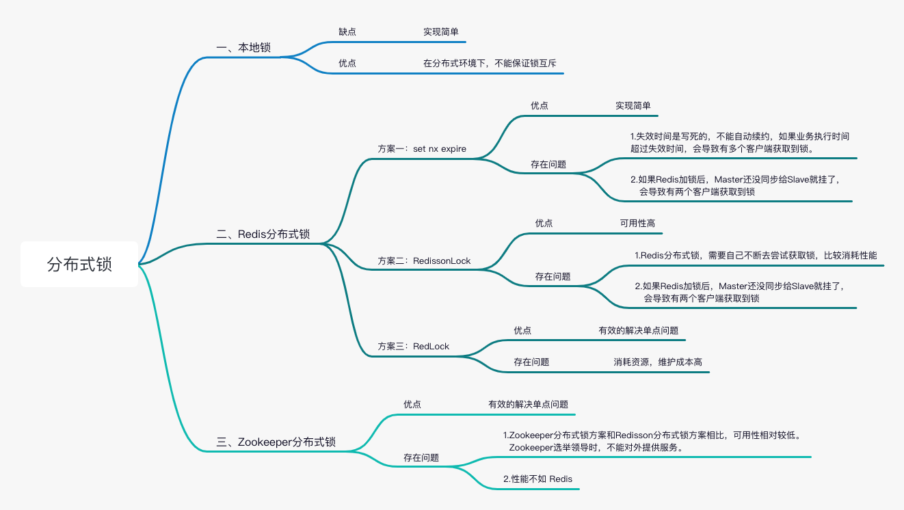
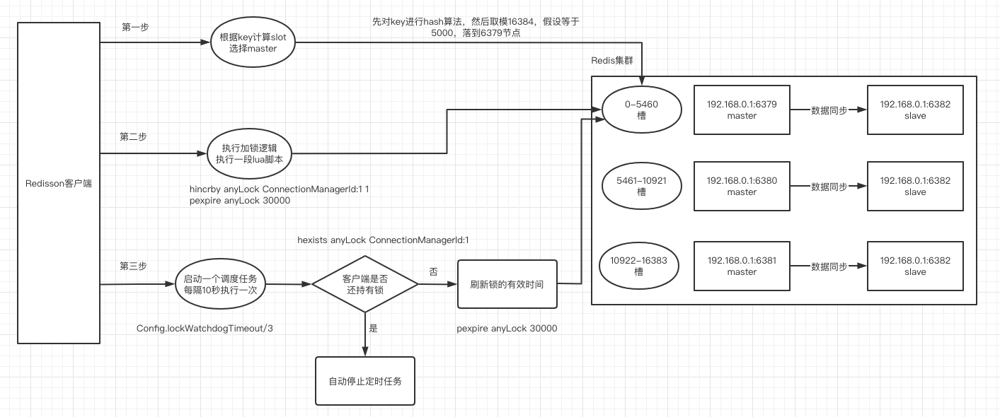
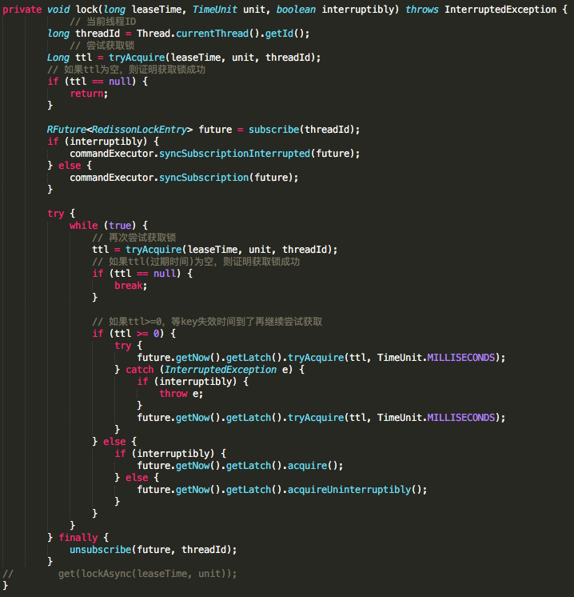
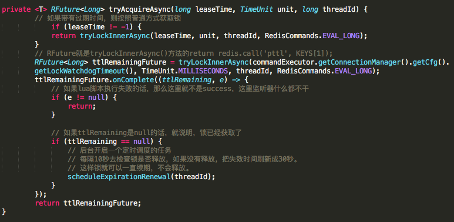
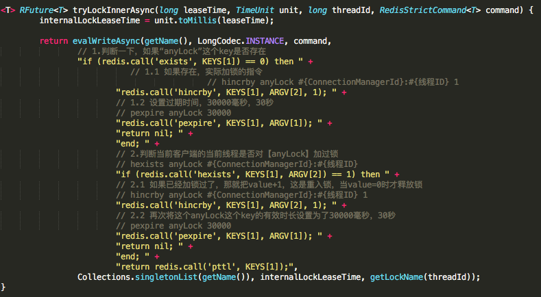
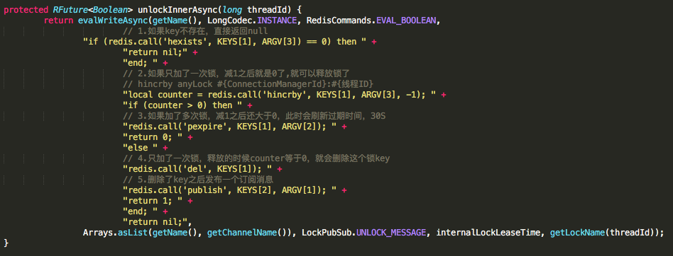
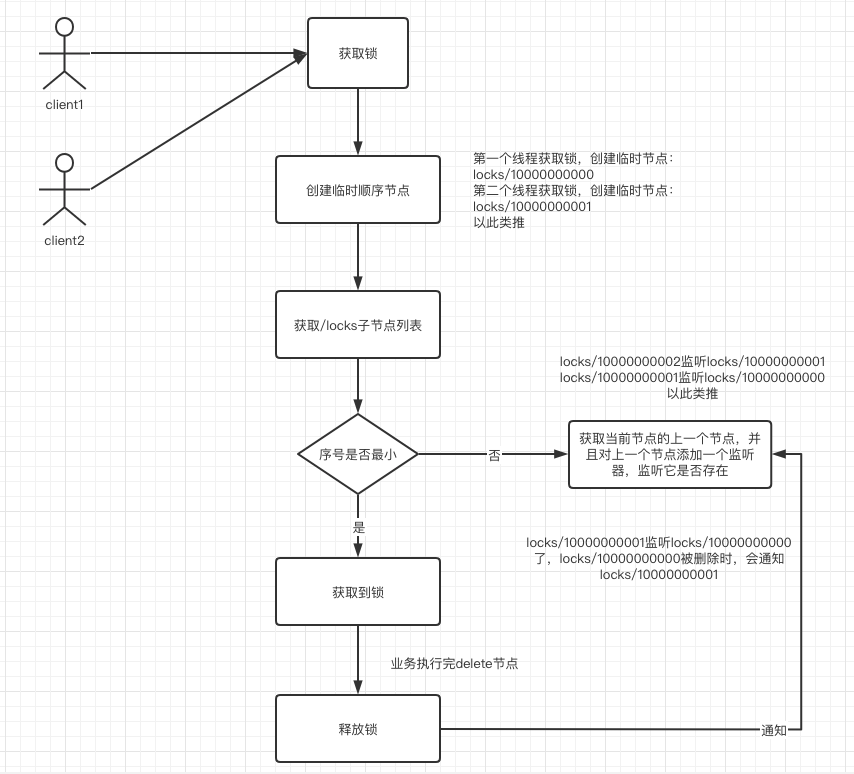
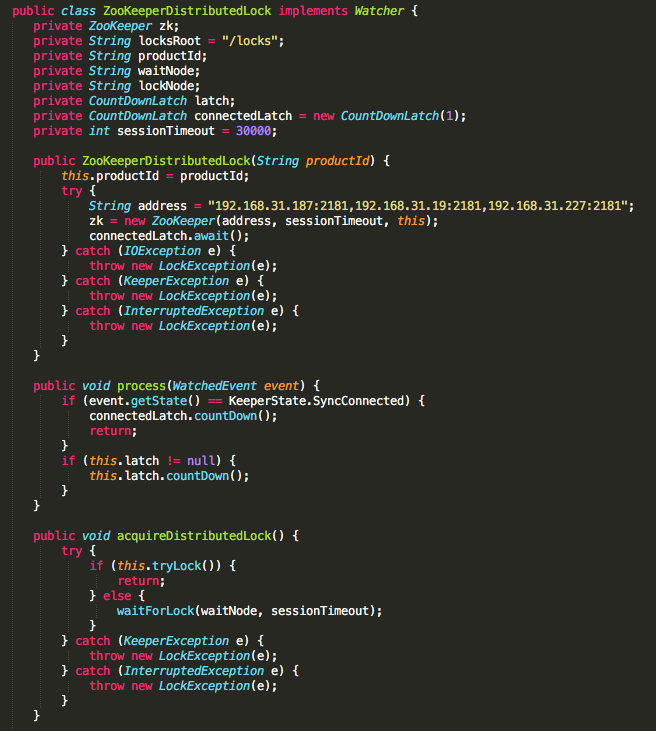
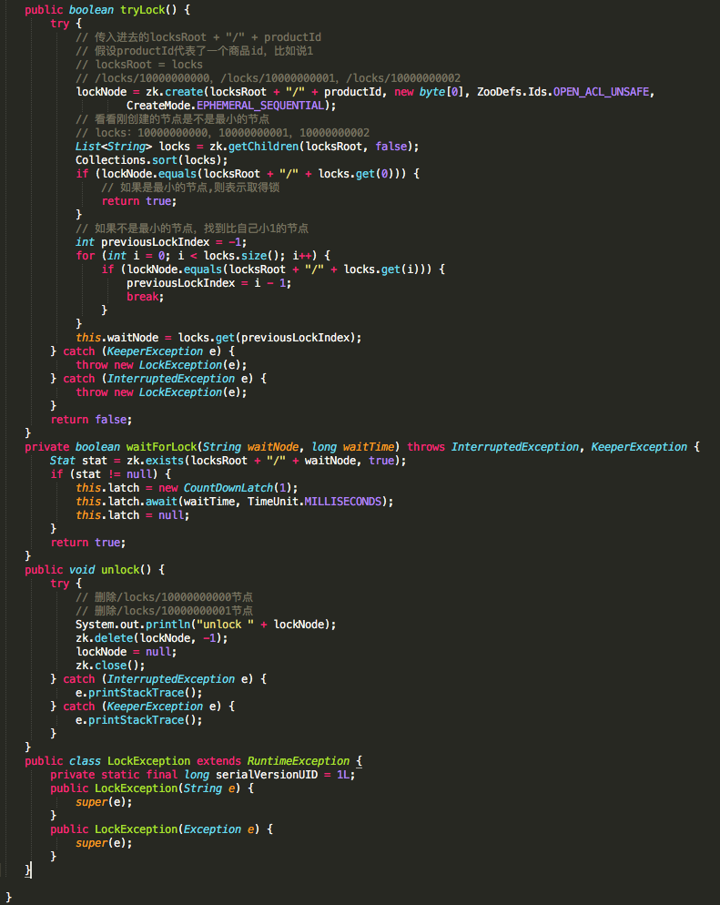

## 解答

## 1.为什么需要分布式锁？

    public synchronized void test() {
        System.out.println("获取到锁");
    }
    public void test2() {
         synchronized (Test.class) {
              System.out.println("获取到锁");
         }
    }

假设我们把上述代码部署到多台服务器上，这个互斥锁还能生效吗？答案是否定的，这时分布式锁应运而生。

## 2.Redis分布式锁？

接下来我给大家讲解完整的演变过程，让大家更深刻的理解分布式锁。

Redis setnx 线程1申请加锁，这时没有人持有锁，加锁成功：

    127.0.0.1:6379> setnx lock 1
    (integer) 1

线程2申请加锁，此时发现有人持有锁未释放，加锁失败：

    127.0.0.1:6379> setnx lock 1
    (integer) 0

线程1执行完成业务逻辑后，执行DEL命令释放锁：

    127.0.0.1:6379> del lock
    (integer) 1

存在问题：

①假设线程1执行到一半，系统挂了，这时锁还没释放，就会造成死锁。

②如果Redis加锁后，Master还没同步给Slave就挂了，会导致有两个客户端获取到锁

解决方案：setnx expire

**Redis setnx expire**

为了解决上述死锁问题，我们在setnx后，给这个key加上失效时间。

此时线程1加锁的代码改成：

    127.0.0.1:6379> setnx lock 1 ## 加锁
    (integer) 1
    127.0.0.1:6379> expire lock 3 ## 设置 key 3秒失效
    (integer) 1

存在问题：

①假设setnx lock 1执行成功了，但是expire lock 3执行失败了，还是会存在死锁问题，这两个命令需要保证原子性。

②失效时间是我们写死的，不能自动续约，如果业务执行时间超过失效时间，会出现线程1还在执行，线程2就加锁成功了，并有没达到互斥效果。

③如果Redis加锁后，Master还没同步给Slave就挂了，会导致有两个客户端获取到锁

解决方案：RedissonLock

## RedissonLock
上述两个问题，RedissonLock都解决了，我通过源码给大家剖析，看RedissonLock是如何解决的，基础好的小伙伴可以好好读读源码，其实RedissonLock源码也不难。

我先写结论，基础较弱的小伙伴，只要记得结论就行：

①RedisssonLock底层使用的是lua脚本执行的redis指令，lua脚本可以保证加锁和失效指令的原子性。

②RedisssonLock底层有个看门狗机制，加锁成功后，会开启一个定时调度任务，每隔10秒去检查锁是否释放，如果没有释放，把失效时间刷新成30秒。这样锁就可以一直续期，不会释放。

我看的是3.12.5版本源码，不同版本实现上可能存在一些差异。

应用程序加锁代码：

    RLock lock = redissonLock.getLock("anyLock");
    lock.lock();

RedissonLock加锁核心代码：

RedissonLock获取锁核心代码：

底层加锁逻辑：

KEYS[1] = anyLock，锁的名称。

ARGV[1] = 30000，失效时间，通过lockWatchdogTimeout配置。

ARGV[2] = c1b51ddb-1505-436c-a308-b3b75b4bd407:1，他是ConnectionManager的ID，我们可以简单的把它理解为一个客户端的一个线程对应的唯一标志性。

RedissonLock解锁核心代码：

存在问题：如果redis是单节点，存在单节点故障问题；如果做主从架构，Redis加锁后，Master还没同步给Slave就挂了，会导致有两个客户端获取到锁

有小伙伴问我，如果这里我用集群会存在这个问题吗？集群的本质是分片，这个key最终还是会落到某个具体的节点，这个节点要么是单独存在，要么是主从架构，所以还是会存在上述问题。

**解决方案：RedLock**

补充：虽然RedLock可以解决上述问题，但是在生产环境中我们很少使用，因为它部署成本很高，相比RedissonLock性能也略微有所下降​。

如果业务能接受极端情况下存在互斥失败问题，并且对性能要求比较高，我们会选择RedissonLock，并做好响应​的兜底方案。

如果业务对数据要求绝对正确，​我们会采用Zookeeper来做分布式锁。​

## Redlock
我们假设有5个完全相互独立的Redis Master单机节点，所以我们需要在5台机器上面运行这些实例，如下图所示（请注意这张图中5个Master节点完全相互独立）

为了取到锁，客户端应该执行以下操作:

①获取当前Unix时间，以毫秒为单位。

②依次尝试从N个Master实例使用相同的key和随机值获取锁（假设这个key是LOCK_KEY）。当向Redis设置锁时，客户端应该设置一个网络连接和响应超时时间，这个超时时间应该小于锁的失效时间。例如你的锁自动失效时间为10秒，则超时时间应该在5-50毫秒之间。这样可以避免服务器端Redis已经挂掉的情况下，客户端还在死死地等待响应结果。如果服务器端没有在规定时间内响应，客户端应该尽快尝试另外一个Redis实例。

③客户端使用当前时间减去开始获取锁时间（步骤1记录的时间）就得到获取锁使用的时间。当且仅当从大多数的Redis节点都取到锁，并且使用的时间小于锁失效时间时，锁才算获取成功。

④如果取到了锁，key的真正有效时间等于有效时间减去获取锁所使用的时间（步骤3计算的结果）。

⑤如果因为某些原因，获取锁失败（没有在至少N/2+1个Redis实例取到锁或者取锁时间已经超过了有效时间），客户端应该在所有的Redis实例上进行解锁（即便某些Redis实例根本就没有加锁成功）。

缺点：像我们系统，并发量比较大，生产环境必须要做分片才能扛住并发，像上述方案，我们需要准备5个Redis集群，这种机器成本是非常高的。

## 3.Zookeeper分布式锁

如果有一把锁，被多个人给竞争，此时多个人会排队，第一个拿到锁的人会执行，然后释放锁，后面的每个人都会去监听排在自己前面的那个人创建的node上，一旦某个人释放了锁，排在自己后面的人就会被zookeeper给通知，一旦被通知了之后，就ok了，自己就获取到了锁，就可以执行代码了。

为了帮助大家理解，我暂时不用框架，通过手写代码带大家理解Zookeeper锁：

 
此时有小伙伴问，如果业务执行一半，系统宕机了怎么办？

zk创建的是临时节点，客户端获取到锁执行业务，执行到一半突然挂掉（Session连接断开），那么这个临时节点就会自动删除掉，其他客户端自动获取锁，不会存在死锁问题。

一般生产环境我们都会使用Curator来完成分布式锁编码，他提供了可重入锁、非可重入锁、Semaphore、可重入读写锁、MultiLock等各种分布式锁。

