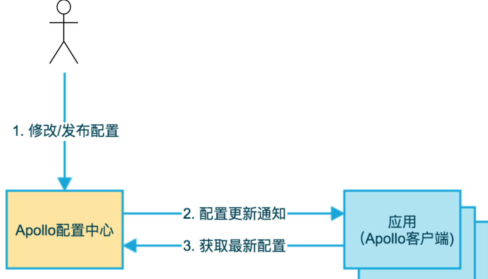
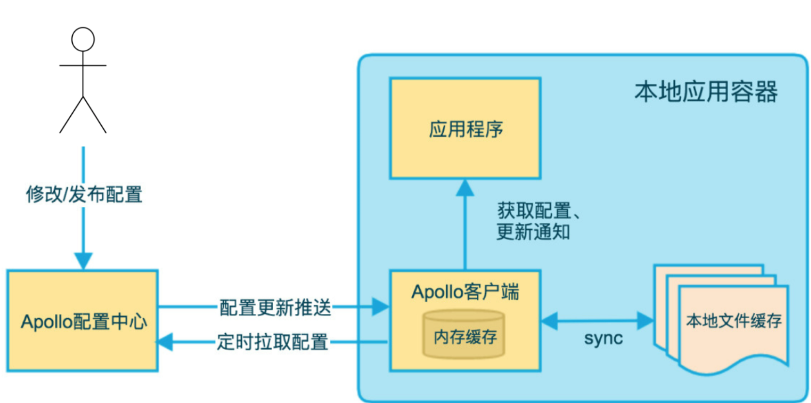
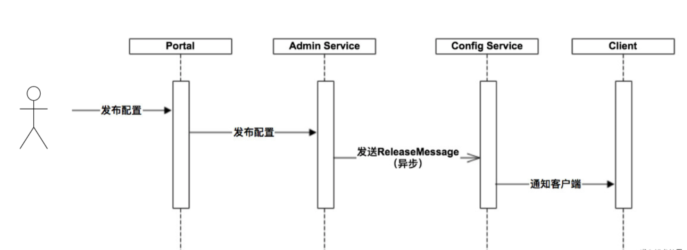
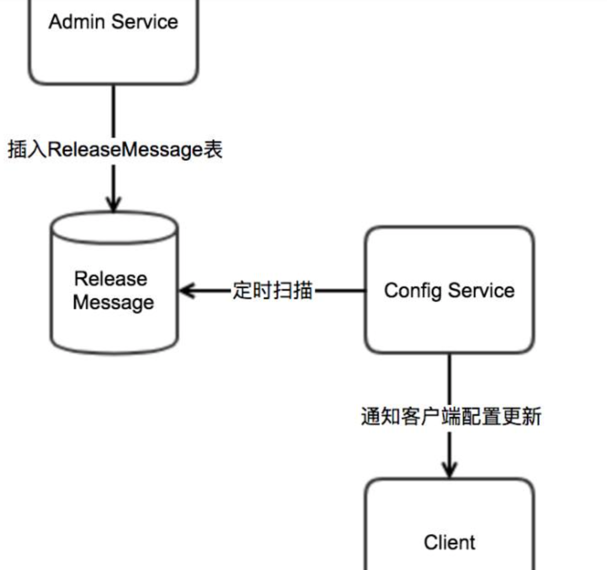
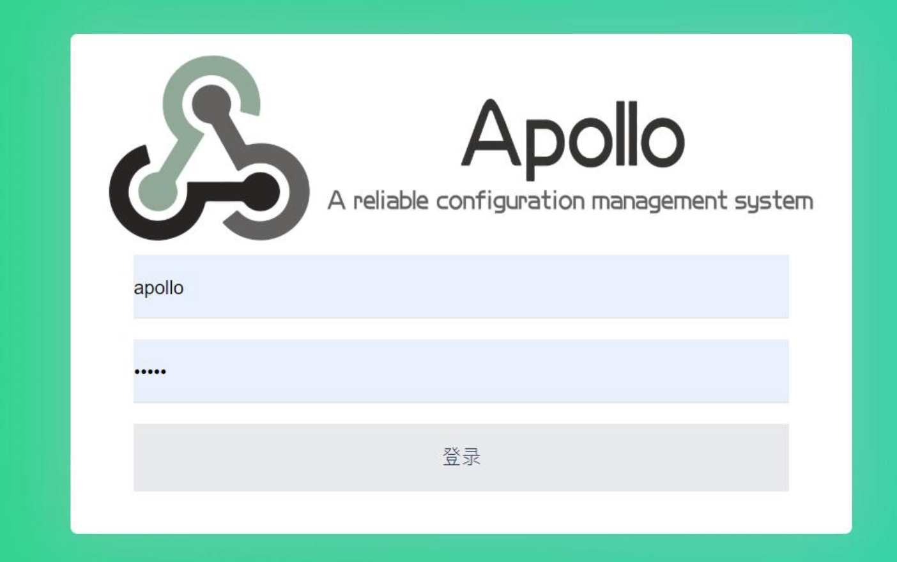
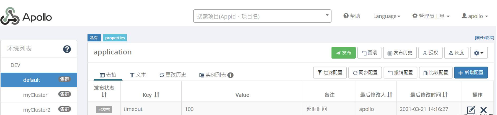
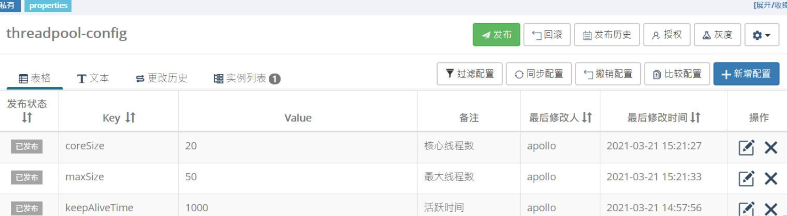
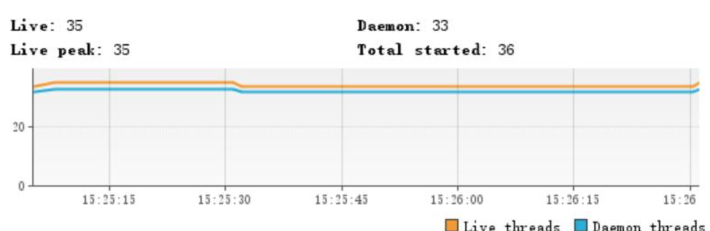
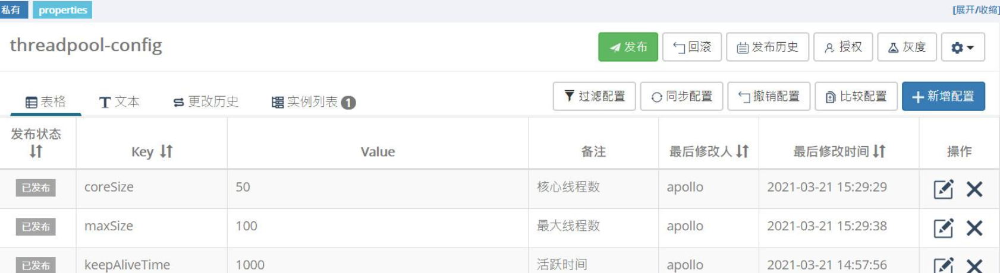
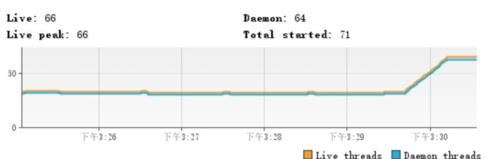

## 解答

### 0 文章概述
流量洪峰是互联网生产环境经常遇到的情况，例如某个时间点进行商品抢购活动，或者某个时间点集中触发定时任务，这些场景都有可能引发流量洪峰，所以如何应对流量洪峰我们必须面对的问题。

纵向维度我们可以从代理层、WEB层、服务层、缓存层、数据层进行思考，横向维度我们可以从高频检测、缓存前置、节点冗余、服务降级等方向进行思考。本文我们从服务层动态线程池这个角度思考应对流量洪峰。

动态线程池是指我们可以根据流量的不同调节线程池某些参数，例如可以在业务低峰期调低线程数，在业务高峰期调高线程数增加处理线程从而应对流量洪峰。本文我们结合Apollo和线程池实现一个动态线程池。

### 1 线程池基础
#### 1.1 七个参数
我们首先回顾一下Java线程池七大参数，这对后续设置线程池参数有帮助。我们查看ThreadPoolExecutor构造函数如下：

    public class ThreadPoolExecutor extends AbstractExecutorService {
        public ThreadPoolExecutor(int corePoolSize,
                                  int maximumPoolSize,
                                  long keepAliveTime,
                                  TimeUnit unit,
                                  BlockingQueue<Runnable> workQueue,
                                  ThreadFactory threadFactory,
                                  RejectedExecutionHandler handler) {
            if (corePoolSize < 0 ||
                    maximumPoolSize <= 0 ||
                    maximumPoolSize < corePoolSize ||
                    keepAliveTime < 0)
                throw new IllegalArgumentException();
            if (workQueue == null || threadFactory == null || handler == null)
                throw new NullPointerException();
            this.acc = System.getSecurityManager() == null ?
                       null :
                       AccessController.getContext();
            this.corePoolSize = corePoolSize;
            this.maximumPoolSize = maximumPoolSize;
            this.workQueue = workQueue;
            this.keepAliveTime = unit.toNanos(keepAliveTime);
            this.threadFactory = threadFactory;
            this.handler = handler;
        }
    }

(1) corePoolSize
线程池核心线程数，类比业务大厅开设的固定窗口。例如业务大厅开设2个固定窗口，那么这两个窗口不会关闭，全天都会进行业务办理

(2) workQueue
存储已提交但尚未执行的任务，类比业务大厅等候区。例如业务大厅一开门进来很多顾客，2个固定窗口进行业务办理，其他顾客到等候区等待

(3) maximumPoolSize
线程池可以容纳同时执行最大线程数，类比业务大厅最大窗口数。例如业务大厅最大窗口数是5个，业务员看到2个固定窗口和等候区都满了，可以临时增加3个窗口

(4) keepAliveTime
非核心线程数存活时间。当业务不忙时刚才新增的3个窗口需要关闭，空闲时间超过keepAliveTime空闲会被关闭

(5) unit
keepAliveTime存活时间单位

(6) threadFactory
线程工厂可以用来指定线程名

(7) handler
线程池线程数已达到maximumPoolSize且队列已满时执行拒绝策略。例如业务大厅5个窗口全部处于忙碌状态且等候区已满，业务员根据实际情况选择拒绝策略

#### 1.2 四种拒绝策略
(1) AbortPolicy
默认策略直接抛出RejectExecutionException阻止系统正常运行

    /**
     * AbortPolicy
     *
     * @author 微信公众号「JAVA前线」
     *
     */
    public class AbortPolicyTest {
        public static void main(String[] args) {
            int coreSize = 1;
            int maxSize = 2;
            int queueSize = 1;
            AbortPolicy abortPolicy = new ThreadPoolExecutor.AbortPolicy();
            ThreadPoolExecutor executor = new ThreadPoolExecutor(coreSize, maxSize, 1, TimeUnit.SECONDS, new LinkedBlockingQueue<Runnable>(queueSize), Executors.defaultThreadFactory(), abortPolicy);
            for (int i = 0; i < 100; i++) {
                executor.execute(new Runnable() {
                    @Override
                    public void run() {
                        System.out.println(Thread.currentThread().getName() + " -> run");
                    }
                });
            }
        }
    }

程序执行结果：

    pool-1-thread-1 -> run
    pool-1-thread-2 -> run
    pool-1-thread-1 -> run
    Exception in thread "main" java.util.concurrent.RejectedExecutionException: Task com.xy.juc.threadpool.reject.AbortPolicyTest$1@70dea4e rejected from java.util.concurrent.ThreadPoolExecutor@5c647e05[Running, pool size = 2, active threads = 0, queued tasks = 0, completed tasks = 2]
        at java.util.concurrent.ThreadPoolExecutor$AbortPolicy.rejectedExecution(ThreadPoolExecutor.java:2063)
        at java.util.concurrent.ThreadPoolExecutor.reject(ThreadPoolExecutor.java:830)
        at java.util.concurrent.ThreadPoolExecutor.execute(ThreadPoolExecutor.java:1379)
        at com.xy.juc.threadpool.reject.AbortPolicyTest.main(AbortPolicyTest.java:21)

(2) CallerRunsPolicy
任务回退给调用者自己运行

    /**
     * CallerRunsPolicy
     *
     * @author 微信公众号「JAVA前线」
     *
     */
    public class CallerRunsPolicyTest {
        public static void main(String[] args) {
            int coreSize = 1;
            int maxSize = 2;
            int queueSize = 1;
            CallerRunsPolicy callerRunsPolicy = new ThreadPoolExecutor.CallerRunsPolicy();
            ThreadPoolExecutor executor = new ThreadPoolExecutor(coreSize, maxSize, 1, TimeUnit.SECONDS, new LinkedBlockingQueue<Runnable>(queueSize), Executors.defaultThreadFactory(), callerRunsPolicy);
            for (int i = 0; i < 10; i++) {
                executor.execute(new Runnable() {
                    @Override
                    public void run() {
                        System.out.println(Thread.currentThread().getName() + " -> run");
                    }
                });
            }
        }
    }
    
程序执行结果：

    main -> run
    pool-1-thread-1 -> run
    pool-1-thread-2 -> run
    pool-1-thread-1 -> run
    main -> run
    main -> run
    pool-1-thread-2 -> run
    pool-1-thread-1 -> run
    main -> run
    pool-1-thread-2 -> run

(3) DiscardOldestPolicy
抛弃队列中等待最久的任务不会抛出异常

    /**
     * DiscardOldestPolicy
     *
     * @author 微信公众号「JAVA前线」
     *
     */
    public class DiscardOldestPolicyTest {
        public static void main(String[] args) {
            int coreSize = 1;
            int maxSize = 2;
            int queueSize = 1;
            DiscardOldestPolicy discardOldestPolicy = new ThreadPoolExecutor.DiscardOldestPolicy();
            ThreadPoolExecutor executor = new ThreadPoolExecutor(coreSize, maxSize, 1, TimeUnit.SECONDS, new LinkedBlockingQueue<Runnable>(queueSize), Executors.defaultThreadFactory(), discardOldestPolicy);
            for (int i = 0; i < 10; i++) {
                executor.execute(new Runnable() {
                    @Override
                    public void run() {
                        System.out.println(Thread.currentThread().getName() + " -> run");
                    }
                });
            }
        }
    }

程序执行结果：

    pool-1-thread-1 -> run
    pool-1-thread-2 -> run
    pool-1-thread-1 -> run

(4) DiscardPolicy
直接丢弃任务不会抛出异常

    /**
     * DiscardPolicy
     *
     * @author 微信公众号「JAVA前线」
     *
     */
    public class DiscardPolicyTest {
        public static void main(String[] args) {
            int coreSize = 1;
            int maxSize = 2;
            int queueSize = 1;
            DiscardPolicy discardPolicy = new ThreadPoolExecutor.DiscardPolicy();
            ThreadPoolExecutor executor = new ThreadPoolExecutor(coreSize, maxSize, 1, TimeUnit.SECONDS, new LinkedBlockingQueue<Runnable>(queueSize), Executors.defaultThreadFactory(), discardPolicy);
            for (int i = 0; i < 10; i++) {
                executor.execute(new Runnable() {
                    @Override
                    public void run() {
                        System.out.println(Thread.currentThread().getName() + " -> run");
                    }
                });
            }
        }
    }

程序执行结果：

    pool-1-thread-1 -> run
    pool-1-thread-2 -> run
    pool-1-thread-1 -> run

#### 1.3 修改参数
如果初始化线程池完成后，我们是否可以修改线程池某些参数呢？答案是可以。我们选择线程池提供的四个修改方法进行源码分析。

(1) setCorePoolSize

    public class ThreadPoolExecutor extends AbstractExecutorService {
        public void setCorePoolSize(int corePoolSize) {
            if (corePoolSize < 0)
                throw new IllegalArgumentException();
            // 新核心线程数减去原核心线程数
            int delta = corePoolSize - this.corePoolSize;
            // 新核心线程数赋值
            this.corePoolSize = corePoolSize;
            // 如果当前线程数大于新核心线程数
            if (workerCountOf(ctl.get()) > corePoolSize)
                // 中断空闲线程
                interruptIdleWorkers();
            // 如果需要新增线程则通过addWorker增加工作线程
            else if (delta > 0) {
                int k = Math.min(delta, workQueue.size());
                while (k-- > 0 && addWorker(null, true)) {
                    if (workQueue.isEmpty())
                        break;
                }
            }
        }
    }

(2) setMaximumPoolSize

    public class ThreadPoolExecutor extends AbstractExecutorService {
        public void setMaximumPoolSize(int maximumPoolSize) {
            if (maximumPoolSize <= 0 || maximumPoolSize < corePoolSize)
                throw new IllegalArgumentException();
            this.maximumPoolSize = maximumPoolSize;
            // 如果当前线程数量大于新最大线程数量
            if (workerCountOf(ctl.get()) > maximumPoolSize)
                // 中断空闲线程
                interruptIdleWorkers();
        }
    }

(3) setKeepAliveTime

    public class ThreadPoolExecutor extends AbstractExecutorService {
        public void setKeepAliveTime(long time, TimeUnit unit) {
            if (time < 0)
                throw new IllegalArgumentException();
            if (time == 0 && allowsCoreThreadTimeOut())
                throw new IllegalArgumentException("Core threads must have nonzero keep alive times");
            long keepAliveTime = unit.toNanos(time);
            // 新超时时间减去原超时时间
            long delta = keepAliveTime - this.keepAliveTime;
            this.keepAliveTime = keepAliveTime;
            // 如果新超时时间小于原超时时间
            if (delta < 0)
                // 中断空闲线程
                interruptIdleWorkers();
        }
    }

(4) setRejectedExecutionHandler

    public class ThreadPoolExecutor extends AbstractExecutorService {
        public void setRejectedExecutionHandler(RejectedExecutionHandler handler) {
            if (handler == null)
                throw new NullPointerException();
            // 设置拒绝策略
            this.handler = handler;
        }
    }

现在我们知道线程池系统上述调整参数的方法，但仅仅分析到此是不够的，因为如果没有动态调整参数的方法，那么每次修改必须重新发布才可以生效，那么有没有方法不用发布就可以动态调整线程池参数呢？

### 2 Apollo配置中心
#### 2.1 核心原理
Apollo是携程框架部门研发的分布式配置中心，能够集中化管理应用不同环境、不同集群的配置，配置修改后能够实时推送到应用端，并且具备规范的权限、流程治理等特性，适用于微服务配置管理场景。Apollo开源地址如下：

    https://github.com/ctripcorp/apollo

我们在使用配置中心时第一步用户在配置中心修改配置项，第二步配置中心通知Apollo客户端有配置更新，第三步Apollo客户端从配置中心拉取最新配置，更新本地配置并通知到应用，官网基础模型图如下：

配置中心配置项发生变化客户端如何感知呢？分为推和拉两种方式。推依赖客户端和服务端保持了一个长连接，发生数据变化时服务端推送信息给客户端，这就是长轮询机制。拉依赖客户端定时从配置中心服务端拉取应用最新配置，这是一个fallback机制。官网客户端设计图如下：

本文重点分析配置更新推送方式，我们首先看官网服务端设计图：

ConfigService模块提供配置的读取推送等功能，服务对象是Apollo客户端。AdminService模块提供配置的修改发布等功能，服务对象是Portal模块即管理界面。需要说明Apollo并没有引用消息中间件，图中发送异步消息是指ConfigService定时扫描异步消息数据表：

消息数据保存在MySQL消息表：

    CREATE TABLE `releasemessage` (
      `Id` int(11) unsigned NOT NULL AUTO_INCREMENT COMMENT '自增主键',
      `Message` varchar(1024) NOT NULL DEFAULT '' COMMENT '发布的消息内容',
      `DataChange_LastTime` timestamp NOT NULL DEFAULT CURRENT_TIMESTAMP ON UPDATE CURRENT_TIMESTAMP COMMENT '最后修改时间',
      PRIMARY KEY (`Id`),
      KEY `DataChange_LastTime` (`DataChange_LastTime`),
      KEY `IX_Message` (`Message`(191))
    ) ENGINE=InnoDB AUTO_INCREMENT=1 DEFAULT CHARSET=utf8mb4 COMMENT='发布消息'

Apollo核心原理本文暂且谈到这里，后续我会写文章通过源码分析Apollo长轮询机制请继续关注。

#### 2.2 实例分析
2.2.1 服务端安装
服务端关键步骤是导入数据库和修改端口号，具体步骤请参看官方网站：

    https://ctripcorp.github.io/apollo/#/zh/deployment/quick-start
启动成功后访问地址：

    http://localhost:8070

输入用户名apollo、密码admin登录：

点击进入我创建myApp项目，我们看到在DEV环境、default集群、application命名空间包含一个timeout配置项，100是这个配置项的值，下面我们在应用程序读取这个配置项：

2.2.2 应用程序
(1) 引入依赖

    <dependencies>
        <dependency>
        <groupId>com.ctrip.framework.apollo</groupId>
        <artifactId>apollo-client</artifactId>
        <version>1.7.0</version>
        </dependency>
    </dependencies>	

(2) 简单实例

    public class GetApolloConfigTest extends BaseTest {
    
        /**
         * -Dapp.id=myApp -Denv=DEV -Dapollo.cluster=default -Ddev_meta=http://localhost:8080
         *
         * myApp+DEV+default+application
         */
        @Test
        public void testGet() throws InterruptedException {
            Config appConfig = ConfigService.getAppConfig();
            while (true) {
                String value = appConfig.getProperty("timeout", "200");
                System.out.println("timeout=" + value);
                TimeUnit.SECONDS.sleep(1);
            }
        }
    }

因为上述程序是通过while(true)不断获取配置项的值，所以程序输出结果如下：

    timeout=100
    timeout=100
    timeout=100
    timeout=100
    timeout=100
    timeout=100

我们现在把配置项的值改为200程序输出结果如下:

    timeout=100
    timeout=100
    timeout=100
    timeout=100
    timeout=200
    timeout=200
    timeout=200
(3) 监听实例
生产环境我们一般不用while(true)监听变化，而是通过注册监听器方式感知变化信息：

    public class GetApolloConfigTest extends BaseTest {
    
        /**
         * 监听命名空间变化
         *
         * -Dapp.id=myApp -Denv=DEV -Dapollo.cluster=default -Ddev_meta=http://localhost:8080
         *
         * myApp+DEV+default+application
         */
        @Test
        public void testListen() throws InterruptedException {
            Config config = ConfigService.getConfig("application");
            config.addChangeListener(new ConfigChangeListener() {
                @Override
                public void onChange(ConfigChangeEvent changeEvent) {
                    System.out.println("发生变化命名空间=" + changeEvent.getNamespace());
                    for (String key : changeEvent.changedKeys()) {
                        ConfigChange change = changeEvent.getChange(key);
                        System.out.println(String.format("发生变化key=%s,oldValue=%s,newValue=%s,changeType=%s", change.getPropertyName(), change.getOldValue(), change.getNewValue(), change.getChangeType()));
                    }
                }
            });
            Thread.sleep(1000000L);
        }
    }

我们现在把timeout值从200改为300，程序输出结果：

    发生变化命名空间=application
    发生变化key=timeout,oldValue=200,newValue=300,changeType=MODIFIED

### 3 动态线程池
现在我们把线程池和Apollo结合起来构建动态线程池，具备了上述知识编写起来并不复杂。首先我们用默认值构建一个线程池，然后线程池会监听Apollo关于相关配置项，如果相关配置有变化则刷新相关参数。第一步在Apollo配置中心设置三个线程池参数（本文没有设置拒绝策略其原理一致）：

第二步编写核心代码：

    /**
     * 动态线程池工厂
     *
     * @author 微信公众号「JAVA前线」
     *
     */
    @Slf4j
    @Component
    public class DynamicThreadPoolFactory {
        private static final String NAME_SPACE = "threadpool-config";
    
        /** 线程执行器 **/
        private volatile ThreadPoolExecutor executor;
    
        /** 核心线程数 **/
        private Integer CORE_SIZE = 10;
    
        /** 最大值线程数 **/
        private Integer MAX_SIZE = 20;
    
        /** 等待队列长度 **/
        private Integer QUEUE_SIZE = 2000;
    
        /** 线程存活时间 **/
        private Long KEEP_ALIVE_TIME = 1000L;
    
        /** 线程名 **/
        private String threadName;
    
        public DynamicThreadPoolFactory() {
            Config config = ConfigService.getConfig(NAME_SPACE);
            init(config);
            listen(config);
        }
    
        /**
         * 初始化
         */
        private void init(Config config) {
            if (executor == null) {
                synchronized (DynamicThreadPoolFactory.class) {
                    if (executor == null) {
                        String coreSize = config.getProperty(KeysEnum.CORE_SIZE.getNodeKey(), CORE_SIZE.toString());
                        String maxSize = config.getProperty(KeysEnum.MAX_SIZE.getNodeKey(), MAX_SIZE.toString());
                        String keepAliveTIme = config.getProperty(KeysEnum.KEEP_ALIVE_TIME.getNodeKey(), KEEP_ALIVE_TIME.toString());
                        BlockingQueue<Runnable> queueToUse = new LinkedBlockingQueue<Runnable>(QUEUE_SIZE);
                        executor = new ThreadPoolExecutor(Integer.valueOf(coreSize), Integer.valueOf(maxSize), Long.valueOf(keepAliveTIme), TimeUnit.MILLISECONDS, queueToUse, new NamedThreadFactory(threadName, true), new AbortPolicyDoReport(threadName));
                    }
                }
            }
        }
    
        /**
         * 监听器
         */
        private void listen(Config config) {
            config.addChangeListener(new ConfigChangeListener() {
                @Override
                public void onChange(ConfigChangeEvent changeEvent) {
                    log.info("命名空间发生变化={}", changeEvent.getNamespace());
                    for (String key : changeEvent.changedKeys()) {
                        ConfigChange change = changeEvent.getChange(key);
                        String newValue = change.getNewValue();
                        refreshThreadPool(key, newValue);
                        log.info("发生变化key={},oldValue={},newValue={},changeType={}", change.getPropertyName(), change.getOldValue(), change.getNewValue(), change.getChangeType());
                    }
                }
            });
        }
    
        /**
         * 刷新线程池
         */
        private void refreshThreadPool(String key, String newValue) {
            if (executor == null) {
                return;
            }
            if (KeysEnum.CORE_SIZE.getNodeKey().equals(key)) {
                executor.setCorePoolSize(Integer.valueOf(newValue));
                log.info("修改核心线程数key={},value={}", key, newValue);
            }
            if (KeysEnum.MAX_SIZE.getNodeKey().equals(key)) {
                executor.setMaximumPoolSize(Integer.valueOf(newValue));
                log.info("修改最大线程数key={},value={}", key, newValue);
            }
            if (KeysEnum.KEEP_ALIVE_TIME.getNodeKey().equals(key)) {
                executor.setKeepAliveTime(Integer.valueOf(newValue), TimeUnit.MILLISECONDS);
                log.info("修改活跃时间key={},value={}", key, newValue);
            }
        }
    
        public ThreadPoolExecutor getExecutor(String threadName) {
            return executor;
        }
    
        enum KeysEnum {
    
            CORE_SIZE("coreSize", "核心线程数"),
    
            MAX_SIZE("maxSize", "最大线程数"),
    
            KEEP_ALIVE_TIME("keepAliveTime", "线程活跃时间")
    
            ;
    
            private String nodeKey;
            private String desc;
    
            KeysEnum(String nodeKey, String desc) {
                this.nodeKey = nodeKey;
                this.desc = desc;
            }
    
            public String getNodeKey() {
                return nodeKey;
            }
    
            public void setNodeKey(String nodeKey) {
                this.nodeKey = nodeKey;
            }
    
            public String getDesc() {
                return desc;
            }
    
            public void setDesc(String desc) {
                this.desc = desc;
            }
        }
    }
    
    /**
     * 动态线程池执行器
     *
     * @author 微信公众号「JAVA前线」
     *
     */
    @Component
    public class DynamicThreadExecutor {
    
        @Resource
        private DynamicThreadPoolFactory threadPoolFactory;
    
        public void execute(String bizName, Runnable job) {
            threadPoolFactory.getExecutor(bizName).execute(job);
        }
    
        public Future<?> sumbit(String bizName, Runnable job) {
            return threadPoolFactory.getExecutor(bizName).submit(job);
        }
    }

第三步运行测试用例并结合VisualVM观察线程数：

    /**
     * 动态线程池测试
     *
     * @author 微信公众号「JAVA前线」
     *
     */
    public class DynamicThreadExecutorTest extends BaseTest {
    
        @Resource
        private DynamicThreadExecutor dynamicThreadExecutor;
    
        /**
         * -Dapp.id=myApp -Denv=DEV -Dapollo.cluster=default -Ddev_meta=http://localhost:8080
         *
         * myApp+DEV+default+thread-pool
         */
        @Test
        public void testExecute() throws InterruptedException {
            while (true) {
                dynamicThreadExecutor.execute("bizName", new Runnable() {
                    @Override
                    public void run() {
                        System.out.println("bizInfo");
                    }
                });
                TimeUnit.SECONDS.sleep(1);
            }
        }
    }

我们在配置中心修改配置项把核心线程数设置为50，最大线程数设置为100：

通过VisualVM可以观察到线程数显著上升：

### 4 文章总结
本文我们首先介绍了线程池基础知识，包括七大参数和四个拒绝策略，随后我们介绍了Apollo配置中心的原理和应用，最后我们将线程池和配置中心相结合，实现了动态调整线程数的效果，希望本文对大家有所帮助。

