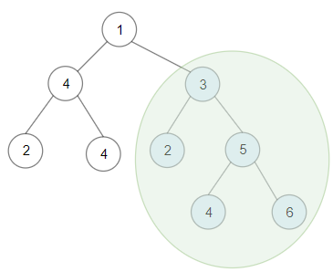

## 题目

给你一棵以 root 为根的 二叉树 ，请你返回 任意 二叉搜索子树的最大键值和。

二叉搜索树的定义如下：

任意节点的左子树中的键值都 小于 此节点的键值。
任意节点的右子树中的键值都 大于 此节点的键值。
任意节点的左子树和右子树都是二叉搜索树。
 

示例 1：



    输入：root = [1,4,3,2,4,2,5,null,null,null,null,null,null,4,6]
    输出：20
    解释：键值为 3 的子树是和最大的二叉搜索树。
示例 2：


    输入：root = [4,3,null,1,2]
    输出：2
    解释：键值为 2 的单节点子树是和最大的二叉搜索树。
示例 3：

    输入：root = [-4,-2,-5]
    输出：0
    解释：所有节点键值都为负数，和最大的二叉搜索树为空。
示例 4：

    输入：root = [2,1,3]
    输出：6
示例 5：

    输入：root = [5,4,8,3,null,6,3]
    输出：7
 

提示：

- 每棵树有 1 到 40000 个节点。
- 每个节点的键值在 [-4 * 10^4 , 4 * 10^4] 之间。


## 思路

int[] res = new int[4];

后序遍历

## 解法
```java

/**
 * Definition for a binary tree node.
 * public class TreeNode {
 *     int val;
 *     TreeNode left;
 *     TreeNode right;
 *     TreeNode() {}
 *     TreeNode(int val) { this.val = val; }
 *     TreeNode(int val, TreeNode left, TreeNode right) {
 *         this.val = val;
 *         this.left = left;
 *         this.right = right;
 *     }
 * }
 */
class Solution {
    //全局变量，记录 BST 最大节点之和
    int maxSum = 0;

    public int maxSumBST(TreeNode root) {
        traverse(root);
        return maxSum;
    }


    public int[] traverse(TreeNode root) {
        if (root == null) {
            return new int[]{
                    1, Integer.MAX_VALUE, Integer.MIN_VALUE, 0
            };
        }

        //递归计算左右子树
        int[] left = traverse(root.left);
        int[] right = traverse(root.right);

        /**
         * res[0] 记录以 root 为根的二叉树是否是 BST，若为1则说明是 BST，若为0则说明不是 BST
         * res[1] 记录以 root 为根的二叉树所有节点中的最小值
         * res[2] 记录以 root 为根的二叉树所有节点中的最大值
         * res[3] 记录以 root 为根的二叉树所有节点值之和
         */
        /************* 后序遍历位置 ****************/
        int[] res = new int[4];
        //这个 if 在判断以 root 为根的二叉树是不是 BST
        //BST的根节点是大于左子树的最大值，小于右子树的最小值
        if (left[0] == 1 && right[0] == 1 &&
                root.val > left[2] && root.val < right[1]) {
            //以 root 为根的二叉树是 BST
            res[0] = 1;
            //计算以 root 为根的这棵 BST 的最小值
            res[1] = Math.min(left[1], root.val);
            //计算以 root 为根的这棵 BST 的最大值
            res[2] = Math.max(right[2], root.val);
            //计算以 root 为根的这棵 BST 所有节点之和
            res[3] = left[3] + right[3] + root.val;
            //更新全局变量
            maxSum = Math.max(maxSum, res[3]);
        } else {
            //以 root 为根的二叉树不是 BST
            res[0] = 0;
        }
        /*****************************************/

        return res;
    }
}
```

## 总结

- 分析出几种情况，然后分别对各个情况实现 
