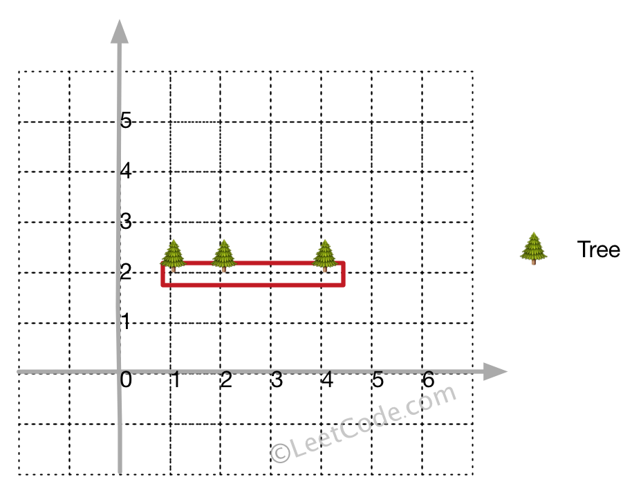

## 题目

在一个二维的花园中，有一些用 (x, y) 坐标表示的树。由于安装费用十分昂贵，你的任务是先用最短的绳子围起所有的树。只有当所有的树都被绳子包围时，花园才能围好栅栏。你需要找到正好位于栅栏边界上的树的坐标。

 

示例 1:

输入: [[1,1],[2,2],[2,0],[2,4],[3,3],[4,2]]
输出: [[1,1],[2,0],[4,2],[3,3],[2,4]]
解释:


示例 2:

输入: [[1,2],[2,2],[4,2]]
输出: [[1,2],[2,2],[4,2]]
解释:


即使树都在一条直线上，你也需要先用绳子包围它们。
 

注意:

- 所有的树应当被围在一起。你不能剪断绳子来包围树或者把树分成一组以上。
- 输入的整数在 0 到 100 之间。
- 花园至少有一棵树。
- 所有树的坐标都是不同的。
- 输入的点没有顺序。输出顺序也没有要求。


## 思路


## 解法
```java

class Solution {
    public int[][] outerTrees(int[][] points) {
        if(points.length<4){return points;}
        Arrays.sort(points,(a,b)->a[0]==b[0]?a[1]-b[1]:a[0]-b[0]);
        List<Integer> list=new ArrayList<>();
        boolean used[]=new boolean[3005];
        list.add(0);
        list.add(1);
        used[1]=true;
        //先求下半包：
        for(int i=2;i<points.length;i++){
            while(list.size()>1){
                int p1=list.get(list.size()-2),p2=list.get(list.size()-1);
                int cross=crossProduct(points[p1],points[p2],points[i]);
                if(cross<0){
                    list.remove(list.size()-1);
                    used[p2]=false;
                }
                else{break;}
            }
            list.add(i);
            used[i]=true;
        }
        //再求上半包：
        for(int i=points.length-2;i>=0;i--){
            if(used[i]){continue;}
            while(list.size()>1){
                int p1=list.get(list.size()-2),p2=list.get(list.size()-1);
                int cross=crossProduct(points[p1],points[p2],points[i]);
                if(cross<0){
                    list.remove(list.size()-1);
                    used[p2]=false;
                }
                else{break;}
            }
            if(i>0){list.add(i);}
            used[i]=true;
        }
        int ans[][]=new int[list.size()][];
        for(int i=0;i<ans.length;i++){ans[i]=points[list.get(i)];}
        return ans;
    }
    public int crossProduct(int p1[],int p2[],int p3[]){
        //计算向量d1×d2
        return (p2[0]-p1[0])*(p3[1]-p2[1])-(p3[0]-p2[0])*(p2[1]-p1[1]);
    }
}
```

## 总结

- 分析出几种情况，然后分别对各个情况实现 
