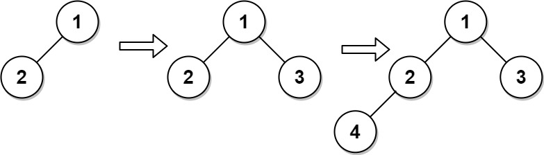

## 题目

完全二叉树 是每一层（除最后一层外）都是完全填充（即，节点数达到最大）的，并且所有的节点都尽可能地集中在左侧。

设计一种算法，将一个新节点插入到一个完整的二叉树中，并在插入后保持其完整。

实现 CBTInserter 类:

- CBTInserter(TreeNode root) 使用头节点为 root 的给定树初始化该数据结构；
- CBTInserter.insert(int v)  向树中插入一个值为 Node.val == val的新节点 TreeNode。使树保持完全二叉树的状态，并返回插入节点 TreeNode 的父节点的值；
- CBTInserter.get_root() 将返回树的头节点。

示例 1：




    输入
    ["CBTInserter", "insert", "insert", "get_root"]
    [[[1, 2]], [3], [4], []]
    输出
    [null, 1, 2, [1, 2, 3, 4]]
    
    解释
    CBTInserter cBTInserter = new CBTInserter([1, 2]);
    cBTInserter.insert(3);  // 返回 1
    cBTInserter.insert(4);  // 返回 2
    cBTInserter.get_root(); // 返回 [1, 2, 3, 4]
 

提示：

- 树中节点数量范围为 [1, 1000] 
- 0 <= Node.val <= 5000
- root 是完全二叉树
- 0 <= val <= 5000 
- 每个测试用例最多调用 insert 和 get_root 操作 10<sup>4</sup> 次

## 思路

    bfs遍历

## 解法
```java

/**
 * Definition for a binary tree node.
 * public class TreeNode {
 *     int val;
 *     TreeNode left;
 *     TreeNode right;
 *     TreeNode() {}
 *     TreeNode(int val) { this.val = val; }
 *     TreeNode(int val, TreeNode left, TreeNode right) {
 *         this.val = val;
 *         this.left = left;
 *         this.right = right;
 *     }
 * }
 */
class CBTInserter {
    Map<Integer, TreeNode> map;
    int size;
    public CBTInserter(TreeNode root) {
        map = new HashMap<>();
        bfs(root);
    }
    public void bfs(TreeNode root) {
        Deque<TreeNode> queue = new ArrayDeque<>();
        queue.add(root);
        int index = 0;
        while(!queue.isEmpty()) {
            TreeNode node = queue.poll();
            map.put(++index, node);
            if(node.left != null) {
                queue.add(node.left);
            }
            if(node.right != null) {
                queue.add(node.right);
            }
        }
        size = index;
    } 
    
    public int insert(int val) {
        TreeNode node = new TreeNode(val);
        map.put(++size, node);
        TreeNode parent = map.get(size / 2);
        if(size % 2 == 0) {
            parent.left = node;
        } else {
            parent.right = node;
        }
        return parent.val;
    }
    
    public TreeNode get_root() {
        return map.get(1);
    }
}

/**
 * Your CBTInserter object will be instantiated and called as such:
 * CBTInserter obj = new CBTInserter(root);
 * int param_1 = obj.insert(val);
 * TreeNode param_2 = obj.get_root();
 */
```

## 总结

- 分析出几种情况，然后分别对各个情况实现 
