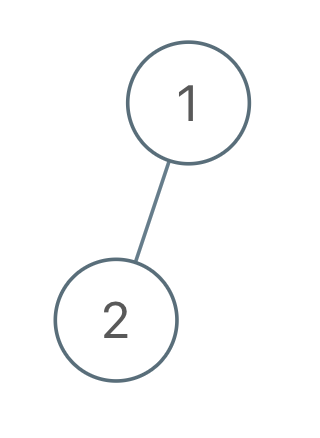

## 题目

给你一棵二叉树的根节点 root ，树中有 n 个节点，每个节点都有一个不同于其他节点且处于 1 到 n 之间的值。

另给你一个由 n 个值组成的行程序列 voyage ，表示 预期 的二叉树 先序遍历 结果。

通过交换节点的左右子树，可以 翻转 该二叉树中的任意节点。例，翻转节点 1 的效果如下：


请翻转 最少 的树中节点，使二叉树的 先序遍历 与预期的遍历行程 voyage 相匹配 。 

如果可以，则返回 翻转的 所有节点的值的列表。你可以按任何顺序返回答案。如果不能，则返回列表 [-1]。

 

示例 1：




    输入：root = [1,2], voyage = [2,1]
    输出：[-1]
    解释：翻转节点无法令先序遍历匹配预期行程。
示例 2：


    输入：root = [1,2,3], voyage = [1,3,2]
    输出：[1]
    解释：交换节点 2 和 3 来翻转节点 1 ，先序遍历可以匹配预期行程。
示例 3：


    输入：root = [1,2,3], voyage = [1,2,3]
    输出：[]
    解释：先序遍历已经匹配预期行程，所以不需要翻转节点。
     

提示：

- 树中的节点数目为 n
- n == voyage.length
- 1 <= n <= 100
- 1 <= Node.val, voyage[i] <= n
- 树中的所有值 互不相同
- voyage 中的所有值 互不相同

## 思路

递归

## 解法
```java

/**
 * Definition for a binary tree node.
 * public class TreeNode {
 *     int val;
 *     TreeNode left;
 *     TreeNode right;
 *     TreeNode() {}
 *     TreeNode(int val) { this.val = val; }
 *     TreeNode(int val, TreeNode left, TreeNode right) {
 *         this.val = val;
 *         this.left = left;
 *         this.right = right;
 *     }
 * }
 */
class Solution {
    List<Integer> result = new ArrayList<>();
    int p = 0;

    public List<Integer> flipMatchVoyage(TreeNode root, int[] voyage) {
        return doVoyage(root, voyage) && p == voyage.length ? result : new ArrayList<Integer>() {{
            add(-1);
        }};
    }

    public boolean doVoyage(TreeNode node, int[] voyage) {
        if (node == null) {
            return true;
        }
        if (node.val != voyage[p]) {
            return false;
        }
        p++;
        if (node.left != null && node.left.val != voyage[p]) {
            TreeNode tem = node.left;
            node.left = node.right;
            node.right = tem;
            result.add(node.val);
        }
        return doVoyage(node.left, voyage) && doVoyage(node.right, voyage);

    }
}
```

## 总结

- 分析出几种情况，然后分别对各个情况实现 
