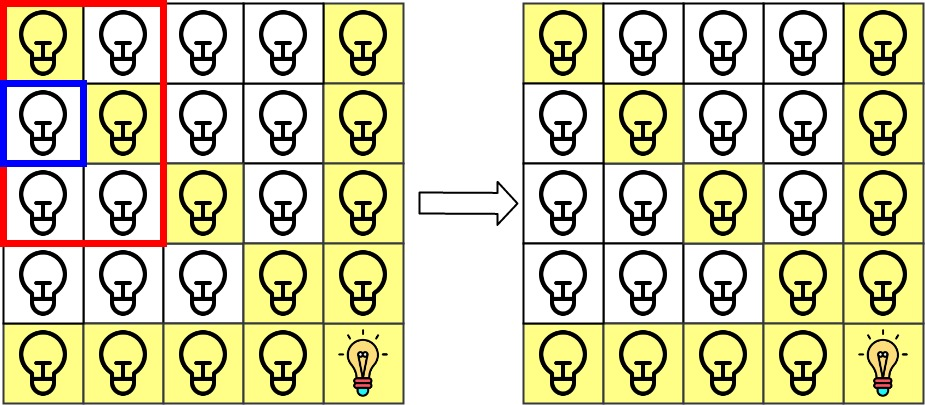

---
categories:
  - algorithm
  - leetcode
tags:
  - Java
author: 
  name: JavaInterview.cn
  link: https://JavaInterview.cn
titleTag: Java
feed:
  enable: true
description: 1001. 网格照明

---

## 题目
在大小为 n x n 的网格 grid 上，每个单元格都有一盏灯，最初灯都处于 关闭 状态。

给你一个由灯的位置组成的二维数组 lamps ，其中 lamps[i] = [rowi, coli] 表示 打开 位于 grid[rowi][coli] 的灯。即便同一盏灯可能在 lamps 中多次列出，不会影响这盏灯处于 打开 状态。

当一盏灯处于打开状态，它将会照亮 自身所在单元格 以及同一 行 、同一 列 和两条 对角线 上的 所有其他单元格 。

另给你一个二维数组 queries ，其中 queries[j] = [rowj, colj] 。对于第 j 个查询，如果单元格 [rowj, colj] 是被照亮的，则查询结果为 1 ，否则为 0 。在第 j 次查询之后 [按照查询的顺序] ，关闭 位于单元格 grid[rowj][colj] 上及相邻 8 个方向上（与单元格 grid[rowi][coli] 共享角或边）的任何灯。

返回一个整数数组 ans 作为答案， ans[j] 应等于第 j 次查询 queries[j] 的结果，1 表示照亮，0 表示未照亮。


示例 1：


    
    输入：n = 5, lamps = [[0,0],[4,4]], queries = [[1,1],[1,0]]
    输出：[1,0]
    解释：最初所有灯都是关闭的。在执行查询之前，打开位于 [0, 0] 和 [4, 4] 的灯。第 0 次查询检查 grid[1][1] 是否被照亮（蓝色方框）。该单元格被照亮，所以 ans[0] = 1 。然后，关闭红色方框中的所有灯。


    第 1 次查询检查 grid[1][0] 是否被照亮（蓝色方框）。该单元格没有被照亮，所以 ans[1] = 0 。然后，关闭红色矩形中的所有灯。


示例 2：

    输入：n = 5, lamps = [[0,0],[4,4]], queries = [[1,1],[1,1]]
    输出：[1,1]
示例 3：

    输入：n = 5, lamps = [[0,0],[0,4]], queries = [[0,4],[0,1],[1,4]]
    输出：[1,1,0]


提示：

* 1 <= n <= 10<sup>9</sup>
* 0 <= lamps.length <= 20000
* 0 <= queries.length <= 20000
* lamps[i].length == 2
* 0 <= rowi, coli < n
* queries[j].length == 2
* 0 <= rowj, colj < n

## 思路

四个哈希表分别表示行、列、正对角线、反对角线的灯的数量

## 解法
```java
class Solution {
    public int[] gridIllumination(int n, int[][] lamps, int[][] queries) {
        //四个哈希表分别表示行、列、正对角线、反对角线的灯的数量
        Map<Integer, Integer> rows = new HashMap<>();  
        Map<Integer, Integer> columns = new HashMap<>(); 
        Map<Integer, Integer> diagonal = new HashMap<>(); 
        Map<Integer, Integer> antiDiagonal = new HashMap<>(); 
        //一个set存放所有的点，记录开灯情况，便于在查询过程中检查周围8个是否开灯
        Set<String> points = new HashSet<>();
        //遍历lamps二维数组，对四个map进行填充，对set中开灯情况进行记录
        for(int[] lamp : lamps){
            //如果这个lamp坐标值已经被记录在points集合中，跳过
            if(!points.add(lamp[0] + "+" + lamp[1])) continue; 
            //否则对四个哈希表进行操作
            rows.put(lamp[0], rows.getOrDefault(lamp[0],0) + 1);
            columns.put(lamp[1], columns.getOrDefault(lamp[1],0) + 1);
            //这里采取对角线与x轴交点的坐标值作为该条对角线的key值
            diagonal.put(lamp[0]-lamp[1], diagonal.getOrDefault(lamp[0] - lamp[1], 0) + 1);
            antiDiagonal.put(lamp[0]+lamp[1], antiDiagonal.getOrDefault(lamp[0] + lamp[1], 0) + 1);
        }
        //开始查询
        int[] res = new int[queries.length];
        for(int i = 0; i < queries.length; i++){
            int row = queries[i][0], column = queries[i][1];
            //判断该点的行、列、两条对角线是否有灯，只要有一条线上有灯亮就置1
            if(rows.getOrDefault(row, 0) > 0) res[i] = 1;
            else if(columns.getOrDefault(column,0) > 0) res[i] = 1;
            else if(diagonal.getOrDefault(row - column, 0) > 0) res[i] = 1;
            else if(antiDiagonal.getOrDefault(row + column, 0) > 0) res[i] = 1;
            //判断该点的周围8点是否有灯打开，执行关灯操作 3*3数组
            for(int x = row - 1; x <= row + 1; x++){
                for(int y = column - 1; y <= column + 1; y++){
                    //越界判断，注意点在最外面一圈的情况
                    if(x < 0 || y < 0 || x >= n || y >= n) continue;
                    //如果set中该点是开着的，移除，将该点所在行、列、两条对角线的值都减1
                    if(points.remove(x + "+" + y)){
                        //行
                        rows.put(x,rows.get(x) - 1);
                        if(rows.get(x) == 0) rows.remove(x); //如果灯亮的次数清为0了，直接从map中移除
                        //列
                        columns.put(y,columns.get(y) - 1);
                        if(columns.get(y) == 0) columns.remove(y); 
                        //正对角线
                        diagonal.put(x-y,diagonal.get(x-y) - 1);
                        if(diagonal.get(x-y) == 0) diagonal.remove(x-y); 
                        //反对角线
                        antiDiagonal.put(x+y,antiDiagonal.get(x+y) - 1);
                        if(antiDiagonal.get(x+y) == 0) antiDiagonal.remove(x+y);
                    }
                    //完成hashmap和set的更新，进行下一个坐标的判断
                }
            }
        }
        return res;
    }
}

```

## 总结

- 分析出几种情况，然后分别对各个情况实现 
