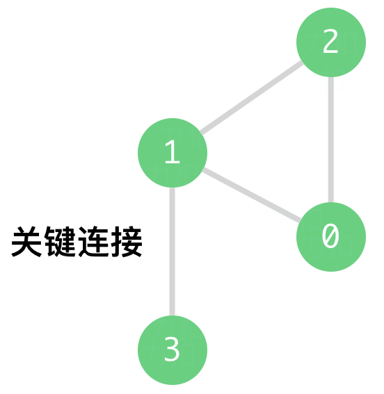

---
categories:
  - algorithm
  - leetcode
tags:
  - 
author: 
  name: JavaInterview.cn
  link: https://JavaInterview.cn
titleTag: Java
---


## 题目

力扣数据中心有 n 台服务器，分别按从 0 到 n-1 的方式进行了编号。它们之间以 服务器到服务器 的形式相互连接组成了一个内部集群，连接是无向的。用  connections 表示集群网络，connections[i] = [a, b] 表示服务器 a 和 b 之间形成连接。任何服务器都可以直接或者间接地通过网络到达任何其他服务器。

关键连接 是在该集群中的重要连接，假如我们将它移除，便会导致某些服务器无法访问其他服务器。

请你以任意顺序返回该集群内的所有 关键连接 。


示例 1：



    输入：n = 4, connections = [[0,1],[1,2],[2,0],[1,3]]
    输出：[[1,3]]
    解释：[[3,1]] 也是正确的。
示例 2:

    输入：n = 2, connections = [[0,1]]
    输出：[[0,1]]


提示：

* 2 <= n <= 10<sup>5</sup>
* n - 1 <= connections.length <= 10<sup>5</sup>
* 0 <= ai, bi <= n - 1
* ai != bi
* 不存在重复的连接

## 思路

tarjan找桥模板

## 解法
```java

import java.util.*;

class Solution {
    int [] dfn  ;
    int [] low  ;
    ArrayList<Integer>[] map;
    int [] father;
    List<List<Integer>> lists;
    int times;


    public List<List<Integer>> criticalConnections(int n, List<List<Integer>> connections) {
        lists = new ArrayList<>();
        father = new int[n];
        dfn = new int[n];
        low = new int[n];
        map = new ArrayList[n];
        times = 0;

        for (List<Integer> connection : connections) {

            if( map[connection.get(0)] == null)
            {
                map[connection.get(0)] = new ArrayList();
            }
            if( map[connection.get(1)] == null)
            {
                map[connection.get(1)] = new ArrayList();
            }
            map[connection.get(0)].add(connection.get(1));

            map[connection.get(1)].add(connection.get(0));
        }
        tarjan(0);
        return lists;
    }

    void tarjan ( int point)
    {
        dfn[point] = low[point] = ++times;

        for (int k = 0; k < map[point].size(); k++) {

            int i =  map[point].get(k);

            if(dfn[i] == 0)
            {
                father[i] = point;
                tarjan(i);

                if(low[i] > dfn[point])
                {
                    ArrayList<Integer> temp = new ArrayList<>();
                    temp.add(i);
                    temp.add(point);
                    lists.add(temp);
                }
                low[point] = Math.min(low[point],low[i]);
            }
            if(father[point] != i)
            {
                low[point] = Math.min(low[point],low[i]);
            }
        }
    }
}
```

## 总结

- 分析出几种情况，然后分别对各个情况实现 
