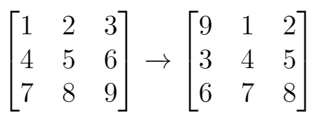

## 题目

给你一个 m 行 n 列的二维网格 grid 和一个整数 k。你需要将 grid 迁移 k 次。

每次「迁移」操作将会引发下述活动：

* 位于 grid[i][j]（j < n - 1）的元素将会移动到 grid[i][j + 1]。
* 位于 grid[i][n - 1] 的元素将会移动到 grid[i + 1][0]。
* 位于 grid[m - 1][n - 1] 的元素将会移动到 grid[0][0]。
请你返回 k 次迁移操作后最终得到的 二维网格。


示例 1：



    输入：grid = [[1,2,3],[4,5,6],[7,8,9]], k = 1
    输出：[[9,1,2],[3,4,5],[6,7,8]]
示例 2：


    输入：grid = [[3,8,1,9],[19,7,2,5],[4,6,11,10],[12,0,21,13]], k = 4
    输出：[[12,0,21,13],[3,8,1,9],[19,7,2,5],[4,6,11,10]]
示例 3：

    输入：grid = [[1,2,3],[4,5,6],[7,8,9]], k = 9
    输出：[[1,2,3],[4,5,6],[7,8,9]]


提示：

* m == grid.length
* n == grid[i].length
* 1 <= m <= 50
* 1 <= n <= 50
* -1000 <= grid[i][j] <= 1000
* 0 <= k <= 100

## 思路

// 可以把grid想象成长度为m * n的一维数组，题目的意思相当于是把这个长度为m * n的一维数组循环移动k位
// 我们只需要从移动到(0, 0)位置的坐标开始模拟即可

## 解法
```java

class Solution {
    public List<List<Integer>> shiftGrid(int[][] grid, int k) {
        int m = grid.length, n = grid[0].length;
        List<List<Integer>> ans = new ArrayList<>();
        for (int i = 0; i < m; i++) {
            ans.add(new ArrayList<>());
        }
        k %= m * n;
        for (int i = 0; i < m * n; i++) {
            int j = (m * n + i - k) % (m * n);
            int row = j / n, column = j % n;
            ans.get(i / n).add(grid[row][column]);
        }
        return ans;
    }
}
```

## 总结

- 分析出几种情况，然后分别对各个情况实现 
