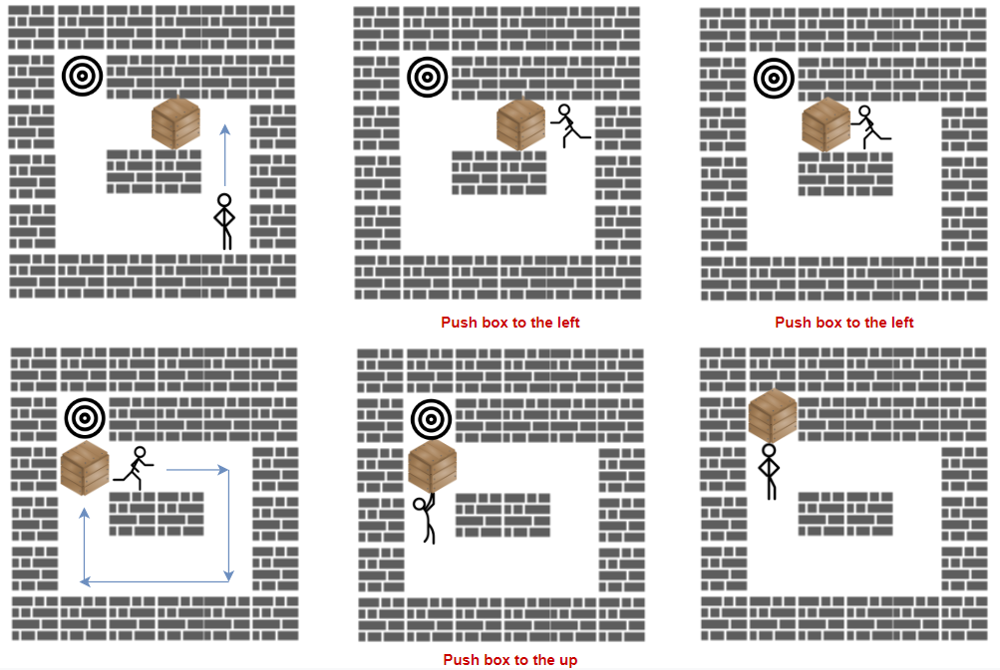

---
categories:
  - algorithm
  - leetcode
tags:
  - Java
author: 
  name: JavaInterview.cn
  link: https://JavaInterview.cn
titleTag: Java
feed:
  enable: true
description: 1263. 推箱子

---

## 题目

「推箱子」是一款风靡全球的益智小游戏，玩家需要将箱子推到仓库中的目标位置。

游戏地图用大小为 m x n 的网格 grid 表示，其中每个元素可以是墙、地板或者是箱子。

现在你将作为玩家参与游戏，按规则将箱子 'B' 移动到目标位置 'T' ：

* 玩家用字符 'S' 表示，只要他在地板上，就可以在网格中向上、下、左、右四个方向移动。
* 地板用字符 '.' 表示，意味着可以自由行走。
* 墙用字符 '#' 表示，意味着障碍物，不能通行。
* 箱子仅有一个，用字符 'B' 表示。相应地，网格上有一个目标位置 'T'。
* 玩家需要站在箱子旁边，然后沿着箱子的方向进行移动，此时箱子会被移动到相邻的地板单元格。记作一次「推动」。
* 玩家无法越过箱子。
返回将箱子推到目标位置的最小 推动 次数，如果无法做到，请返回 -1。


示例 1：



    输入：grid = [["#","#","#","#","#","#"],
    ["#","T","#","#","#","#"],
    ["#",".",".","B",".","#"],
    ["#",".","#","#",".","#"],
    ["#",".",".",".","S","#"],
    ["#","#","#","#","#","#"]]
    输出：3
    解释：我们只需要返回推箱子的次数。
示例 2：

    输入：grid = [["#","#","#","#","#","#"],
    ["#","T","#","#","#","#"],
    ["#",".",".","B",".","#"],
    ["#","#","#","#",".","#"],
    ["#",".",".",".","S","#"],
    ["#","#","#","#","#","#"]]
    输出：-1
示例 3：

    输入：grid = [["#","#","#","#","#","#"],
    ["#","T",".",".","#","#"],
    ["#",".","#","B",".","#"],
    ["#",".",".",".",".","#"],
    ["#",".",".",".","S","#"],
    ["#","#","#","#","#","#"]]
    输出：5
    解释：向下、向左、向左、向上再向上。


提示：

* m == grid.length
* n == grid[i].length
* 1 <= m, n <= 20
* grid 仅包含字符 '.', '#',  'S' , 'T', 以及 'B'。
* grid 中 'S', 'B' 和 'T' 各只能出现一个。

## 思路

记忆化BFS

## 解法
```java
class Solution {
    public int minPushBox(char[][] grid) {
        int m = grid[0].length, n = grid.length;
        int[] S = new int[2] , B = new int[2] ,T = new int[2];
        for(int i=0; i<n; i++){
            for(int j=0; j<m; j++){
                if(grid[i][j] == '#') continue;
                if(grid[i][j] == 'S') {
                    S[0] = i;
                    S[1] = j;
                }else if(grid[i][j] == 'B') {
                    B[0] = i;
                    B[1] = j;
                } else if(grid[i][j] == 'T'){
                    T[0] = i;
                    T[1] = j;
                }
            }
        }
        int[][] f = new int[n][m];
        Deque<int[]> q = new LinkedList<>();
        q.add(new int[]{B[0],B[1],S[0],S[1]});
        int k = 0, size = 1;
        while(!q.isEmpty()){
            int[] res = q.poll();
            int i= res[0], j = res[1],x = res[2],y = res[3];
            if(i == T[0] && j == T[1]) return k;
            boolean[][] g = new boolean[n][m];
            grid[i][j] = 'B';
            dfs(g,x,y,grid);
            
            if((f[i][j] & 1) == 0 && i-1 >=0 && grid[i-1][j] != '#' && i+1 < n && g[i+1][j]) {
                f[i][j] |= 1;
                q.add(new int[]{i-1,j,i,j});
            }
            if((f[i][j] & 2) == 0 && j+1 < m && grid[i][j+1] != '#' && j-1 >= 0 && g[i][j-1]) {
                f[i][j] |= 2;
                q.add(new int[]{i,j+1,i,j});
            }
            if((f[i][j] & 4) == 0 && i+1 < n && grid[i+1][j] != '#' && i-1 >=0 && g[i-1][j]) {
                f[i][j] |= 4;
                q.add(new int[]{i+1,j,i,j});
            }
            if((f[i][j] & 8) == 0 && j-1 >=0 && grid[i][j-1] != '#' && j+1 < m && g[i][j+1]) {
                f[i][j] |= 8;
                q.add(new int[]{i,j-1,i,j});
            }
            grid[i][j] = '.';
            if(--size == 0){
                k++;
                size = q.size();
            }
        }
        return -1;
    }
    private void dfs(boolean[][] g,int i, int j, char[][] grid){
        g[i][j] = true;
        if(i-1 >= 0 && grid[i-1][j] != '#' && grid[i-1][j] != 'B' && !g[i-1][j]) dfs(g,i-1,j,grid);
        if(i+1 < g.length && grid[i+1][j] != '#' && grid[i+1][j] != 'B' && !g[i+1][j]) dfs(g,i+1,j,grid);
        if(j-1 >= 0 && grid[i][j-1] != '#' && grid[i][j-1] != 'B' && !g[i][j-1]) dfs(g,i,j-1,grid);
        if(j+1 < g[0].length && grid[i][j+1] != '#' && grid[i][j+1] != 'B' && !g[i][j+1]) dfs(g,i,j+1,grid);
    }
}

```

## 总结

- 分析出几种情况，然后分别对各个情况实现 
