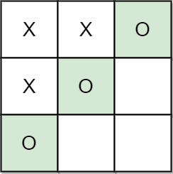

---
categories:
  - algorithm
  - leetcode
tags:
  - Java
author: 
  name: JavaInterview.cn
  link: https://JavaInterview.cn
titleTag: Java
feed:
  enable: true
description: 1275. 找出井字棋的获胜者

---

## 题目

井字棋 是由两个玩家 A 和 B 在 3 x 3 的棋盘上进行的游戏。井字棋游戏的规则如下：

* 玩家轮流将棋子放在空方格 (' ') 上。
* 第一个玩家 A 总是用 'X' 作为棋子，而第二个玩家 B 总是用 'O' 作为棋子。
* 'X' 和 'O' 只能放在空方格中，而不能放在已经被占用的方格上。
* 只要有 3 个相同的（非空）棋子排成一条直线（行、列、对角线）时，游戏结束。
* 如果所有方块都放满棋子（不为空），游戏也会结束。
* 游戏结束后，棋子无法再进行任何移动。
* 给你一个数组 moves，其中 moves[i] = [rowi, coli] 表示第 i 次移动在 grid[rowi][coli]。如果游戏存在获胜者（A 或 B），就返回该游戏的获胜者；如果游戏以平局结束，则返回 "Draw"；如果仍会有行动（游戏未结束），则返回 "Pending"。

你可以假设 moves 都 有效（遵循 井字棋 规则），网格最初是空的，A 将先行动。


示例 1：


    输入：moves = [[0,0],[2,0],[1,1],[2,1],[2,2]]
    输出："A"
    解释："A" 获胜，他总是先走。
示例 2：


    输入：moves = [[0,0],[1,1],[0,1],[0,2],[1,0],[2,0]]
    输出："B"
    解释："B" 获胜。
示例 3：


    输入：moves = [[0,0],[1,1],[2,0],[1,0],[1,2],[2,1],[0,1],[0,2],[2,2]]
    输出："Draw"
    解释：由于没有办法再行动，游戏以平局结束。


提示：

* 1 <= moves.length <= 9
* moves[i].length == 2
* 0 <= moves[i][j] <= 2
* moves 里没有重复的元素。
* moves 遵循井字棋的规则。

## 思路

char[][] f = new char[3][3];

## 解法
```java
class Solution {
    public String tictactoe(int[][] moves) {
        char[][] f = new char[3][3];
        int cnt = 0;
        for (int[] tmp : moves){
            if (cnt == 0){
                f[tmp[0]][tmp[1]] = 'X';
                cnt = 1;
            } else {
                f[tmp[0]][tmp[1]] = 'O';
                cnt = 0;
            }
        }
        return check(f);
    }

    String check(char[][] f){
        if (f[0][0] == 'X' && f[0][1] == 'X' && f[0][2] == 'X'){
            return "A";
        }
        if (f[1][0] == 'X' && f[1][1] == 'X' && f[1][2] == 'X'){
            return "A";
        }
        if (f[2][0] == 'X' && f[2][1] == 'X' && f[2][2] == 'X'){
            return "A";
        }
        if (f[0][0] == 'X' && f[1][0] == 'X' && f[2][0] == 'X'){
            return "A";
        }
        if (f[0][1] == 'X' && f[1][1] == 'X' && f[2][1] == 'X'){
            return "A";
        }
        if (f[0][2] == 'X' && f[1][2] == 'X' && f[2][2] == 'X'){
            return "A";
        }
        if (f[0][0] == 'X' && f[1][1] == 'X' && f[2][2] == 'X'){
            return "A";
        }
        if (f[0][2] == 'X' && f[1][1] == 'X' && f[2][0] == 'X'){
            return "A";
        }
        if (f[0][0] == 'O' && f[0][1] == 'O' && f[0][2] == 'O'){
            return "B";
        }
        if (f[1][0] == 'O' && f[1][1] == 'O' && f[1][2] == 'O'){
            return "B";
        }
        if (f[2][0] == 'O' && f[2][1] == 'O' && f[2][2] == 'O'){
            return "B";
        }
        if (f[0][0] == 'O' && f[1][0] == 'O' && f[2][0] == 'O'){
            return "B";
        }
        if (f[0][1] == 'O' && f[1][1] == 'O' && f[2][1] == 'O'){
            return "B";
        }
        if (f[0][2] == 'O' && f[1][2] == 'O' && f[2][2] == 'O'){
            return "B";
        }
        if (f[0][0] == 'O' && f[1][1] == 'O' && f[2][2] == 'O'){
            return "B";
        }
        if (f[0][2] == 'O' && f[1][1] == 'O' && f[2][0] == 'O'){
            return "B";
        }
        for (int i = 0;i < 3;i++){
            for (int j = 0;j < 3;j++){
                if (f[i][j] != 'X' && f[i][j] != 'O'){
                    return "Pending";
                }
            }
        }
        return "Draw";
    }
}

```

## 总结

- 分析出几种情况，然后分别对各个情况实现 
