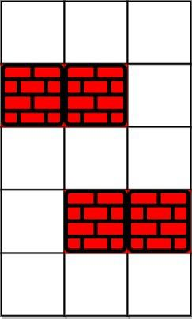

---
categories:
  - algorithm
  - leetcode
tags:
  - Java
author: 
  name: JavaInterview.cn
  link: https://JavaInterview.cn
titleTag: Java
feed:
  enable: true
description: 1293. 网格中的最短路径

---

## 题目

给你一个 m * n 的网格，其中每个单元格不是 0（空）就是 1（障碍物）。每一步，您都可以在空白单元格中上、下、左、右移动。

如果您 最多 可以消除 k 个障碍物，请找出从左上角 (0, 0) 到右下角 (m-1, n-1) 的最短路径，并返回通过该路径所需的步数。如果找不到这样的路径，则返回 -1 。


示例 1：


    输入： grid = [[0,0,0],[1,1,0],[0,0,0],[0,1,1],[0,0,0]], k = 1
    输出：6
    解释：
    不消除任何障碍的最短路径是 10。
    消除位置 (3,2) 处的障碍后，最短路径是 6 。该路径是 (0,0) -> (0,1) -> (0,2) -> (1,2) -> (2,2) -> (3,2) -> (4,2).
示例 2：



    输入：grid = [[0,1,1],[1,1,1],[1,0,0]], k = 1
    输出：-1
    解释：我们至少需要消除两个障碍才能找到这样的路径。


提示：
* grid.length == m
* grid[0].length == n
* 1 <= m, n <= 40
* 1 <= k <= m*n
* grid[i][j] 是 0 或 1
* grid[0][0] == grid[m-1][n-1] == 0

## 思路

private int[][] dirs = {{0,1}, {1,0}, {0,-1},{-1,0}};

## 解法
```java
class Solution {

	private int[][] dirs = {{0,1}, {1,0}, {0,-1},{-1,0}};

	public int shortestPath(int[][] grid, int k) {
		int m = grid.length;
		int n = grid[0].length;
		if (m == 1 && n == 1) return 0;
		Queue<int[]> queue = new LinkedList<>();
		int[][] vis = new int[m][n];
		for (int[] vi : vis)
			Arrays.fill(vi, -1);
		queue.add(new int[]{0, 0, 0, k});
		vis[0][0] = k;
		while (!queue.isEmpty()) {
			int[] poll = queue.poll();
			for (int[] dir : dirs) {
				int x = poll[0] + dir[0];
				int y = poll[1] + dir[1];
				int z = poll[2];
				int r = poll[3];
				if (x >= 0 && x < m && y >= 0 && y < n) {
					if (x == m - 1 && y == n - 1) {
						return z + 1;
					}
					r -= grid[x][y];
					if (r >= 0 && r > vis[x][y]) {
						queue.add(new int[]{x, y, z+1, r});
						vis[x][y] = r;
					}
				}
			}
		}
		return -1;
    }
}

```

## 总结

- 分析出几种情况，然后分别对各个情况实现 
