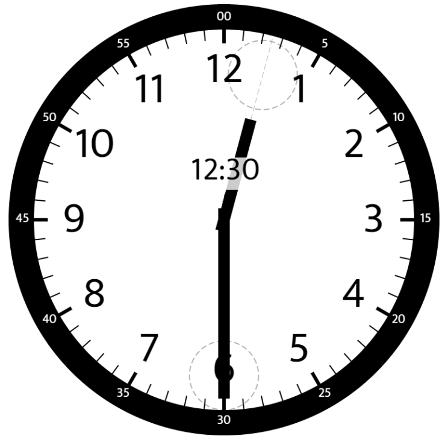

## 题目

给你两个数 hour 和 minutes 。请你返回在时钟上，由给定时间的时针和分针组成的较小角的角度（60 单位制）。


示例 1：



    输入：hour = 12, minutes = 30
    输出：165
示例 2：


    输入：hour = 3, minutes = 30
    输出；75
示例 3：


    输入：hour = 3, minutes = 15
    输出：7.5
示例 4：

    输入：hour = 4, minutes = 50
    输出：155
示例 5：

    输入：hour = 12, minutes = 0
    输出：0


提示：

* 1 <= hour <= 12
* 0 <= minutes <= 59
* 与标准答案误差在 10^-5 以内的结果都被视为正确结果。

## 思路

Math.abs

## 解法
```java
class Solution {
    // 简单题
    public static double angleClock(int hour, int minutes) {
        double hourAngle = (hour % 12 + minutes / 60.0) * 30;
        double minuteAngle = minutes * 6;
        double angle = Math.abs(hourAngle - minuteAngle);
        return Math.min(angle, 360 - angle);
    }
}

```

## 总结

- 分析出几种情况，然后分别对各个情况实现 
