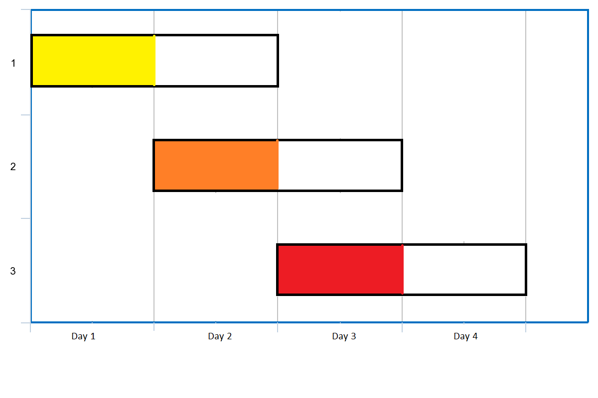

---
categories:
  - algorithm
  - leetcode
tags:
  - Java
author: 
  name: JavaInterview.cn
  link: https://JavaInterview.cn
titleTag: Java
feed:
  enable: true
description: 1353. 最多可以参加的会议数目

---

## 题目
给你一个数组 events，其中 events[i] = [startDayi, endDayi] ，表示会议 i 开始于 startDayi ，结束于 endDayi 。

你可以在满足 startDayi <= d <= endDayi 中的任意一天 d 参加会议 i 。在任意一天 d 中只能参加一场会议。

请你返回你可以参加的 最大 会议数目。


示例 1：



    输入：events = [[1,2],[2,3],[3,4]]
    输出：3
    解释：你可以参加所有的三个会议。
    安排会议的一种方案如上图。
    第 1 天参加第一个会议。
    第 2 天参加第二个会议。
    第 3 天参加第三个会议。
示例 2：

    输入：events= [[1,2],[2,3],[3,4],[1,2]]
    输出：4


提示：​​​​​​

* 1 <= events.length <= 10<sup>5</sup>
* events[i].length == 2
* 1 <= startDayi <= endDayi <= 10<sup>5</sup>

## 思路


    //对会议进行排序，会议开始时间从下到大
    //能参与会议最多的情况就是优先去参加会议结束时间最近的会议
    //所以要保存会议结束时间最近的会议 考虑使用数据结构小顶堆

## 解法
```java
class Solution {
    public int maxEvents(int[][] events) {
        //对会议进行排序，会议开始时间从下到大
        //能参与会议最多的情况就是优先去参加会议结束时间最近的会议
        //所以要保存会议结束时间最近的会议 考虑使用数据结构小顶堆
        List<int[]> list = Arrays.stream(events).sorted(Comparator.comparingInt(a -> a[0])).collect(Collectors.toList());;
        PriorityQueue<Integer> pq = new PriorityQueue<>();
        int length = list.size();
        int currDay = 1;
        int i = 0;
        int count = 0;

        //所有会议没有遍历完或者堆中还有元素继续循环
        while(i < length || !pq.isEmpty()) {
            //添加会议起始日期为currDay的所有会议结束时间
            while(i < length && list.get(i)[0] == currDay) {
                pq.add(list.get(i)[1]);
                i++;
            }

            //对于结束日期小于当前天没有参与的会议 直接排除
            while(!pq.isEmpty() && pq.peek() < currDay) {
                pq.remove();
            }

            //若堆不为空 从堆中删除最小堆顶 即参与结束时间最早的会议
            if(!pq.isEmpty()) {
                pq.remove();
                count++;
            }

            //当前天增加
            currDay++;

        }
        return count;
    }
}
```

## 总结

- 分析出几种情况，然后分别对各个情况实现 
