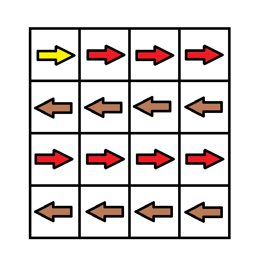

---
categories:
  - algorithm
  - leetcode
tags:
  - Java
author: 
  name: JavaInterview.cn
  link: https://JavaInterview.cn
titleTag: Java
feed:
  enable: true
description: 1368. 使网格图至少有一条有效路径的最小代价

---

## 题目

给你一个 m x n 的网格图 grid 。 grid 中每个格子都有一个数字，对应着从该格子出发下一步走的方向。 grid[i][j] 中的数字可能为以下几种情况：

* 1 ，下一步往右走，也就是你会从 grid[i][j] 走到 grid[i][j + 1]
* 2 ，下一步往左走，也就是你会从 grid[i][j] 走到 grid[i][j - 1]
* 3 ，下一步往下走，也就是你会从 grid[i][j] 走到 grid[i + 1][j]
* 4 ，下一步往上走，也就是你会从 grid[i][j] 走到 grid[i - 1][j]
注意网格图中可能会有 无效数字 ，因为它们可能指向 grid 以外的区域。

一开始，你会从最左上角的格子 (0,0) 出发。我们定义一条 有效路径 为从格子 (0,0) 出发，每一步都顺着数字对应方向走，最终在最右下角的格子 (m - 1, n - 1) 结束的路径。有效路径 不需要是最短路径 。

你可以花费 cost = 1 的代价修改一个格子中的数字，但每个格子中的数字 只能修改一次 。

请你返回让网格图至少有一条有效路径的最小代价。


示例 1：



    输入：grid = [[1,1,1,1],[2,2,2,2],[1,1,1,1],[2,2,2,2]]
    输出：3
    解释：你将从点 (0, 0) 出发。
    到达 (3, 3) 的路径为： (0, 0) --> (0, 1) --> (0, 2) --> (0, 3) 花费代价 cost = 1 使方向向下 --> (1, 3) --> (1, 2) --> (1, 1) --> (1, 0) 花费代价 cost = 1 使方向向下 --> (2, 0) --> (2, 1) --> (2, 2) --> (2, 3) 花费代价 cost = 1 使方向向下 --> (3, 3)
    总花费为 cost = 3.
示例 2：


    输入：grid = [[1,1,3],[3,2,2],[1,1,4]]
    输出：0
    解释：不修改任何数字你就可以从 (0, 0) 到达 (2, 2) 。
示例 3：


    输入：grid = [[1,2],[4,3]]
    输出：1
示例 4：

    输入：grid = [[2,2,2],[2,2,2]]
    输出：3
示例 5：

    输入：grid = [[4]]
    输出：0


提示：

* m == grid.length
* n == grid[i].length
* 1 <= m, n <= 100

## 思路

dp数组

## 解法
```java

class Solution {
public int minCost(int[][] grid) {
        Queue<int[]>queue=new LinkedList();//，每个queue元素是[x,y]
        int[][]direction={{0,0},{0,1},{0,-1},{1,0},{-1,0}};
        //四个方向有五个是因为为了和题里面的1,2,3,4四个编号匹配上
        queue.add(new int[]{0,0});//把初始位置加进去
        int[][]count=new int[grid.length][grid[0].length];//记录每个节点的cost花费情况
        for(int i=0;i<count.length;i++){
            for(int j=0;j<count[i].length;j++)
                count[i][j]=Integer.MAX_VALUE;
                //赋值为最大值，因为下面的cost要比当前的值小才能更新
        }
        
        count[0][0]=0;
        while(!queue.isEmpty()){
            int[]current=queue.poll();
            int nowX=current[0];
            int nowY=current[1];
            for(int i=1;i<5;i++){
                //四个方向都走一遍试试，看哪个的cost最小
                int nextX=nowX+direction[i][0];
                int nextY=nowY+direction[i][1];
                if(nextX<0||nextX>=grid.length||nextY<0||nextY>=grid[0].length)//下一步出界了
                	continue;
                int cost=count[nowX][nowY]+(grid[nowX][nowY]==i?0:1);
                //如果我走的方向和格子上的数字不一样，就要花费cost
                if(cost<count[nextX][nextY]){
                    count[nextX][nextY]=cost;//更新下一步的cost
                    queue.add(new int[]{nextX,nextY});
                }
            }
        }
        /*for(int i=0;i<count.length;i++){
            for(int j=0;j<count[i].length;j++){
                System.out.print(count[i][j]+" ");//查看最后的count情况
            }
            System.out.println();
        }*/
        return count[grid.length-1][grid[0].length-1];
    }
}
```

## 总结

- 分析出几种情况，然后分别对各个情况实现 
