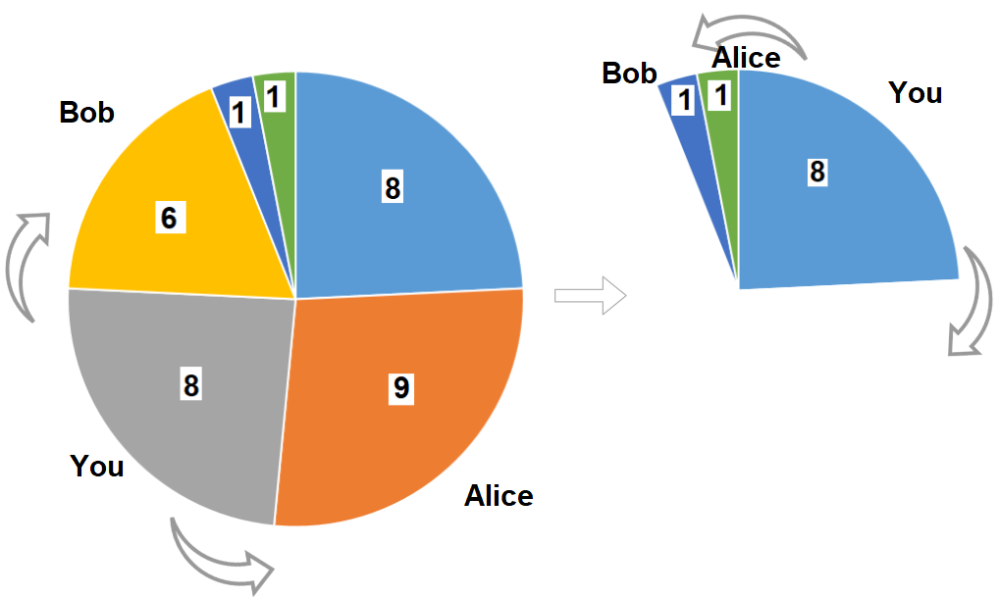

---
categories:
  - algorithm
  - leetcode
tags:
  - Java
author: 
  name: JavaInterview.cn
  link: https://JavaInterview.cn
titleTag: Java
feed:
  enable: true
description: 1388. 3n 块披萨

---

## 题目
给你一个披萨，它由 3n 块不同大小的部分组成，现在你和你的朋友们需要按照如下规则来分披萨：

* 你挑选 任意 一块披萨。
* Alice 将会挑选你所选择的披萨逆时针方向的下一块披萨。
* Bob 将会挑选你所选择的披萨顺时针方向的下一块披萨。
* 重复上述过程直到没有披萨剩下。
每一块披萨的大小按顺时针方向由循环数组 slices 表示。

请你返回你可以获得的披萨大小总和的最大值。


示例 1：


    输入：slices = [1,2,3,4,5,6]
    输出：10
    解释：选择大小为 4 的披萨，Alice 和 Bob 分别挑选大小为 3 和 5 的披萨。然后你选择大小为 6 的披萨，Alice 和 Bob 分别挑选大小为 2 和 1 的披萨。你获得的披萨总大小为 4 + 6 = 10 。
示例 2：



    输入：slices = [8,9,8,6,1,1]
    输出：16
    解释：两轮都选大小为 8 的披萨。如果你选择大小为 9 的披萨，你的朋友们就会选择大小为 8 的披萨，这种情况下你的总和不是最大的。


提示：

* 1 <= slices.length <= 500
* slices.length % 3 == 0
* 1 <= slices[i] <= 1000


## 思路

01背包dp

## 解法
```java
class Solution {
    // 01背包dp,本质是环形数组打家劫舍问题
    // 环形首尾不可同时选，分别以原数组[0,n-2]、[1,n-1]两段作为新数组进行01背包，选出若干个不相邻的值，使得和最大。
    // 本题的解题区别在于规定了选取的数字个数，必须选出n/3个数求和，所以需要在打家劫舍问题基础上增加一维选取数量。
    // dp[i][j]代表从数组前i位中选取j个数的最大和。
    public int maxSizeSlices(int[] nums) {
        int n = nums.length, m = n/3;
        int[][] dp1 = new int[n+1][m+1];
        int[][] dp2 = new int[n+1][m+1];
        for(int i = 0; i < n-1; ++i){
            for(int j = 1; j <= m; ++j){
                dp1[i+2][j] = Math.max(dp1[i+1][j], dp1[i][j-1] + nums[i]);
                dp2[i+2][j] = Math.max(dp2[i+1][j], dp2[i][j-1] + nums[i+1]);
            }
        }
        return Math.max(dp1[n][m], dp2[n][m]);
    }
}

```

## 总结

- 分析出几种情况，然后分别对各个情况实现 
