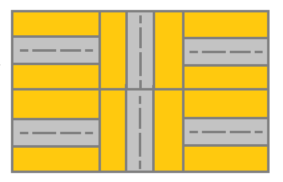

## 题目
给你一个 m x n 的网格 grid。网格里的每个单元都代表一条街道。grid[i][j] 的街道可以是：

* 1 表示连接左单元格和右单元格的街道。
* 2 表示连接上单元格和下单元格的街道。
* 3 表示连接左单元格和下单元格的街道。
* 4 表示连接右单元格和下单元格的街道。
* 5 表示连接左单元格和上单元格的街道。
* 6 表示连接右单元格和上单元格的街道。


你最开始从左上角的单元格 (0,0) 开始出发，网格中的「有效路径」是指从左上方的单元格 (0,0) 开始、一直到右下方的 (m-1,n-1) 结束的路径。该路径必须只沿着街道走。

注意：你 不能 变更街道。

如果网格中存在有效的路径，则返回 true，否则返回 false 。


示例 1：


    输入：grid = [[2,4,3],[6,5,2]]
    输出：true
    解释：如图所示，你可以从 (0, 0) 开始，访问网格中的所有单元格并到达 (m - 1, n - 1) 。
示例 2：



    输入：grid = [[1,2,1],[1,2,1]]
    输出：false
    解释：如图所示，单元格 (0, 0) 上的街道没有与任何其他单元格上的街道相连，你只会停在 (0, 0) 处。
示例 3：
    
    输入：grid = [[1,1,2]]
    输出：false
    解释：你会停在 (0, 1)，而且无法到达 (0, 2) 。
示例 4：

    输入：grid = [[1,1,1,1,1,1,3]]
    输出：true
示例 5：

    输入：grid = [[2],[2],[2],[2],[2],[2],[6]]
    输出：true


提示：

* m == grid.length
* n == grid[i].length
* 1 <= m, n <= 300
* 1 <= grid[i][j] <= 6


## 思路

dfs

## 解法
```java
class Solution {
    private boolean flag = false;
    private static final int[][][] dirs
            = {{{}}, {{0,1},{0,-1}}, {{1,0},{-1,0}}, {{0,-1},{1,0}}, {{0,1},{1,0}}, {{0,-1},{-1,0}}, {{0,1},{-1,0}}};

    public boolean hasValidPath(int[][] grid) {
        int m = grid.length;
        int n = grid[0].length;
        boolean[][] vis = new boolean[m][n];
        dfs(grid, vis, m, n, 0, 0);
        return flag;
    }

    private boolean dfs(int[][] grid, boolean[][] vis, int m, int n, int i, int j) {
        if (i == m - 1 && j == n - 1)
            return flag = true;
        vis[i][j] = true;
        for (int[] dir : dirs[grid[i][j]]) {
            int newX = i + dir[0];
            int newY = j + dir[1];
            if (newX >= 0 && newX < m && newY >= 0 && newY < n
                    && !vis[newX][newY] && check(grid, i, j, newX, newY))
                if (dfs(grid, vis, m, n, newX, newY))
                    return true;
        }
        return false;
    }

    private boolean check(int[][] grid, int x, int y, int newX, int newY) {
        for (int[] d : dirs[grid[newX][newY]])
            if (newX + d[0] == x && newY + d[1] == y)
                return true;
        return false;
    }
}

```

## 总结

- 分析出几种情况，然后分别对各个情况实现 
