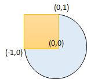

## 题目
给你一个以 (radius, xCenter, yCenter) 表示的圆和一个与坐标轴平行的矩形 (x1, y1, x2, y2) ，其中 (x1, y1) 是矩形左下角的坐标，而 (x2, y2) 是右上角的坐标。

如果圆和矩形有重叠的部分，请你返回 true ，否则返回 false 。

换句话说，请你检测是否 存在 点 (xi, yi) ，它既在圆上也在矩形上（两者都包括点落在边界上的情况）。


示例 1 ：

    
    输入：radius = 1, xCenter = 0, yCenter = 0, x1 = 1, y1 = -1, x2 = 3, y2 = 1
    输出：true
    解释：圆和矩形存在公共点 (1,0) 。
示例 2 ：

    输入：radius = 1, xCenter = 1, yCenter = 1, x1 = 1, y1 = -3, x2 = 2, y2 = -1
    输出：false
示例 3 ：


    输入：radius = 1, xCenter = 0, yCenter = 0, x1 = -1, y1 = 0, x2 = 0, y2 = 1
    输出：true


提示：

* 1 <= radius <= 2000
* -10<sup>4</sup> <= xCenter, yCenter <= 10<sup>4</sup>
* -10<sup>4</sup> <= x1 < x2 <= 10<sup>4</sup>
* -10<sup>4</sup> <= y1 < y2 <= 10<sup>4</sup>


## 思路
先判断圆心是否在矩形内部，然后判断四条边到圆心的距离是否小于R。


## 解法
```java
class Solution {
    public boolean checkOverlap(int radius, int x_center, int y_center, int x1, int y1, int x2, int y2) {
        if (x_center >= x1 && x_center <= x2 && y_center >= y1 && y_center <= y2)
            return true;    // 圆心在矩形内部
        // y = x1
        int dis = 0, xdiff = 0, ydiff = 0;
        if (y_center < y1 || y_center > y2)
            ydiff = Math.min(Math.abs(y1 - y_center), Math.abs(y2 - y_center));
        dis = (x1 - x_center) * (x1 - x_center) + ydiff * ydiff;
        if (dis <= radius * radius)
            return true;
        // y = x2
        dis = (x2 - x_center) * (x2 - x_center) + ydiff * ydiff;
        if (dis <= radius * radius)
            return true;
        // x = y1
        if (x_center < x1 || x_center > x2)
            xdiff = Math.min(Math.abs(x1 - x_center), Math.abs(x2 - x_center));
        dis = (y1 - y_center) * (y1 - y_center) + xdiff * xdiff;
        if (dis <= radius * radius)
            return true;
        // x = y2
        dis = (y2 - y_center) * (y2 - y_center) + xdiff * xdiff;
        if (dis <= radius * radius)
            return true;
        return false;
    }
}

```

## 总结

- 分析出几种情况，然后分别对各个情况实现 
