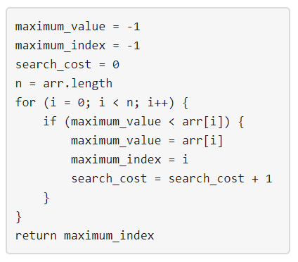

## 题目
给定三个整数 n、m 和 k 。考虑使用下图描述的算法找出正整数数组中最大的元素。



请你构建一个具有以下属性的数组 arr ：

* arr 中包含确切的 n 个整数。
* 1 <= arr[i] <= m 其中 (0 <= i < n) 。
* 将上面提到的算法应用于 arr 之后，search_cost 的值等于 k 。
返回在满足上述条件的情况下构建数组 arr 的 方法数量 ，由于答案可能会很大，所以 必须 对 10^9 + 7 取余。


示例 1：

    输入：n = 2, m = 3, k = 1
    输出：6
    解释：可能的数组分别为 [1, 1], [2, 1], [2, 2], [3, 1], [3, 2] [3, 3]
示例 2：

    输入：n = 5, m = 2, k = 3
    输出：0
    解释：没有数组可以满足上述条件
示例 3：

    输入：n = 9, m = 1, k = 1
    输出：1
    解释：唯一可能的数组是 [1, 1, 1, 1, 1, 1, 1, 1, 1]


提示：

* 1 <= n <= 50
* 1 <= m <= 100
* 0 <= k <= n


## 思路
记忆化DFS + 快速幂


## 解法
```java
class Solution {
    public int numOfArrays(int n, int m, int k) {
        if (k > m) {
            return 0;
        }
        // 每个峰值的Si => [i+1, m - (k - (i+1))]; 峰值组合情况C(k,m)
        // 大于峰间的Si >= max(a0...ai)
        int t = m - k + 1, v = n - k;
        // 记忆化 res[i][t][v] 表示 第i个峰值是t是后面有v个时候的情况
        long[][][] res = new long[k][t][v + 1];
        return (int) (dfs(0, 0, 0, res, v, t, k) % mod);
    }
    private static final int mod = (int) 1e9 + 7;
    private long dfs(int k_, int v_, int t_, long[][][] res, int v, int t, int k) {
        if (k_ >= k) {
            return 1;
        }
        // 当前峰值范围 可用余数
        int l = Math.max(k_ + 1, t_ + 1), r = t + k_, V = v - v_;
        long n = 0;
        int L = k_ + 1;
        while (l <= r) {
            long m = 0;
            int V_ = v - v_;
            if (res[k_][l - L][V_] != 0) {
                m += res[k_][l - L][V_];
                m %= mod;
            } else {
                while (V_ >= 0) {
                    long pow = pow(l, V_, mod);
                    long dfs = dfs(k_ + 1, v_ + V_, l, res, v, t, k) % mod;
                    long m_ = ((pow * dfs) % mod);
                    res[k_][l- L][V] += m_;
                    res[k_][l- L][V] %= mod;
                    m += m_;
                    m %= mod;
                    V_--;
                    if (k_ == k-1) {
                        break;
                    }
                }
            }
            n += m;
            n %= mod;
            l++;
        }
        return n;
    }
    public long pow(long n, long m, int mod) {
        long res = 1L;
        n %= mod;
        for (; m != 0; m /= 2) {
            if ((m & 1) == 1) {
                res = (res * n) % mod;
            }
            n = (n * n) % mod;
        }
        return res;
    }
}

```

## 总结

- 分析出几种情况，然后分别对各个情况实现 
