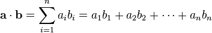

---
categories:
  - algorithm
  - leetcode
tags:
  - Java
author: 
  name: JavaInterview.cn
  link: https://JavaInterview.cn
titleTag: Java
feed:
  enable: true
description: 1458. 两个子序列的最大点积

---

## 题目
给你两个数组 nums1 和 nums2 。

请你返回 nums1 和 nums2 中两个长度相同的 非空 子序列的最大点积。

数组的非空子序列是通过删除原数组中某些元素（可能一个也不删除）后剩余数字组成的序列，但不能改变数字间相对顺序。比方说，[2,3,5] 是 [1,2,3,4,5] 的一个子序列而 [1,5,3] 不是。


示例 1：

    输入：nums1 = [2,1,-2,5], nums2 = [3,0,-6]
    输出：18
    解释：从 nums1 中得到子序列 [2,-2] ，从 nums2 中得到子序列 [3,-6] 。
    它们的点积为 (2*3 + (-2)*(-6)) = 18 。
示例 2：

    输入：nums1 = [3,-2], nums2 = [2,-6,7]
    输出：21
    解释：从 nums1 中得到子序列 [3] ，从 nums2 中得到子序列 [7] 。
    它们的点积为 (3*7) = 21 。
示例 3：

    输入：nums1 = [-1,-1], nums2 = [1,1]
    输出：-1
    解释：从 nums1 中得到子序列 [-1] ，从 nums2 中得到子序列 [1] 。
    它们的点积为 -1 。


提示：

* 1 <= nums1.length, nums2.length <= 500
* -1000 <= nums1[i], nums2[i] <= 100


点积：

定义 a = [a1, a2,…, an] 和 b = [b1, b2,…, bn] 的点积为：


这里的 Σ 指示总和符号。


## 思路

dp

## 解法
```java
class Solution {
    public int maxDotProduct(int[] nums1, int[] nums2) {
        int m = nums1.length, n = nums2.length;

        // 创建一维DP数组，长度为n+1
        // f[j]表示考虑nums1的前i个元素和nums2的前j个元素时的最大点积
        var f = new int[n + 1];

        // 初始化f数组为一个很小的负数，表示还未选择任何元素时的状态
        // 0x3f3f3f3f是一个大的正数，-0x3f3f3f3f是一个小的负数
        Arrays.fill(f, -0x3f3f3f3f);

        // 遍历nums1中的每个元素
        for (int i = 0; i < m; i++) {
            // prev用于存储f[j]的上一个状态，初始化为0
            for (int j = 0, prev = 0; j < n; j++) {
                // 暂存当前f[j+1]的值，因为它将在下一轮迭代中用作prev
                int tmp = f[j + 1];

                // 更新f[j+1]，取以下三种情况的最大值：
                // 1. Math.max(0, prev) + nums1[i] * nums2[j]：
                //     选择当前元素对，可能加上之前的结果（如果之前的结果为正）
                //     相当于if(f[i][j]>=0) f[i][j]+nums1[i]*nums2[j]; else nums1[i]*nums2[j];
                // 2. f[j+1]：不选择nums1[i]，保持原状态
                // 3. f[j]：不选择nums2[j]，使用前一个状态
                f[j + 1] = Math.max(Math.max(0, prev) + nums1[i] * nums2[j],
                        Math.max(f[j + 1], f[j]));

                // 更新prev为这一轮之前的f[j+1]
                prev = tmp;
            }
        }

        // 返回考虑所有元素后的最大点积
        return f[n];
    }
}

```

## 总结

- 分析出几种情况，然后分别对各个情况实现 
