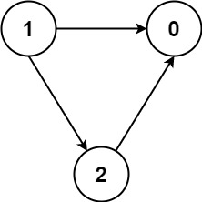

---
categories:
  - algorithm
  - leetcode
tags:
  - Java
author: 
  name: JavaInterview.cn
  link: https://JavaInterview.cn
titleTag: Java
feed:
  enable: true
description: 1462. 课程表IV

---

## 题目

你总共需要上 numCourses 门课，课程编号依次为 0 到 numCourses-1 。你会得到一个数组 prerequisite ，其中 prerequisites[i] = [ai, bi] 表示如果你想选 bi 课程，你 必须 先选 ai 课程。

* 有的课会有直接的先修课程，比如如果想上课程 1 ，你必须先上课程 0 ，那么会以 [0,1] 数对的形式给出先修课程数对。
先决条件也可以是 间接 的。如果课程 a 是课程 b 的先决条件，课程 b 是课程 c 的先决条件，那么课程 a 就是课程 c 的先决条件。

你也得到一个数组 queries ，其中 queries[j] = [uj, vj]。对于第 j 个查询，您应该回答课程 uj 是否是课程 vj 的先决条件。

返回一个布尔数组 answer ，其中 answer[j] 是第 j 个查询的答案。


示例 1：


    输入：numCourses = 2, prerequisites = [[1,0]], queries = [[0,1],[1,0]]
    输出：[false,true]
    解释：[1, 0] 数对表示在你上课程 0 之前必须先上课程 1。
    课程 0 不是课程 1 的先修课程，但课程 1 是课程 0 的先修课程。
示例 2：

    输入：numCourses = 2, prerequisites = [], queries = [[1,0],[0,1]]
    输出：[false,false]
    解释：没有先修课程对，所以每门课程之间是独立的。
示例 3：



    输入：numCourses = 3, prerequisites = [[1,2],[1,0],[2,0]], queries = [[1,0],[1,2]]
    输出：[true,true]


提示：

* 2 <= numCourses <= 100
* 0 <= prerequisites.length <= (numCourses * (numCourses - 1) / 2)
* prerequisites[i].length == 2
* 0 <= ai, bi <= numCourses - 1
* ai != bi
* 每一对 [ai, bi] 都 不同
* 先修课程图中没有环。
* 1 <= queries.length <= 10<sup>4</sup>
* 0 <= ui, vi <= numCourses - 1
* ui != vi

## 思路

    boolean[][] G = new boolean[n][n];
    
## 解法
```java
class Solution {
    public List<Boolean> checkIfPrerequisite(int n, int[][] prerequisites, int[][] queries) {
        boolean[][] G = new boolean[n][n];
        for(int i = 0; i < prerequisites.length; i++){
            G[prerequisites[i][0]][prerequisites[i][1]] = true;
        }

        for(int i = 0; i < n; i++){
            for(int j = 0; j < n; j++){
                for(int k = 0; k < n; k++){
                    if(G[j][i] && G[i][k])
                    G[j][k] = true;
                }
            }
        }

        List<Boolean> res = new ArrayList<>();
        for(int i = 0; i < queries.length; i++){
            res.add(G[queries[i][0]][queries[i][1]]);
        }
        return res;
    }
}

```

## 总结

- 分析出几种情况，然后分别对各个情况实现 
