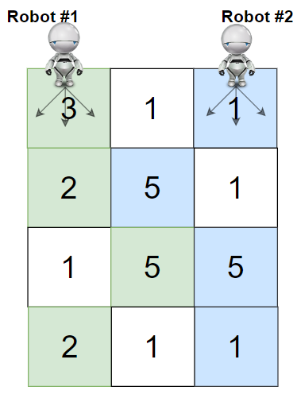

## 题目
给你一个 rows x cols 的矩阵 grid 来表示一块樱桃地。 grid 中每个格子的数字表示你能获得的樱桃数目。

你有两个机器人帮你收集樱桃，机器人 1 从左上角格子 (0,0) 出发，机器人 2 从右上角格子 (0, cols-1) 出发。

请你按照如下规则，返回两个机器人能收集的最多樱桃数目：

* 从格子 (i,j) 出发，机器人可以移动到格子 (i+1, j-1)，(i+1, j) 或者 (i+1, j+1) 。
* 当一个机器人经过某个格子时，它会把该格子内所有的樱桃都摘走，然后这个位置会变成空格子，即没有樱桃的格子。
* 当两个机器人同时到达同一个格子时，它们中只有一个可以摘到樱桃。
* 两个机器人在任意时刻都不能移动到 grid 外面。
* 两个机器人最后都要到达 grid 最底下一行。


示例 1：



    输入：grid = [[3,1,1],[2,5,1],[1,5,5],[2,1,1]]
    输出：24
    解释：机器人 1 和机器人 2 的路径在上图中分别用绿色和蓝色表示。
    机器人 1 摘的樱桃数目为 (3 + 2 + 5 + 2) = 12 。
    机器人 2 摘的樱桃数目为 (1 + 5 + 5 + 1) = 12 。
    樱桃总数为： 12 + 12 = 24 。
示例 2：


    
    输入：grid = [[1,0,0,0,0,0,1],[2,0,0,0,0,3,0],[2,0,9,0,0,0,0],[0,3,0,5,4,0,0],[1,0,2,3,0,0,6]]
    输出：28
    解释：机器人 1 和机器人 2 的路径在上图中分别用绿色和蓝色表示。
    机器人 1 摘的樱桃数目为 (1 + 9 + 5 + 2) = 17 。
    机器人 2 摘的樱桃数目为 (1 + 3 + 4 + 3) = 11 。
    樱桃总数为： 17 + 11 = 28 。
示例 3：

    输入：grid = [[1,0,0,3],[0,0,0,3],[0,0,3,3],[9,0,3,3]]
    输出：22
示例 4：

    输入：grid = [[1,1],[1,1]]
    输出：4


提示：

* rows == grid.length
* cols == grid[i].length
* 2 <= rows, cols <= 70
* 0 <= grid[i][j] <= 100


## 思路

    int[][][] dp=new int[n+1][m+1][m+1];

## 解法
```java
class Solution {
    public int cherryPickup(int[][] grid) {
        int n=grid.length;
        int m=grid[0].length;
        int[][][] dp=new int[n+1][m+1][m+1];
        for(int i=0;i<n;i++){
            for(int j=0;j<m;j++)
                Arrays.fill(dp[i][j],-1);
        }
        int[] dir={-1,0,1};
        
        dp[0][0][m-1]=grid[0][0]+grid[0][m-1];
        int res=dp[0][0][m-1];
        for(int i=1;i<n;i++){
            for(int l=0;l<m;l++){
                for(int r=l+1;r<m;r++){
                    for(int k=0;k<3;k++){
                        for(int j=0;j<3;j++){
                            int x1=l+dir[k];
                            int x2=r+dir[j];
                            if(x1>=x2||x1<0||x1>=m||x2<0||x2>=m) continue;
                            if(dp[i-1][x1][x2]==-1) continue;
                            dp[i][l][r]=Math.max(dp[i][l][r],dp[i-1][x1][x2]+grid[i][l]+grid[i][r]);
                        }
                    }
                    res=Math.max(res,dp[i][l][r]);
                }
                
            }
        }
        return res;
    }
}

```

## 总结

- 分析出几种情况，然后分别对各个情况实现 
