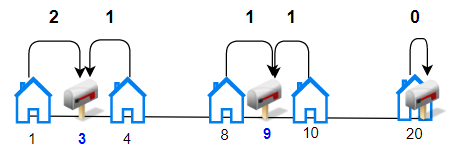
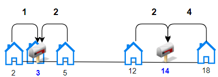

## 题目

给你一个房屋数组houses 和一个整数 k ，其中 houses[i] 是第 i 栋房子在一条街上的位置，现需要在这条街上安排 k 个邮筒。

请你返回每栋房子与离它最近的邮筒之间的距离的 最小 总和。

答案保证在 32 位有符号整数范围以内。


示例 1：



    输入：houses = [1,4,8,10,20], k = 3
    输出：5
    解释：将邮筒分别安放在位置 3， 9 和 20 处。
    每个房子到最近邮筒的距离和为 |3-1| + |4-3| + |9-8| + |10-9| + |20-20| = 5 。
示例 2：



    输入：houses = [2,3,5,12,18], k = 2
    输出：9
    解释：将邮筒分别安放在位置 3 和 14 处。
    每个房子到最近邮筒距离和为 |2-3| + |3-3| + |5-3| + |12-14| + |18-14| = 9 。
示例 3：

    输入：houses = [7,4,6,1], k = 1
    输出：8
示例 4：

    输入：houses = [3,6,14,10], k = 4
    输出：0


提示：

* n == houses.length
* 1 <= n <= 100
* 1 <= houses[i] <= 10^4
* 1 <= k <= n
* 数组 houses 中的整数互不相同。

## 思路
记忆化搜索


## 解法
```java
class Solution {

    public int minDistance(int[] houses, int K) {
        int n = houses.length;
        Arrays.sort(houses);
        int[][] helper = new int[n][n];
        for (int i = 0; i < n; i++) {
            for (int j = 0; j < n; j++) {
                int mid = (i + j) >>> 1;
                for (int k = i; k <= j; k++) {
                    helper[i][j] += Math.abs(houses[k] - houses[mid]);
                }
            }
        }
        int[][] cache = new int[n][K + 1];
        for (int[] arr : cache) {
            Arrays.fill(arr, -1);
        }
        return dfs(houses, helper, cache, n - 1, K);
    }

    private int dfs(int[] house, int[][] helper, int[][] cache, int right, int k) {
        if (right < 0 && k <= 0) return 0;
        if (right < 0) return Integer.MAX_VALUE;
        if (k <= 0) return Integer.MAX_VALUE;
        if (right + 1 < k) return Integer.MAX_VALUE;
        if (cache[right][k] != -1) return cache[right][k];
        int ans = Integer.MAX_VALUE;
        for (int i = k - 1; i <= right; i++) {
            int sub = dfs(house, helper, cache, i - 1, k - 1);
            if (sub == Integer.MAX_VALUE) continue;
            ans = Math.min(ans, sub + helper[i][right]);
        }
        return cache[right][k] = ans;
    }
}

```

## 总结

- 分析出几种情况，然后分别对各个情况实现 
