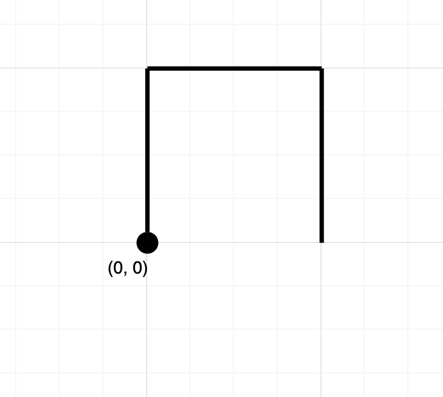

## 题目
给你一个字符串 path，其中 path[i] 的值可以是 'N'、'S'、'E' 或者 'W'，分别表示向北、向南、向东、向西移动一个单位。

你从二维平面上的原点 (0, 0) 处开始出发，按 path 所指示的路径行走。

如果路径在任何位置上与自身相交，也就是走到之前已经走过的位置，请返回 true ；否则，返回 false 。


示例 1：


    输入：path = "NES"
    输出：false
    解释：该路径没有在任何位置相交。
示例 2：


    输入：path = "NESWW"
    输出：true
    解释：该路径经过原点两次。


提示：

* 1 <= path.length <= 10<sup>4</sup>


## 思路

HashSet

## 解法
```java
class Solution {
public boolean isPathCrossing(String path) {
    int[] compass = new int[2];
    Set<Integer> set = new HashSet<>();
    set.add(0);
    for(int i =0 ; i < path.length(); i++){
        char c = path.charAt(i);
        if(c == 'N'){
            compass[1]++;
        } else if (c == 'S') {
            compass[1]--;
        }else if(c == 'E'){
            compass[0]+=20001;
        }else if (c == 'W'){
            compass[0]-=20001;
        }

        if(!set.add(compass[0]+compass[1])){
           return true;
        }
    }

    return false;
}
}

```

## 总结

- 分析出几种情况，然后分别对各个情况实现 
