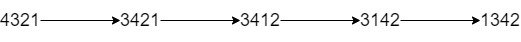

## 题目

给你一个字符串 num 和一个整数 k 。其中，num 表示一个很大的整数，字符串中的每个字符依次对应整数上的各个 数位 。

你可以交换这个整数相邻数位的数字 最多 k 次。

请你返回你能得到的最小整数，并以字符串形式返回。


示例 1：



    输入：num = "4321", k = 4
    输出："1342"
    解释：4321 通过 4 次交换相邻数位得到最小整数的步骤如上图所示。
示例 2：

    输入：num = "100", k = 1
    输出："010"
    解释：输出可以包含前导 0 ，但输入保证不会有前导 0 。
示例 3：

    输入：num = "36789", k = 1000
    输出："36789"
    解释：不需要做任何交换。
示例 4：

    输入：num = "22", k = 22
    输出："22"
示例 5：

    输入：num = "9438957234785635408", k = 23
    输出："0345989723478563548"


提示：

* 1 <= num.length <= 30000
* num 只包含 数字 且不含有 前导 0 。
* 1 <= k <= 10^9

## 思路

    简单树状数组

## 解法
```java
class Solution {
    public String minInteger(String num, int k) {
        //没有比它小的就不动 否则优先找k范围内可以找的最小且最近的数字  
        int n=num.length();
        char[] chars=num.toCharArray();
        Map<Integer,TreeSet<Integer>> map=new HashMap<>();
        Fenwick fw=new Fenwick(n+1);
        for(int i=0;i<n;i++){
            fw.add(i+1,1);
            map.computeIfAbsent(chars[i]-'0',j->new TreeSet<>()).add(i+1);
        }
        StringBuilder sb=new StringBuilder();
        boolean[] vis=new boolean[n];
        int cnt=0;
        while(k>0){
            for(int i=0;i<10;i++){
                if(map.get(i)==null) continue;
                TreeSet<Integer> set=map.get(i);
                int ids=set.getFirst();
                int x=fw.pref(ids)-1;
                if(x<=k){
                    k-=x;
                    fw.add(ids,-1);
                    sb.append(i+"");
                    set.removeFirst();
                    if(set.isEmpty()) map.remove(i);
                    vis[ids-1]=true;
                    cnt++;
                    break;
                }
            }
            if(cnt==n) break;
        }
        for(int i=0;i<n;i++) if(!vis[i]) sb.append(chars[i]);
        return sb.toString();
    }
}
class Fenwick {
    public int[] a,tree;
    //a代表原数组，用第二种初始化方式，表示每个位置的值，不需要保存数组值得时候用第一种初始化方式
    //所有段都是1为起始下标
    public int n;
    public Fenwick(int n){
        this.n=n;
        a=new int[n+1];
        tree=new int[n+1];
    }
    public Fenwick(int[] nums) {
        n = nums.length;
        a = new int[n+1];
        tree = new int[n + 1];
        for (int i = 1; i <= n; i++) {
            update(i, nums[i-1]);
        }
    }
    public void add(int index, int val) {
        //将a[index]值增加val
        a[index] += val;
        //下标从1开始
        for (int i = index; i <= n; i += i & -i) {
            tree[i] += val;
        }
    }
    public void update(int index, int val) {
        //将a[index]值更新为val
        int diff = val - a[index];
        a[index] = val;
        //下标从1开始
        for (int i = index; i <= n; i += i & -i) {
            tree[i] += diff;
        }
    }
    //[1,i]的和
    public int pref(int i) {
        int s = 0;//注意会不会爆int
        for (; i > 0; i -= i & -i) {
            s += tree[i];
        }
        return s;
    }
    //都是从1开始下标
    public int sum(int left, int right) {
        if(left>right) return 0;
        return pref(right) - pref(left-1);
    }
}

```

## 总结

- 分析出几种情况，然后分别对各个情况实现 
