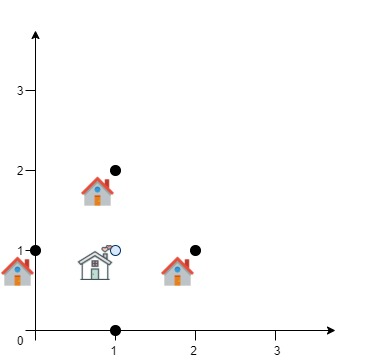

---
categories:
  - algorithm
  - leetcode
tags:
  - Java
author: 
  name: JavaInterview.cn
  link: https://JavaInterview.cn
titleTag: Java
feed:
  enable: true
description: 1515. 服务中心的最佳位置

---

## 题目

一家快递公司希望在新城市建立新的服务中心。公司统计了该城市所有客户在二维地图上的坐标，并希望能够以此为依据为新的服务中心选址：使服务中心 到所有客户的欧几里得距离的总和最小 。

给你一个数组 positions ，其中 positions[i] = [xi, yi] 表示第 i 个客户在二维地图上的位置，返回到所有客户的 欧几里得距离的最小总和 。

换句话说，请你为服务中心选址，该位置的坐标 [xcentre, ycentre] 需要使下面的公式取到最小值：


与真实值误差在 10-5之内的答案将被视作正确答案。


示例 1：



    输入：positions = [[0,1],[1,0],[1,2],[2,1]]
    输出：4.00000
    解释：如图所示，你可以选 [xcentre, ycentre] = [1, 1] 作为新中心的位置，这样一来到每个客户的距离就都是 1，所有距离之和为 4 ，这也是可以找到的最小值。
示例 2：


    输入：positions = [[1,1],[3,3]]
    输出：2.82843
    解释：欧几里得距离可能的最小总和为 sqrt(2) + sqrt(2) = 2.82843


提示：

* 1 <= positions.length <= 50
* positions[i].length == 2
* 0 <= xi, yi <= 100

## 思路

三分

## 解法
```java

class Solution {

    private final double P = 1e-5;

    private final double MAX = Double.MAX_VALUE;

    public double getMinDistSum(int[][] positions) {
        double ans = MAX;
        double lo = 0, hi = 100;
        while (hi - lo > P) {
            double lmid = (lo + hi) / 2.0;
            double rmid = (lmid + hi) / 2.0;

            double lans = cacl(lmid, positions);
            double rans = cacl(rmid, positions);

            ans = Math.min(ans, Math.min(lans, rans));

            if (lans < rans) {
                hi = rmid;
            } else {
                lo = lmid;
            }
        }
        return ans;
    }

    private double cacl(double x, int[][] positions) {
        double ans = MAX;
        double lo = 0, hi = 100;
        while (hi - lo > P) {
            double lmid = (lo + hi) / 2.0;
            double rmid = (lmid + hi) / 2.0;

            double lans = dist(x, lmid, positions);
            double rans = dist(x, rmid, positions);

            ans = Math.min(ans, Math.min(lans, rans));

            if (lans < rans) {
                hi = rmid;
            } else {
                lo = lmid;
            }
        }
        return ans;
    }

    private double dist(double x, double y, int[][] positions) {
        double ans = 0;
        for (int[] position : positions) {
            double sqrt = Math.sqrt(square(x - position[0]) + square(y - position[1]));
            ans += sqrt;
        }
        return ans;
    }

    private double square(double x) {
        return x * x;
    }
}
```

## 总结

- 分析出几种情况，然后分别对各个情况实现 
