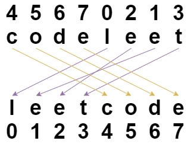

## 题目
给你一个字符串 s 和一个 长度相同 的整数数组 indices 。

请你重新排列字符串 s ，其中第 i 个字符需要移动到 indices[i] 指示的位置。

返回重新排列后的字符串。


示例 1：



    输入：s = "codeleet", indices = [4,5,6,7,0,2,1,3]
    输出："leetcode"
    解释：如图所示，"codeleet" 重新排列后变为 "leetcode" 。
示例 2：

    输入：s = "abc", indices = [0,1,2]
    输出："abc"
    解释：重新排列后，每个字符都还留在原来的位置上。


提示：

* s.length == indices.length == n
* 1 <= n <= 100
* s 仅包含小写英文字母
* 0 <= indices[i] < n
* indices 的所有的值都是 唯一 的
* 


## 思路

char数组

## 解法
```java

class Solution {
    public String restoreString(String s, int[] indices) {
        char[] chars = new char[s.length()];
        for (int i = 0; i < indices.length; i++) {
            chars[indices[i]] = s.charAt(i);
        }
        return new String(chars);
    }
}
```

## 总结

- 分析出几种情况，然后分别对各个情况实现 
