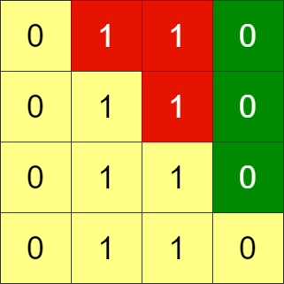

## 题目
给你一个 n x n 的二进制网格 grid，每一次操作中，你可以选择网格的 相邻两行 进行交换。

一个符合要求的网格需要满足主对角线以上的格子全部都是 0 。

请你返回使网格满足要求的最少操作次数，如果无法使网格符合要求，请你返回 -1 。

主对角线指的是从 (1, 1) 到 (n, n) 的这些格子。


示例 1：


    输入：grid = [[0,0,1],[1,1,0],[1,0,0]]
    输出：3
示例 2：



    输入：grid = [[0,1,1,0],[0,1,1,0],[0,1,1,0],[0,1,1,0]]
    输出：-1
    解释：所有行都是一样的，交换相邻行无法使网格符合要求。
示例 3：


    输入：grid = [[1,0,0],[1,1,0],[1,1,1]]
    输出：0


提示：

* n == grid.length
* n == grid[i].length
* 1 <= n <= 200
* grid[i][j] 要么是 0 要么是 1 。


## 思路

while

## 解法
```java
class Solution {
public static int minSwaps(int[][] grid) {
        int c = 0;

        int idx = 0;
        boolean tag;
        for(int i = 1;i <= grid.length - 1;i++) {
            tag = false;
            for(int j = idx;j < grid.length;j++) {
                if(index(grid[j]) <= i) {
                    tag = true;
                    int round = j - idx;
                    int x = j;
                    while(x > 0 && round != 0) {
                        int[] tmp = grid[x];
                        grid[x] = grid[x - 1];
                        grid[x - 1] = tmp;
                        round--;
                        x--;
                        c++;
                    }
                    break;
                }
            }
            if(!tag) return -1;
            idx++;
        }

        return c;
    }

    private static int index(int[] nums) {
        for(int i = nums.length - 1;i >= 0;i--) {
            if(nums[i] == 1) return i + 1;
        }

        return -1;
    }
}

```

## 总结

- 分析出几种情况，然后分别对各个情况实现 
