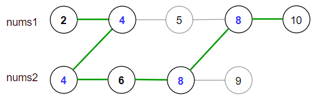

---
categories:
  - algorithm
  - leetcode
tags:
  - Java
author: 
  name: JavaInterview.cn
  link: https://JavaInterview.cn
titleTag: Java
feed:
  enable: true
description: 1537. 最大得分

---

## 题目

你有两个 有序 且数组内元素互不相同的数组 nums1 和 nums2 。

一条 合法路径 定义如下：

* 选择数组 nums1 或者 nums2 开始遍历（从下标 0 处开始）。
* 从左到右遍历当前数组。
* 如果你遇到了 nums1 和 nums2 中都存在的值，那么你可以切换路径到另一个数组对应数字处继续遍历（但在合法路径中重复数字只会被统计一次）。
得分 定义为合法路径中不同数字的和。

请你返回 所有可能 合法路径 中的最大得分。由于答案可能很大，请你将它对 10^9 + 7 取余后返回。


示例 1：



    输入：nums1 = [2,4,5,8,10], nums2 = [4,6,8,9]
    输出：30
    解释：合法路径包括：
    [2,4,5,8,10], [2,4,5,8,9], [2,4,6,8,9], [2,4,6,8,10],（从 nums1 开始遍历）
    [4,6,8,9], [4,5,8,10], [4,5,8,9], [4,6,8,10]  （从 nums2 开始遍历）
    最大得分为上图中的绿色路径 [2,4,6,8,10] 。
示例 2：

    输入：nums1 = [1,3,5,7,9], nums2 = [3,5,100]
    输出：109
    解释：最大得分由路径 [1,3,5,100] 得到。
示例 3：

    输入：nums1 = [1,2,3,4,5], nums2 = [6,7,8,9,10]
    输出：40
    解释：nums1 和 nums2 之间无相同数字。
    最大得分由路径[6,7,8,9,10]得到。


提示：

* 1 <= nums1.length, nums2.length <= 10<sup>5</sup>
* 1 <= nums1[i], nums2[i] <= 10<sup>7</sup>
* nums1 和 nums2 都是严格递增的数组。

## 思路

dp

## 解法
```java
class Solution {
    public int maxSum(int[] nums1, int[] nums2) {
        int len1 = nums1.length, len2 = nums2.length, mod = (int) 1e9 + 7;
        long[] sums1 = new long[len1+1], sums2 = new long[len2+1];
        List<int[]> list = new ArrayList<>();
        Map<Integer, Integer> map = new HashMap<>();
        for (int i = 0; i < len1; i++) {
            map.put(nums1[i], i);
            sums1[i+1] = sums1[i] + nums1[i];
        }
        for (int i = 0; i < len2; i++) {
            int j = map.getOrDefault(nums2[i], -1);
            if (j != -1) list.add(new int[]{j, i});
            sums2[i+1] = sums2[i] + nums2[i];
        }
        list.add(new int[]{len1-1, len2-1});
        int[] ans = new int[]{-1, -1};
        long dp = 0;
        for (int i = 0; i < list.size(); i++) {
            int[] ans_ = list.get(i);
            long sum1 = sums1[ans_[0]+1] - sums1[ans[0]+1];
            long sum2 = sums2[ans_[1]+1] - sums2[ans[1]+1];
            dp = (Math.max(sum1, sum2) + dp) % mod;
            ans = ans_;
        }
        return (int) dp;
    }
}

```

## 总结

- 分析出几种情况，然后分别对各个情况实现 
