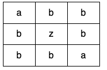

---
categories:
  - algorithm
  - leetcode
tags:
  - Java
author: 
  name: JavaInterview.cn
  link: https://JavaInterview.cn
titleTag: Java
feed:
  enable: true
description: 1559. 二维网格图中探测环

---

## 题目

给你一个二维字符网格数组 grid ，大小为 m x n ，你需要检查 grid 中是否存在 相同值 形成的环。

一个环是一条开始和结束于同一个格子的长度 大于等于 4 的路径。对于一个给定的格子，你可以移动到它上、下、左、右四个方向相邻的格子之一，可以移动的前提是这两个格子有 相同的值 。

同时，你也不能回到上一次移动时所在的格子。比方说，环  (1, 1) -> (1, 2) -> (1, 1) 是不合法的，因为从 (1, 2) 移动到 (1, 1) 回到了上一次移动时的格子。

如果 grid 中有相同值形成的环，请你返回 true ，否则返回 false 。


示例 1：


    输入：grid = [["a","a","a","a"],["a","b","b","a"],["a","b","b","a"],["a","a","a","a"]]
    输出：true
    解释：如下图所示，有 2 个用不同颜色标出来的环：

示例 2：


    输入：grid = [["c","c","c","a"],["c","d","c","c"],["c","c","e","c"],["f","c","c","c"]]
    输出：true
    解释：如下图所示，只有高亮所示的一个合法环：

示例 3：



    输入：grid = [["a","b","b"],["b","z","b"],["b","b","a"]]
    输出：false


提示：

* m == grid.length
* n == grid[i].length
* 1 <= m <= 500
* 1 <= n <= 500
* grid 只包含小写英文字母。

## 思路

    new int[][]{{1, 0}, {0, -1}, {-1, 0}, {0, 1}}

## 解法
```java
public class Solution {
    private final int[][] nexts = new int[][]{{1, 0}, {0, -1}, {-1, 0}, {0, 1}};

    public boolean containsCycle(char[][] grid) {

        int m = grid.length;
        if (m <= 1) return false;
        int n = grid[0].length;
        if (n <= 1) return false;

        boolean[][] visited = new boolean[m][n];
        for (int i = 0; i < m; i++) {
            for (int j = 0; j < n; j++) {
                if (visited[i][j]) {
                    // 如果访问过
                    continue;
                }
                if (search(grid, visited, i, j, -2, -2)) return true;
            }
        }
        return false;
    }

    private boolean search(char[][] grid, boolean[][] visited, int i, int j, int fromI, int fromJ) {
        int m = grid.length;
        int n = grid[0].length;
        visited[i][j] = true;
        boolean[] ok = new boolean[4];
        // 先看一圈周围的
        for (int k = 0; k < 4; k++) {
            int nextI = i + nexts[k][0];
            int nextJ = j + nexts[k][1];
            if (nextI == fromI && nextJ == fromJ) continue;
            if (nextI >= 0 && nextI < m && nextJ >= 0 && nextJ < n) {
                if (grid[i][j] == grid[nextI][nextJ]) {
                    if (visited[nextI][nextJ]) return true;
                    ok[k] = true;
                }
            }
        }
        // 根据之前记录的可选方向，往下搜
        for (int k = 0; k < 4; k++) {
            if (ok[k]) {
                if (search(grid, visited, i + nexts[k][0], j + nexts[k][1], i, j)) return true;
            }
        }
        return false;
    }
}

```

## 总结

- 分析出几种情况，然后分别对各个情况实现 
