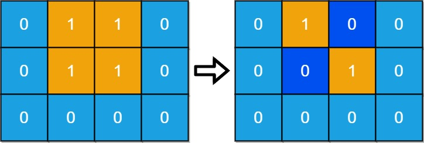

## 题目

给你一个大小为 m x n ，由若干 0 和 1 组成的二维网格 grid ，其中 1 表示陆地， 0 表示水。岛屿 由水平方向或竖直方向上相邻的 1 （陆地）连接形成。

如果 恰好只有一座岛屿 ，则认为陆地是 连通的 ；否则，陆地就是 分离的 。

一天内，可以将 任何单个 陆地单元（1）更改为水单元（0）。

返回使陆地分离的最少天数。


示例 1：


    输入：grid = [[0,1,1,0],[0,1,1,0],[0,0,0,0]]
    输出：2
    解释：至少需要 2 天才能得到分离的陆地。
    将陆地 grid[1][1] 和 grid[0][2] 更改为水，得到两个分离的岛屿。
示例 2：


    输入：grid = [[1,1]]
    输出：2
    解释：如果网格中都是水，也认为是分离的 ([[1,1]] -> [[0,0]])，0 岛屿。


提示：

* m == grid.length
* n == grid[i].length
* 1 <= m, n <= 30
* grid[i][j] 为 0 或 1

## 思路

* 只存在0，1，2
* 0很好找到
* 只需要找到1得情况就好咯，不是1就是2；通过bfs假设那个岛屿格子消失就好咯

## 解法
```java
class Solution {
    public int minDays(int[][] grid) {
        int n = grid.length, m = grid[0].length;
        int num = 0;
        int[] coordinate = null;
        for (int i = 0; i < n; i++) {
            for (int j = 0; j < m; j++) {
                if (grid[i][j] == 1) {
                    num++;
                    if (coordinate == null) {
                        coordinate = new int[]{i, j};
                    }
                }
            }
        }
        if (num <= 1) return num;
        if (bfs(coordinate, grid) < num) return 0;
        for (int i = 0; i < n; i++) {
            for (int j = 0; j < m; j++) {
                if (grid[i][j] == 1) {
                    grid[i][j] = 0;
                    coordinate = null;
                    if (i-1 >= 0 && grid[i-1][j] == 1) coordinate = new int[]{i-1, j};
                    if (coordinate == null && i+1 < n && grid[i+1][j] == 1) coordinate = new int[]{i+1, j};
                    if (coordinate == null && j+1 < m && grid[i][j+1] == 1) coordinate = new int[]{i, j+1};
                    if (coordinate == null && j-1 >= 0 && grid[i][j-1] == 1) coordinate = new int[]{i, j-1};
                    if (bfs(coordinate, grid) < num-1) return 1;
                    grid[i][j] = 1;
                }
            }
        }
        return 2;
    }
    private int bfs (int[] coordinate, int[][] grid) {
        Deque<int[]> q = new ArrayDeque<>();
        q.add(coordinate);
        Set<Integer> set = new HashSet<>();
        set.add((coordinate[1] << 16) | coordinate[0]);
        int num = 0;
        while (!q.isEmpty()) {
            int[] poll = q.poll();
            num++;
            int f = (poll[1] << 16) | (poll[0] - 1);
            if (poll[0] - 1 >= 0 && grid[poll[0]-1][poll[1]] == 1 && !set.contains(f)) {
                q.add(new int[]{poll[0]-1, poll[1]});
                set.add(f);
            }
            f = (poll[1] << 16) | (poll[0] + 1);
            if (poll[0] + 1 < grid.length && grid[poll[0]+1][poll[1]] == 1 && !set.contains(f)) {
                q.add(new int[]{poll[0]+1, poll[1]});
                set.add(f);
            }
            f = ((poll[1] - 1) << 16) | poll[0];
            if (poll[1] - 1 >= 0 && grid[poll[0]][poll[1]-1] == 1 && !set.contains(f)) {
                q.add(new int[]{poll[0], poll[1]-1});
                set.add(f);
            }
            f = ((poll[1] + 1) << 16) | poll[0];
            if (poll[1] + 1 < grid[0].length && grid[poll[0]][poll[1]+1] == 1 && !set.contains(f)) {
                q.add(new int[]{poll[0], poll[1]+1});
                set.add(f);
            }
        }
        return num;
    }
}

```

## 总结

- 分析出几种情况，然后分别对各个情况实现 
