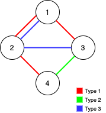

## 题目

Alice 和 Bob 共有一个无向图，其中包含 n 个节点和 3  种类型的边：

* 类型 1：只能由 Alice 遍历。
* 类型 2：只能由 Bob 遍历。
* 类型 3：Alice 和 Bob 都可以遍历。
给你一个数组 edges ，其中 edges[i] = [typei, ui, vi] 表示节点 ui 和 vi 之间存在类型为 typei 的双向边。请你在保证图仍能够被 Alice和 Bob 完全遍历的前提下，找出可以删除的最大边数。如果从任何节点开始，Alice 和 Bob 都可以到达所有其他节点，则认为图是可以完全遍历的。

返回可以删除的最大边数，如果 Alice 和 Bob 无法完全遍历图，则返回 -1 。


示例 1：



    输入：n = 4, edges = [[3,1,2],[3,2,3],[1,1,3],[1,2,4],[1,1,2],[2,3,4]]
    输出：2
    解释：如果删除 [1,1,2] 和 [1,1,3] 这两条边，Alice 和 Bob 仍然可以完全遍历这个图。再删除任何其他的边都无法保证图可以完全遍历。所以可以删除的最大边数是 2 。
示例 2：


    输入：n = 4, edges = [[3,1,2],[3,2,3],[1,1,4],[2,1,4]]
    输出：0
    解释：注意，删除任何一条边都会使 Alice 和 Bob 无法完全遍历这个图。
示例 3：


    输入：n = 4, edges = [[3,2,3],[1,1,2],[2,3,4]]
    输出：-1
    解释：在当前图中，Alice 无法从其他节点到达节点 4 。类似地，Bob 也不能达到节点 1 。因此，图无法完全遍历。


提示：

* 1 <= n <= 10^5
* 1 <= edges.length <= min(10^5, 3 * n * (n-1) / 2)
* edges[i].length == 3
* 1 <= edges[i][0] <= 3
* 1 <= edges[i][1] < edges[i][2] <= n
* 所有元组 (typei, ui, vi) 互不相同

## 思路

维护两个并查集，先考察公共边，再考察独占的边。

## 解法
```java
class Solution {
    public int maxNumEdgesToRemove(int n, int[][] edges) {
        int count = 0;
        // 注意下标问题
        UnionFind unionFindAlice = new UnionFind(n+1);
        UnionFind unionFindBob = new UnionFind(n+1);
        // 先添加可以共用的边
        for (int[] edge : edges) {
            int type = edge[0];
            int f = edge[1];
            int s = edge[2];
            if (type == 3) {
                // 公共边，两个集合是一致的，比较其中一个即可。
                if (unionFindAlice.find(f) == unionFindAlice.find(s)) {
                    // 已连通，可以删除该条边
                    count++;
                }else {
                    // 未连通，加入并查集
                    unionFindAlice.union(f, s);
                    unionFindBob.union(f, s);
                }
            }
        }
        
	// 独有的边
        for (int[] edge : edges) {
            int type = edge[0];
            int f = edge[1];
            int s = edge[2];
            if (type == 1) {
                if (unionFindAlice.find(f) != unionFindAlice.find(s)) {
                    // 未连通，加入并查集
                    unionFindAlice.union(f, s);
                }else {
                    // 已连通，可以删除该条边
                    count++;
                }
            } else if (type == 2) {
                if (unionFindBob.find(f) != unionFindBob.find(s)) {
                    // 未连通，加入并查集
                    unionFindBob.union(f, s);
                }else {
                    // 已连通，可以删除该条边
                    count++;
                }
            }
        }
	// 下标 0 未用到，故能连通的并查集内有两个连通域。
        if (unionFindAlice.size != 2 || unionFindBob.size != 2) {
            return -1;
        }
        return count;
    }

    class UnionFind {
        int[] parent;
        int[] rank;
        int size;

        public UnionFind(int size) {
            this.size = size;
            parent = new int[size];
            rank = new int[size];
            for (int i = 0; i < size; ++i) {
                parent[i] = i;
                rank[i] = 1;
            }
        }

        public int find(int x) {
            if (x != parent[x]) {
                parent[x] = find(parent[x]);
            }
            return parent[x];
        }

        public void union(int x, int y) {
            int nodeX = find(x);
            int nodeY = find(y);
            if (nodeX == nodeY) {
                return;
            }
            size--;
            if (rank[nodeX] > rank[nodeY]) {
                // y->x
                parent[nodeY] = nodeX;
            } else if (rank[nodeX] == rank[nodeY]) {
                parent[nodeY] = nodeX;
                rank[nodeX]++;
            } else {
                // x->y
                parent[nodeX] = nodeY;
            }
        }
    }
}

```

## 总结

- 分析出几种情况，然后分别对各个情况实现 
