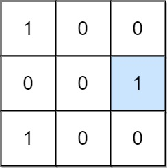
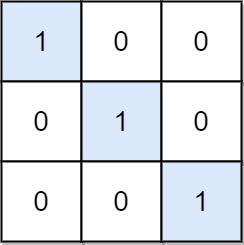

## 题目

给定一个 m x n 的二进制矩阵 mat，返回矩阵 mat 中特殊位置的数量。

如果位置 (i, j) 满足 mat[i][j] == 1 并且行 i 与列 j 中的所有其他元素都是 0（行和列的下标从 0 开始计数），那么它被称为 特殊 位置。


示例 1：


    输入：mat = [[1,0,0],[0,0,1],[1,0,0]]
    输出：1
    解释：位置 (1, 2) 是一个特殊位置，因为 mat[1][2] == 1 且第 1 行和第 2 列的其他所有元素都是 0。
示例 2：


    输入：mat = [[1,0,0],[0,1,0],[0,0,1]]
    输出：3
    解释：位置 (0, 0)，(1, 1) 和 (2, 2) 都是特殊位置。


提示：

* m == mat.length
* n == mat[i].length
* 1 <= m, n <= 100
* mat[i][j] 是 0 或 1。

## 思路

    int[][]

## 解法
```java
class Solution {
    public int numSpecial(int[][] mat) {
        int res = 0;
        for(int i=0; i<mat.length; i++){
            for(int j=0; j<mat[i].length; j++){
                if(mat[i][j] == 1 && sum(mat,i,j) == 1){
                    res++;
                } 
            }
        }
        return res;
    }

    public int sum(int[][] m, int x, int y){
        int res = 0;
        for(int i=0; i<m.length; i++){
            res += m[i][y];
        }
        for(int j=0; j<m[x].length; j++){
            res += m[x][j];
        }
        //m[x][y]算了两遍需要减去一次
        res -= m[x][y];
        return res;
    }
}

```

## 总结

- 分析出几种情况，然后分别对各个情况实现 
