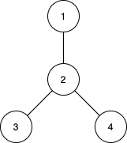

## 题目

给你 n 个城市，编号为从 1 到 n 。同时给你一个大小为 n-1 的数组 edges ，其中 edges[i] = [ui, vi] 表示城市 ui 和 vi 之间有一条双向边。题目保证任意城市之间只有唯一的一条路径。换句话说，所有城市形成了一棵 树 。

一棵 子树 是城市的一个子集，且子集中任意城市之间可以通过子集中的其他城市和边到达。两个子树被认为不一样的条件是至少有一个城市在其中一棵子树中存在，但在另一棵子树中不存在。

对于 d 从 1 到 n-1 ，请你找到城市间 最大距离 恰好为 d 的所有子树数目。

请你返回一个大小为 n-1 的数组，其中第 d 个元素（下标从 1 开始）是城市间 最大距离 恰好等于 d 的子树数目。

请注意，两个城市间距离定义为它们之间需要经过的边的数目。


示例 1：



    输入：n = 4, edges = [[1,2],[2,3],[2,4]]
    输出：[3,4,0]
    解释：
    子树 {1,2}, {2,3} 和 {2,4} 最大距离都是 1 。
    子树 {1,2,3}, {1,2,4}, {2,3,4} 和 {1,2,3,4} 最大距离都为 2 。
    不存在城市间最大距离为 3 的子树。
示例 2：

    输入：n = 2, edges = [[1,2]]
    输出：[1]
示例 3：

    输入：n = 3, edges = [[1,2],[2,3]]
    输出：[2,1]
    

提示：

* 2 <= n <= 15
* edges.length == n-1
* edges[i].length == 2
* 1 <= ui, vi <= n
* 题目保证 (ui, vi) 所表示的边互不相同。

## 思路

二进制枚举子集 + 两次bfs求树的直径

## 解法
```java

class Solution {

    private List<Integer>[] g;

    public int[] countSubgraphsForEachDiameter(int n, int[][] edges) {
        int[] ans = new int[n - 1];
        g = new ArrayList[n];
        for (int i = 0; i < n; i++) g[i] = new ArrayList<>();
        for (int[] edge : edges) {
            int a = edge[0] - 1, b = edge[1] - 1;
            g[a].add(b);
            g[b].add(a);
        }

        int all = 1 << n;
        for (int i = 1; i < all; i++) {
            int root = -1, cnt = 0;
            for (int j = 0; j < n; j++) {
                if ((i & (1 << j)) > 0) {
                    cnt++;
                    if (root == -1) root = j;
                }
            }
            if (root == -1 || cnt <= 1) continue;

            int[] dis = bfs(root, i, n);
            int max = -1, idx = -1;
            for (int k = 0; k < n; k++) {
                if (dis[k] >= 0) {
                    cnt--;
                    if (dis[k] > max) {
                        max = dis[k];
                        idx = k;
                    }
                }
            }
            if (cnt != 0) continue;

            dis = bfs(idx, i, n);
            for (int k = 0; k < n; k++) {
                if (dis[k] > max) {
                    max = dis[k];
                }
            }
            if (max > 0) ans[max - 1]++;
        }
        return ans;
    }

    private int[] bfs(int root, int state, int n) {
        int[] dis = new int[n];
        for (int i = 0; i < n; i++) dis[i] = -1;
        LinkedList<Integer> q = new LinkedList<>();
        q.addLast(root);
        dis[root] = 0;
        while (!q.isEmpty()) {
            Integer cur = q.removeFirst();
            for (Integer son : g[cur]) {
                if (dis[son] != -1 || (state & (1 << son)) == 0) continue;
                q.addLast(son);
                dis[son] = dis[cur] + 1;
            }
        }
        return dis;
    }
}
```

## 总结

- 分析出几种情况，然后分别对各个情况实现 
