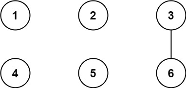
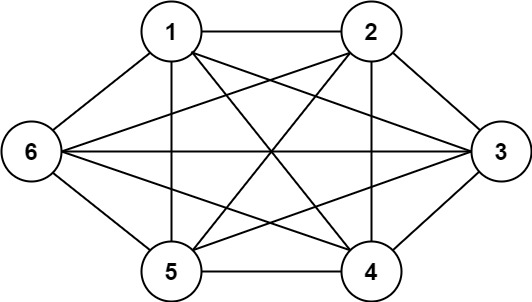
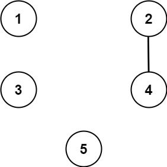

## 题目

有 n 座城市，编号从 1 到 n 。编号为 x 和 y 的两座城市直接连通的前提是： x 和 y 的公因数中，至少有一个 严格大于 某个阈值 threshold 。更正式地说，如果存在整数 z ，且满足以下所有条件，则编号 x 和 y 的城市之间有一条道路：

x % z == 0
y % z == 0
z > threshold
给你两个整数 n 和 threshold ，以及一个待查询数组，请你判断每个查询 queries[i] = [ai, bi] 指向的城市 ai 和 bi 是否连通（即，它们之间是否存在一条路径）。

返回数组 answer ，其中answer.length == queries.length 。如果第 i 个查询中指向的城市 ai 和 bi 连通，则 answer[i] 为 true ；如果不连通，则 answer[i] 为 false 。


示例 1：





    输入：n = 6, threshold = 2, queries = [[1,4],[2,5],[3,6]]
    输出：[false,false,true]
    解释：每个数的因数如下：
    1:   1
    2:   1, 2
    3:   1, 3
    4:   1, 2, 4
    5:   1, 5
    6:   1, 2, 3, 6
    所有大于阈值的的因数已经加粗标识，只有城市 3 和 6 共享公约数 3 ，因此结果是：
    [1,4]   1 与 4 不连通
    [2,5]   2 与 5 不连通
    [3,6]   3 与 6 连通，存在路径 3--6
示例 2：





    输入：n = 6, threshold = 0, queries = [[4,5],[3,4],[3,2],[2,6],[1,3]]
    输出：[true,true,true,true,true]
    解释：每个数的因数与上一个例子相同。但是，由于阈值为 0 ，所有的因数都大于阈值。因为所有的数字共享公因数 1 ，所以所有的城市都互相连通。
示例 3：




    输入：n = 5, threshold = 1, queries = [[4,5],[4,5],[3,2],[2,3],[3,4]]
    输出：[false,false,false,false,false]
    解释：只有城市 2 和 4 共享的公约数 2 严格大于阈值 1 ，所以只有这两座城市是连通的。
    注意，同一对节点 [x, y] 可以有多个查询，并且查询 [x，y] 等同于查询 [y，x] 。


提示：

* 2 <= n <= 10<sup>4</sup>
* 0 <= threshold <= n
* 1 <= queries.length <= 10<sup>5</sup>
* queries[i].length == 2
* 1 <= ai, bi <= cities
* ai != bi

## 思路

并查集

## 解法
```java
class Solution {

    private int[] fa;

    private int find(int x) {
        if (fa[x] == x) return fa[x];
        else return fa[x] = find(fa[x]);
    }

    // 5128. 带阈值的图连通性
    public List<Boolean> areConnected(int n, int threshold, int[][] queries) {
        List<Boolean> ans = new ArrayList<>();
        fa = new int[n + 1];
        for (int i = 1; i <= n; i++) fa[i] = i;

        for (int i = threshold + 1; i <= n; i++) {
            for (int j = i * 2; j <= n; j += i) {
                if (find(i) != find(j)) fa[find(j)] = find(i);
            }
        }

        for (int[] query : queries) ans.add(find(query[0]) == find(query[1]));
        return ans;
    }
}
```

## 总结

- 分析出几种情况，然后分别对各个情况实现 
