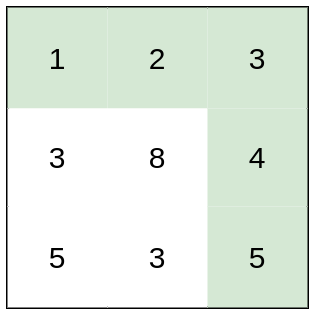

## 题目

你准备参加一场远足活动。给你一个二维 rows x columns 的地图 heights ，其中 heights[row][col] 表示格子 (row, col) 的高度。一开始你在最左上角的格子 (0, 0) ，且你希望去最右下角的格子 (rows-1, columns-1) （注意下标从 0 开始编号）。你每次可以往 上，下，左，右 四个方向之一移动，你想要找到耗费 体力 最小的一条路径。

一条路径耗费的 体力值 是路径上相邻格子之间 高度差绝对值 的 最大值 决定的。

请你返回从左上角走到右下角的最小 体力消耗值 。


示例 1：


    输入：heights = [[1,2,2],[3,8,2],[5,3,5]]
    输出：2
    解释：路径 [1,3,5,3,5] 连续格子的差值绝对值最大为 2 。
    这条路径比路径 [1,2,2,2,5] 更优，因为另一条路径差值最大值为 3 。
示例 2：



    输入：heights = [[1,2,3],[3,8,4],[5,3,5]]
    输出：1
    解释：路径 [1,2,3,4,5] 的相邻格子差值绝对值最大为 1 ，比路径 [1,3,5,3,5] 更优。
示例 3：


    输入：heights = [[1,2,1,1,1],[1,2,1,2,1],[1,2,1,2,1],[1,2,1,2,1],[1,1,1,2,1]]
    输出：0
    解释：上图所示路径不需要消耗任何体力。


提示：

* rows == heights.length
* columns == heights[i].length
* 1 <= rows, columns <= 100
* 1 <= heights[i][j] <= 10<sup>6</sup>

## 思路

二分+dfs

## 解法
```java
class Solution {
    public int minimumEffortPath(int[][] heights) {
        int ans=0;
        int l=0,r=(int) 1e6;
        while(l<=r) {
        	int m=l+(r-l)/2;
        	if(f(heights,m)) {
        		ans=m;
        		r=m-1;
        	}else {
        		l=m+1;
        	}
        }
        return ans;
    }
    static int[][]dx= {{1,0},{-1,0},{0,1},{0,-1}};
    static boolean f(int[][] heights,int m) {
    	int l1=heights.length;
    	int l2=heights[0].length;
    	int v[][]=new int[l1][l2];
    	Queue<int[]>queue=new ArrayDeque<int[]>();
    	queue.add(new int[] {0,0,heights[0][0]});
    	v[0][0]=1;
    	while(!queue.isEmpty()) {
    		int now[]=queue.poll();
    		int x=now[0],y=now[1],t=now[2];
    		if(x==l1-1&&y==l2-1)return true;
    		for(int i=0;i<4;i++) {
    			int xx=x+dx[i][0];
    			int yy=y+dx[i][1];
    			if(xx>=0&&xx<l1&&yy>=0&&yy<l2&&v[xx][yy]==0
    					&&Math.abs(t-heights[xx][yy])<=m) {
    				queue.add(new int[] {xx,yy,heights[xx][yy]});
    				v[xx][yy]=1;
    			}
    		}
    	}
    	return false;
    }
}

```

## 总结

- 分析出几种情况，然后分别对各个情况实现 
