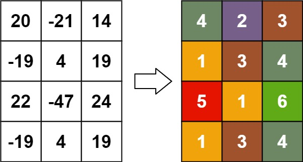

## 题目

给你一个 m x n 的矩阵 matrix ，请你返回一个新的矩阵 answer ，其中 answer[row][col] 是 matrix[row][col] 的秩。

每个元素的 秩 是一个整数，表示这个元素相对于其他元素的大小关系，它按照如下规则计算：

* 秩是从 1 开始的一个整数。
* 如果两个元素 p 和 q 在 同一行 或者 同一列 ，那么：
  * 如果 p < q ，那么 rank(p) < rank(q)
  * 如果 p == q ，那么 rank(p) == rank(q)
  * 如果 p > q ，那么 rank(p) > rank(q)
* 秩 需要越 小 越好。
题目保证按照上面规则 answer 数组是唯一的。


示例 1：


    输入：matrix = [[1,2],[3,4]]
    输出：[[1,2],[2,3]]
    解释：
    matrix[0][0] 的秩为 1 ，因为它是所在行和列的最小整数。
    matrix[0][1] 的秩为 2 ，因为 matrix[0][1] > matrix[0][0] 且 matrix[0][0] 的秩为 1 。
    matrix[1][0] 的秩为 2 ，因为 matrix[1][0] > matrix[0][0] 且 matrix[0][0] 的秩为 1 。
    matrix[1][1] 的秩为 3 ，因为 matrix[1][1] > matrix[0][1]， matrix[1][1] > matrix[1][0] 且 matrix[0][1] 和 matrix[1][0] 的秩都为 2 。
示例 2：


    输入：matrix = [[7,7],[7,7]]
    输出：[[1,1],[1,1]]
示例 3：



    输入：matrix = [[20,-21,14],[-19,4,19],[22,-47,24],[-19,4,19]]
    输出：[[4,2,3],[1,3,4],[5,1,6],[1,3,4]]


提示：

* m == matrix.length
* n == matrix[i].length
* 1 <= m, n <= 500
* -10<sup>9</sup> <= matrix[row][col] <= 10<sup>9</sup>


## 思路

连通图

## 解法
```java

class Solution {
    public int[][] matrixRankTransform(int[][] matrix) {
        int m = matrix.length, n = matrix[0].length;
        int[][] ret = new int[m][n];
        int[] row = new int[m];
        int[] col = new int[n];
        Queue<int[]> queue = new PriorityQueue<>((a, b) -> a[0] - b[0]);
        for(int i = 0; i < m; i++) {
            for(int j = 0; j < n; j++) {
                queue.offer(new int[]{matrix[i][j], i, j});
            }
        }
        while(!queue.isEmpty()) {
            int target = queue.peek()[0];
            List<int[]> list = new ArrayList<>();
            while(!queue.isEmpty() && queue.peek()[0] == target) {
                list.add(queue.poll());
            }
            UF uf = new UF(m + n);
            for (int[] pair : list) {
                uf.union(pair[1], pair[2] + m);
            }
            Map<Integer, List<int[]>> map = new HashMap<>();
            for (int[] pair : list) {
                map.computeIfAbsent(uf.find(pair[1]), $ -> new ArrayList<>()).add(pair);
            }
            for (List<int[]> group : map.values()) {
                int rank = 0;
                for (int[] arr : group) {
                    int i = arr[1], j = arr[2];
                    rank = Math.max(rank, Math.max(row[i], col[j]) + 1);
                }
                for (int[] arr : group) {
                    int i = arr[1], j = arr[2];
                    ret[i][j] = rank;
                    row[i] = Math.max(row[i], rank);
                    col[j] = Math.max(col[j], rank);
                }
            }   
        }
        return ret;
    }
    class UF {
        UF(int size) {
            parent = new int[size];
            for(int i = 0; i < size; i++)
                parent[i] = i;
        }
        private int[] parent;
        private int find(int x) {
            if(parent[x] != x)
                parent[x] = find(parent[x]);
            return parent[x];
        }
        private void union(int x, int y) {
            parent[find(x)] = find(y);
        }
    }
}
   
```

## 总结

- 分析出几种情况，然后分别对各个情况实现 
