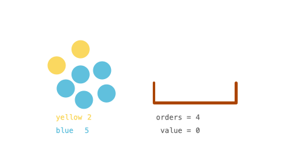

## 题目

你有一些球的库存 inventory ，里面包含着不同颜色的球。一个顾客想要 任意颜色 总数为 orders 的球。

这位顾客有一种特殊的方式衡量球的价值：每个球的价值是目前剩下的 同色球 的数目。比方说还剩下 6 个黄球，那么顾客买第一个黄球的时候该黄球的价值为 6 。这笔交易以后，只剩下 5 个黄球了，所以下一个黄球的价值为 5 （也就是球的价值随着顾客购买同色球是递减的）

给你整数数组 inventory ，其中 inventory[i] 表示第 i 种颜色球一开始的数目。同时给你整数 orders ，表示顾客总共想买的球数目。你可以按照 任意顺序 卖球。

请你返回卖了 orders 个球以后 最大 总价值之和。由于答案可能会很大，请你返回答案对 109 + 7 取余数 的结果。


示例 1：


    输入：inventory = [2,5], orders = 4
    输出：14
    解释：卖 1 个第一种颜色的球（价值为 2 )，卖 3 个第二种颜色的球（价值为 5 + 4 + 3）。
    最大总和为 2 + 5 + 4 + 3 = 14 。
示例 2：

    输入：inventory = [3,5], orders = 6
    输出：19
    解释：卖 2 个第一种颜色的球（价值为 3 + 2），卖 4 个第二种颜色的球（价值为 5 + 4 + 3 + 2）。
    最大总和为 3 + 2 + 5 + 4 + 3 + 2 = 19 。
示例 3：

    输入：inventory = [2,8,4,10,6], orders = 20
    输出：110
示例 4：

    输入：inventory = [1000000000], orders = 1000000000
    输出：21
    解释：卖 1000000000 次第一种颜色的球，总价值为 500000000500000000 。 500000000500000000 对 10<sup>9</sup> + 7 取余为 21 。
    

提示：

* 1 <= inventory.length <= 10<sup>5</sup>
* 1 <= inventory[i] <= 10<sup>9</sup>
* 1 <= orders <= min(sum(inventory[i]), 10<sup>9</sup>)

## 思路

Arrays.sort

## 解法
```java

class Solution {
 public int maxProfit(int[] inventory, int orders) {
        Arrays.sort(inventory);
        int N = inventory.length;
        long res = 0;
        int mod = (int) (1e9 + 7);
        for (int i = N - 1; i >= 0; i--) {
            long next = i == 0 ? 0 : inventory[i - 1];
            long max = inventory[i];
            int size = N - i;
            if (size > orders) {
                res += (long) orders * max % mod;
                return (int) (res % mod);
            } else {
                if (size * (max - next) <= orders) {
                    long n = max - next;
                    long value = n * (next + 1) % mod + ((n - 1) * n / 2) % mod;
                    res += value * size % mod;
                    orders -= size * (max - next);
                } else {
                    long x = orders / size;
                    next = max - x;
                    long y = orders % size;
                    long n = max - next;
                    long value = n * (next + 1) % mod + ((n - 1) * n / 2) % mod;
                    res += value * size % mod;
                    res += next * y % mod;
                    return (int) (res % mod);
                }
            }
        }
        return (int) (res % mod);
    }
}
```

## 总结

- 分析出几种情况，然后分别对各个情况实现 
