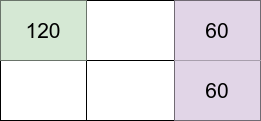

## 题目

给你四个整数 m、n、introvertsCount 和 extrovertsCount 。有一个 m x n 网格，和两种类型的人：内向的人和外向的人。总共有 introvertsCount 个内向的人和 extrovertsCount 个外向的人。

请你决定网格中应当居住多少人，并为每个人分配一个网格单元。 注意，不必 让所有人都生活在网格中。

每个人的 幸福感 计算如下：

* 内向的人 开始 时有 120 个幸福感，但每存在一个邻居（内向的或外向的）他都会 失去  30 个幸福感。
* 外向的人 开始 时有 40 个幸福感，每存在一个邻居（内向的或外向的）他都会 得到  20 个幸福感。
邻居是指居住在一个人所在单元的上、下、左、右四个直接相邻的单元中的其他人。

网格幸福感 是每个人幸福感的 总和 。 返回 最大可能的网格幸福感 。


示例 1：


    输入：m = 2, n = 3, introvertsCount = 1, extrovertsCount = 2
    输出：240
    解释：假设网格坐标 (row, column) 从 1 开始编号。
    将内向的人放置在单元 (1,1) ，将外向的人放置在单元 (1,3) 和 (2,3) 。
    - 位于 (1,1) 的内向的人的幸福感：120（初始幸福感）- (0 * 30)（0 位邻居）= 120
    - 位于 (1,3) 的外向的人的幸福感：40（初始幸福感）+ (1 * 20)（1 位邻居）= 60
    - 位于 (2,3) 的外向的人的幸福感：40（初始幸福感）+ (1 * 20)（1 位邻居）= 60
    网格幸福感为：120 + 60 + 60 = 240
    上图展示该示例对应网格中每个人的幸福感。内向的人在浅绿色单元中，而外向的人在浅紫色单元中。
  
示例 2：

    输入：m = 3, n = 1, introvertsCount = 2, extrovertsCount = 1
    输出：260
    解释：将内向的人放置在单元 (1,1) 和 (3,1) ，将外向的人放置在单元 (2,1) 。
    - 位于 (1,1) 的内向的人的幸福感：120（初始幸福感）- (1 * 30)（1 位邻居）= 90
    - 位于 (2,1) 的外向的人的幸福感：40（初始幸福感）+ (2 * 20)（2 位邻居）= 80
    - 位于 (3,1) 的内向的人的幸福感：120（初始幸福感）- (1 * 30)（1 位邻居）= 90
    网格幸福感为 90 + 80 + 90 = 260
  
示例 3：
    
    输入：m = 2, n = 2, introvertsCount = 4, extrovertsCount = 0
    输出：240


提示：

* 1 <= m, n <= 5
* 0 <= introvertsCount, extrovertsCount <= min(m * n, 6)

## 思路

dfs

## 解法
```java

class Solution {
    int num,maxstatu;
    int[][][][][]dp;
    public int getMaxGridHappiness(int m, int n, int introvertsCount, int extrovertsCount) {
        num = m;
        maxstatu = n;
        dp = new int[m][1<<n][1<<n][introvertsCount+1][extrovertsCount+1];
        return dfs(0,0,0,introvertsCount,extrovertsCount);
    }
     private int dfs(int level, int statu1,int statu2, int nei, int w) {
        if(level>num-1)
            return 0;
        if(dp[level][statu1][statu2][nei][w]!=0)
            return dp[level][statu1][statu2][nei][w];
        int max = 1<<maxstatu,res = 0;
        for (int i = 0; i < max; i++) {
            int ncont = Integer.bitCount(i);
            if(ncont >nei)continue;
            for (int j = 0; j < max; j++) {
                int wcont = Integer.bitCount(j),add = 120*ncont;
                if((i&j)!=0|| wcont >w)continue;
                add+=40*wcont;
                add-=Integer.bitCount(i&statu1)*60;
                add-=Integer.bitCount(i&statu2)*10;
                add-=Integer.bitCount(j&statu1)*10;
                add+=Integer.bitCount(j&statu2)*40;
                add = getCount(i,j,add);
                res = Math.max(res,dfs(level+1,i,j,nei-ncont,w-wcont)+add);
            }
        }
        dp[level][statu1][statu2][nei][w] = res;
        return res;
    }

    private int getCount(int i, int j,int add) {//本行幸福都计算
        int cost = getCost(i),cost1 = getCost(j);
        int cost2 = getCost(i ^ j) - cost - cost1;
        add-=60* cost;
        add+=40*cost1;
        add-=10*cost2;
        return add;
    }

    private int getCost(int num) {//相邻数目计算
        int res = 0,pre = 0;
        while (num>0){
            int now = Integer.lowestOneBit(num);
            if((pre<<1)==now)
                res++;
            pre = now;
            num-=now;
        }
        return res;
    }
}

```

## 总结

- 分析出几种情况，然后分别对各个情况实现 
