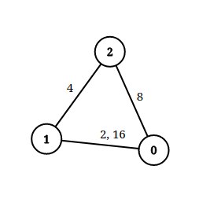

## 题目
给你一个 n 个点组成的无向图边集 edgeList ，其中 edgeList[i] = [ui, vi, disi] 表示点 ui 和点 vi 之间有一条长度为 disi 的边。请注意，两个点之间可能有 超过一条边 。

给你一个查询数组queries ，其中 queries[j] = [pj, qj, limitj] ，你的任务是对于每个查询 queries[j] ，判断是否存在从 pj 到 qj 的路径，且这条路径上的每一条边都 严格小于 limitj 。

请你返回一个 布尔数组 answer ，其中 answer.length == queries.length ，当 queries[j] 的查询结果为 true 时， answer 第 j 个值为 true ，否则为 false 。


示例 1：


    输入：n = 3, edgeList = [[0,1,2],[1,2,4],[2,0,8],[1,0,16]], queries = [[0,1,2],[0,2,5]]
    输出：[false,true]
    解释：上图为给定的输入数据。注意到 0 和 1 之间有两条重边，分别为 2 和 16 。
    对于第一个查询，0 和 1 之间没有小于 2 的边，所以我们返回 false 。
    对于第二个查询，有一条路径（0 -> 1 -> 2）两条边都小于 5 ，所以这个查询我们返回 true 。
示例 2：


    输入：n = 5, edgeList = [[0,1,10],[1,2,5],[2,3,9],[3,4,13]], queries = [[0,4,14],[1,4,13]]
    输出：[true,false]
    解释：上图为给定数据。


提示：

* 2 <= n <= 10<sup>5</sup>
* 1 <= edgeList.length, queries.length <= 10<sup>5</sup>
* edgeList[i].length == 3
* queries[j].length == 3
* 0 <= ui, vi, pj, qj <= n - 1
* ui != vi
* pj != qj
* 1 <= disi, limitj <= 10<sup>9</sup>
* 两个点之间可能有 多条 边。

## 思路

查并集

## 解法
```java

class Solution {
    public boolean[] distanceLimitedPathsExist(int n, int[][] edgeList, int[][] queries) {
        int n1 = edgeList.length, n2 = queries.length;
        boolean[] res = new boolean[n2];
        // 所有的无向边按长度从小到大排序
        Arrays.sort(edgeList, (v1, v2) -> v1[2] - v2[2]);
        Integer[] qids = new Integer[n2];
        for(int i = 0; i < n2; i++) {
            qids[i] = i;
        }
        // 所有的查询条件按长度从小到大排序
        Arrays.sort(qids, (v1, v2) -> queries[v1][2] - queries[v2][2]);
        // 初始化并查集
        UnionFindSet uf = new UnionFindSet(n);
        // k表示上一次查询中不满足limit条件的edge索引
        int idx = 0;
        // 遍历查询
        for(int qid : qids) {
            // 本次查询中将所有满足limit条件的edge全部加入并查集
            while(idx < n1 && edgeList[idx][2] < queries[qid][2]) {
                uf.union(edgeList[idx][0], edgeList[idx][1]);
                idx++;
            }
            res[qid] = uf.connected(queries[qid][0], queries[qid][1]);
        }
        return res;
    }
}

public class UnionFindSet {
    private int n;
    private int[] parent;
    private int[] rank;
    public UnionFindSet(int n) {
        this.n = n;
        this.parent = new int[n];
        this.rank = new int[n];
        for(int i = 0; i < n; i++) {
            parent[i] = i;
            rank[i] = 1;
        }
    }
    public int find(int i) {
        if(parent[i] == i) {
            return i;
        }
        parent[i] = find(parent[i]);
        return parent[i];
    }
    public void union(int i, int j) {
        int p1 = find(i), p2 = find(j);
        if(p1 == p2) {
            return;
        }
        if(rank[p1] > rank[p2]) {
            parent[p2] = p1;
        }else if(rank[p1] < rank[p2]) {
            parent[p1] = p2;
        }else {
            parent[p2] = p1;
            rank[p1]++;
        }
    }
    public boolean connected(int i, int j) {
        return find(i) == find(j);
    }
}
```

## 总结

- 分析出几种情况，然后分别对各个情况实现 
