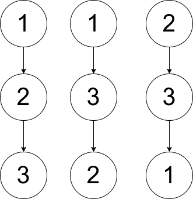

## 题目

给你一个数组 pairs ，其中 pairs[i] = [xi, yi] ，并且满足：

* pairs 中没有重复元素
* xi < yi
令 ways 为满足下面条件的有根树的方案数：

* 树所包含的所有节点值都在 pairs 中。
* 一个数对 [xi, yi] 出现在 pairs 中 当且仅当 xi 是 yi 的祖先或者 yi 是 xi 的祖先。
* 注意：构造出来的树不一定是二叉树。
两棵树被视为不同的方案当存在至少一个节点在两棵树中有不同的父节点。

请你返回：

* 如果 ways == 0 ，返回 0 。
* 如果 ways == 1 ，返回 1 。
* 如果 ways > 1 ，返回 2 。
一棵 有根树 指的是只有一个根节点的树，所有边都是从根往外的方向。

我们称从根到一个节点路径上的任意一个节点（除去节点本身）都是该节点的 祖先 。根节点没有祖先。


示例 1：


    输入：pairs = [[1,2],[2,3]]
    输出：1
    解释：如上图所示，有且只有一个符合规定的有根树。
示例 2：



    输入：pairs = [[1,2],[2,3],[1,3]]
    输出：2
    解释：有多个符合规定的有根树，其中三个如上图所示。
示例 3：

    输入：pairs = [[1,2],[2,3],[2,4],[1,5]]
    输出：0
    解释：没有符合规定的有根树。


提示：

* 1 <= pairs.length <= 10<sup>5</sup>
* 1 <= xi < yi <= 500
* pairs 中的元素互不相同。


## 思路

建图

## 解法
```java
class Solution {
    int N = 510; // 取值范围 500
    // cnts 统计每个值出现次数，fa 记录结点父结点的下标（类似并查集）
    int[] cnts = new int[N], fa = new int[N];
    boolean[][] g = new boolean[N][N];      // 邻接矩阵
    public int checkWays(int[][] pairs) {
        int m = pairs.length;
        // set 去重统计树中结点
        Set<Integer> set = new HashSet<>();
        for (int[] p : pairs) {
            int a = p[0], b = p[1];
            g[a][b] = g[b][a] = true;   // 建图
            cnts[a]++; cnts[b]++;       // 计数
            set.add(a); set.add(b);     // 去重
        }
        // 对去重后的结点按出现的次数（度）进行排序
        List<Integer> list = new ArrayList<>(set);
        Collections.sort(list, (a,b)->cnts[b]-cnts[a]);
        // 出现次数最多的作为根节点的值
        int n = list.size(), root = list.get(0);
        fa[root] = -1;      // 根节点没有父节点，记为 -1
        if (m < n - 1) return 0; // 森林
        // 按出现次数（即结点度的大小）从大到小依次构建结点并插入树中
        // 即自顶向下构造树
        for (int i = 1; i < n; i++) {
            int a = list.get(i);
            boolean ok = false;     // 标记构造的树能否插入当前结点
            // 自顶向下顺序贪心查找树中可以插入的第一个位置
            for (int j = i - 1; j >= 0 && !ok; j--) {
                int b = list.get(j);
                if (g[a][b]) {
                    fa[a] = b;
                    ok = true;
                }
            }
            // 没找到说明这个结点没法插入，即没有符合条件的树
            if (!ok) return 0;
        }
        // 检查是否有可交换的结点、构造的树是否所有结点对都在pairs中
        // c 统计树中路径数量，ans 记录是否只能构造一棵树
        int c = 0, ans = 1;
        for (int i : set) {
            int j = i;
            // 沿着当前结点 i 自底向上一路到根结点
            while (fa[j] != -1) {
                // 如果 i 和其祖先 fa[j] 没有路径相连，那么树不符合条件
                // 即树中存在 不在pairs中的 数对
                if (!g[i][fa[j]]) return 0;
                // 如果 i 与某个祖先结点的度相同，那么两个结点可以互换，即不止一棵树
                if (cnts[i] == cnts[fa[j]]) ans = 2;
                c++;            // 统计路径数量
                j = fa[j];      // 沿着路径向父节点方向走
            }
        }
        // 树中路径数量不应该比 pairs 的数量还少的
        // 树成链表状应该有 c == m 其他情况应该 c > m
        return c < m ? 0 : ans;
    }
}

```

## 总结

- 分析出几种情况，然后分别对各个情况实现 
