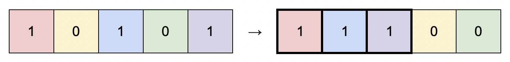

## 题目
给你一个二进制矩阵 matrix ，它的大小为 m x n ，你可以将 matrix 中的 列 按任意顺序重新排列。

请你返回最优方案下将 matrix 重新排列后，全是 1 的子矩阵面积。


示例 1：


    输入：matrix = [[0,0,1],[1,1,1],[1,0,1]]
    输出：4
    解释：你可以按照上图方式重新排列矩阵的每一列。
    最大的全 1 子矩阵是上图中加粗的部分，面积为 4 。
示例 2：


    
    输入：matrix = [[1,0,1,0,1]]
    输出：3
    解释：你可以按照上图方式重新排列矩阵的每一列。
    最大的全 1 子矩阵是上图中加粗的部分，面积为 3 。
示例 3：

    输入：matrix = [[1,1,0],[1,0,1]]
    输出：2
    解释：由于你只能整列整列重新排布，所以没有比面积为 2 更大的全 1 子矩形。
示例 4：

    输入：matrix = [[0,0],[0,0]]
    输出：0
    解释：由于矩阵中没有 1 ，没有任何全 1 的子矩阵，所以面积为 0 。


提示：

* m == matrix.length
* n == matrix[i].length
* 1 <= m * n <= 10<sup>5</sup>
* matrix[i][j] 要么是 0 ，要么是 1 。


## 思路

数组记录连续1的个数

## 解法
```java
class Solution {
    public int largestSubmatrix(int[][] matrix) {
        int res = 0;
        int m = matrix.length, n= matrix[0].length;
        int[] heights = new int[n];
        for(int i = 0; i < m; i++) {
            for(int j = 0; j < n; j++) {
                //用来记录当前行以及以上行的每列连续1的个数
                heights[j] = matrix[i][j] == 0 ? 0 : heights[j] + 1;
            }
            //防止对heights数组污染
            int[] temp = heights.clone();
            Arrays.sort(temp);
            //枚举每个高度的矩形并取最大值
            for(int j = 0; j < n; j++)
                res = Math.max(res, temp[j] * (n - j));
        }
        return res;
    }
}

```

## 总结

- 分析出几种情况，然后分别对各个情况实现 
