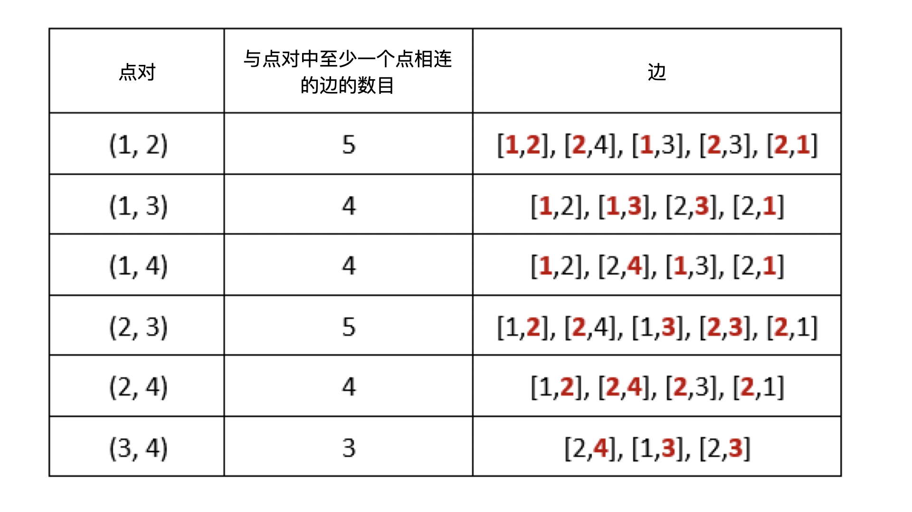

## 题目

给你一个无向图，无向图由整数 n  ，表示图中节点的数目，和 edges 组成，其中 edges[i] = [ui, vi] 表示 ui 和 vi 之间有一条无向边。同时给你一个代表查询的整数数组 queries 。

第 j 个查询的答案是满足如下条件的点对 (a, b) 的数目：

* a < b
* cnt 是与 a 或者 b 相连的边的数目，且 cnt 严格大于 queries[j] 。
请你返回一个数组 answers ，其中 answers.length == queries.length 且 answers[j] 是第 j 个查询的答案。

请注意，图中可能会有 多重边 。


示例 1：



    输入：n = 4, edges = [[1,2],[2,4],[1,3],[2,3],[2,1]], queries = [2,3]
    输出：[6,5]
    解释：每个点对中，与至少一个点相连的边的数目如上图所示。
    answers[0] = 6。所有的点对(a, b)中边数和都大于2，故有6个；
    answers[1] = 5。所有的点对(a, b)中除了(3,4)边数等于3，其它点对边数和都大于3，故有5个。
示例 2：

    输入：n = 5, edges = [[1,5],[1,5],[3,4],[2,5],[1,3],[5,1],[2,3],[2,5]], queries = [1,2,3,4,5]
    输出：[10,10,9,8,6]


提示：

* 2 <= n <= 2 * 10<sup>4</sup>
* 1 <= edges.length <= 10<sup>5</sup>
* 1 <= ui, vi <= n
* ui != vi
* 1 <= queries.length <= 20
* 0 <= queries[j] < edges.length

## 思路

双指针计数

## 解法
```java
class Solution {
    public int[] countPairs(int n, int[][] edges, int[] queries) {
        int m = edges.length, q = queries.length;
        int[] ans = new int[q], deg = new int[n + 1];
        Map<Integer, Integer> map = new HashMap<>();
        for (int[] edge : edges) {
            if (edge[0] > edge[1]) {
                int t = edge[0];
                edge[0] = edge[1];
                edge[1] = t;
            }
            int u = edge[0], v = edge[1], key = v * (n + 1) + u;
            map.put(key, map.getOrDefault(key, 0) + 1);
            deg[u]++;
            deg[v]++;
        }

        List<Pair<Integer, Integer>> pairs = new ArrayList<>();
        Arrays.sort(edges, (o1, o2) -> o1[0] != o2[0] ? Integer.compare(o1[0], o2[0]) :
                Integer.compare(o1[1], o2[1]));
        for (int i = 0; i < m; i++) {
            int u = edges[i][0], v = edges[i][1];
            if (i > 0 && u == edges[i - 1][0] && v == edges[i - 1][1]) continue;
            pairs.add(new Pair<>(u, v));
        }

        int[] tmp = deg.clone();
        Arrays.sort(tmp, 1, n + 1);
        for (int i = 0; i < q; i++) {
            int cnt = 0, l = 1, r = n;
            while (l < r) {
                if (tmp[l] + tmp[r] <= queries[i]) {
                    l++;
                } else {
                    cnt += r - l;
                    r--;
                }
            }
            for (Pair<Integer, Integer> pair : pairs) {
                int u = pair.getKey(), v = pair.getValue(), key = v * (n + 1) + u;
                int t = deg[u] + deg[v], val = map.get(key);
                if (t > queries[i] && t - val <= queries[i]) cnt--;
            }
            ans[i] = cnt;
        }
        return ans;
    }
}

```

## 总结

- 分析出几种情况，然后分别对各个情况实现 
