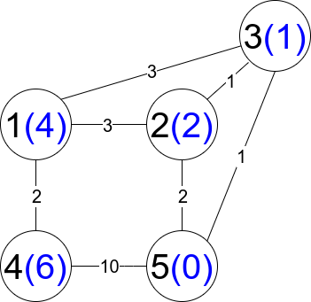
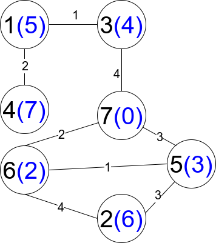

## 题目

现有一个加权无向连通图。给你一个正整数 n ，表示图中有 n 个节点，并按从 1 到 n 给节点编号；另给你一个数组 edges ，其中每个 edges[i] = [ui, vi, weighti] 表示存在一条位于节点 ui 和 vi 之间的边，这条边的权重为 weighti 。

从节点 start 出发到节点 end 的路径是一个形如 [z0, z1, z2, ..., zk] 的节点序列，满足 z0 = start 、zk = end 且在所有符合 0 <= i <= k-1 的节点 zi 和 zi+1 之间存在一条边。

路径的距离定义为这条路径上所有边的权重总和。用 distanceToLastNode(x) 表示节点 n 和 x 之间路径的最短距离。受限路径 为满足 distanceToLastNode(zi) > distanceToLastNode(zi+1) 的一条路径，其中 0 <= i <= k-1 。

返回从节点 1 出发到节点 n 的 受限路径数 。由于数字可能很大，请返回对 109 + 7 取余 的结果。


示例 1：


输入：n = 5, edges = [[1,2,3],[1,3,3],[2,3,1],[1,4,2],[5,2,2],[3,5,1],[5,4,10]]
输出：3
解释：每个圆包含黑色的节点编号和蓝色的 distanceToLastNode 值。三条受限路径分别是：
1) 1 --> 2 --> 5
2) 1 --> 2 --> 3 --> 5
3) 1 --> 3 --> 5
   
示例 2：


输入：n = 7, edges = [[1,3,1],[4,1,2],[7,3,4],[2,5,3],[5,6,1],[6,7,2],[7,5,3],[2,6,4]]
输出：1
解释：每个圆包含黑色的节点编号和蓝色的 distanceToLastNode 值。唯一一条受限路径是：1 --> 3 --> 7 。


提示：

* 1 <= n <= 2 * 10<sup>4</sup>
* n - 1 <= edges.length <= 4 * 10<sup>4</sup>
* edges[i].length == 3
* 1 <= ui, vi <= n
* ui != vi
* 1 <= weighti <= 10<sup>5</sup>
* 任意两个节点之间至多存在一条边
* 任意两个节点之间至少存在一条路径

## 思路

dijkstra+动态dp

## 解法
```java
class Solution {
    public int countRestrictedPaths(int n, int[][] edges) {
        int mod = 1000000007;
        List<int[]>[] graph = new ArrayList[n];
        for(int i = 0;i<n;i++){
            graph[i] = new ArrayList<>();
        }
        for(int[] e:edges){
            graph[e[0]-1].add(new int[]{e[1]-1,e[2]});
            graph[e[1]-1].add(new int[]{e[0]-1,e[2]});
        }
        int[] dist = new int[n];
        Arrays.fill(dist,Integer.MAX_VALUE);
        dist[n-1] = 0;
        PriorityQueue<int[]> pq = new PriorityQueue<>((a,b)->a[1]-b[1]);
        pq.add(new int[]{n-1,0});
        while(!pq.isEmpty()){
            int[] curr = pq.poll();
            int currId = curr[0],currDist = curr[1];
            if(currDist>dist[currId]) continue;
            for(int[] neighbor:graph[currId]){
                int nextId = neighbor[0],weight = neighbor[1];
                int nextDist = dist[currId]+weight;
                if(nextDist<dist[nextId]){
                    dist[nextId] = nextDist;
                    pq.add(new int[]{nextId,nextDist});
                }
            }
        }
        int[] f = new int[n]; //f[i] 为从第 i 个点到结尾的受限路径数量
        f[n-1] = 1;
        List<Integer> list = new ArrayList<>();
        for(int i=0;i<n;i++){
            list.add(i);
        }
        list.sort((a, b) -> dist[a] - dist[b]); // 按距离升序排序节点

        // 逐个节点计算受限路径数量，从距离结尾近的递推到距离结尾远的
        for(int node : list) {
            for(int[] neighbor : graph[node]) {
                int nextNode = neighbor[0];
                if(dist[node] > dist[nextNode]) {
                    f[node] = (f[node] + f[nextNode]) % mod;
                }
            }
        }
        return f[0];
    }
}

```

## 总结

- 分析出几种情况，然后分别对各个情况实现 
