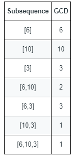

## 题目

给你一个由正整数组成的数组 nums 。

数字序列的 最大公约数 定义为序列中所有整数的共有约数中的最大整数。

* 例如，序列 [4,6,16] 的最大公约数是 2 。
数组的一个 子序列 本质是一个序列，可以通过删除数组中的某些元素（或者不删除）得到。

* 例如，[2,5,10] 是 [1,2,1,2,4,1,5,10] 的一个子序列。
计算并返回 nums 的所有 非空 子序列中 不同 最大公约数的 数目 。


示例 1：


    输入：nums = [6,10,3]
    输出：5
    解释：上图显示了所有的非空子序列与各自的最大公约数。
    不同的最大公约数为 6 、10 、3 、2 和 1 。
示例 2：

    输入：nums = [5,15,40,5,6]
    输出：7


提示：

* 1 <= nums.length <= 10<sup>5</sup>
* 1 <= nums[i] <= 2 * 10<sup>5</sup>

## 思路

枚举

## 解法
```java
class Solution {
    public int countDifferentSubsequenceGCDs(int[] nums) {
        //枚举所有可能的最大公约数，并且去nums当中去查找验证能否出现对应的序列
        //1.显然所有子序列所能提供的最大公约数的值一定是落在[1,max(nums)]中
        //
        Arrays.sort(nums);
        int maxVal = nums[nums.length-1];
        //为了便于快速查看某个元素是否存在，可以将元素值作为索引，并以布尔值进行表示
        boolean[] memo = new boolean[maxVal+1];
        for(int index:nums){
            memo[index] = true;
        }
        int ans = 0;
        //逐一枚举所有可能的最大公约数，并加以验证
        for(int i=1;i<=maxVal;i++){
            //最大公约数是i的时候，最小的元素只能是自己或者更大一些
            int subGcd = 0;//子序列的最大公约数
            //注意此处的j的增量必须控制在i及其倍数上，否则gcd只会越来越小
            //所以j+=i而不能j++,使用j++可能会错过以i为最大公约数的某一个序列
            for(int j=i;j<=maxVal;j+=i){
                //一个元素压根都不存在，那也就是不用检查当前的元素了
                if(memo[j]){
                    if(subGcd==0){
                        subGcd = j;
                    }else{
                        subGcd = gcd(subGcd,j);
                    }

                    if(subGcd==i){
                        ans++;
                        break;//能找到一个可以提供最大公约数为i的子序列即可
                    }
                }
            }
        }
        return ans;
    }
    private int gcd(int a,int b){
        while(a%b!=0){
            int c = a%b;
            a = b;
            b = c;
        }
        return b;
    }
}

```

## 总结

- 分析出几种情况，然后分别对各个情况实现 
