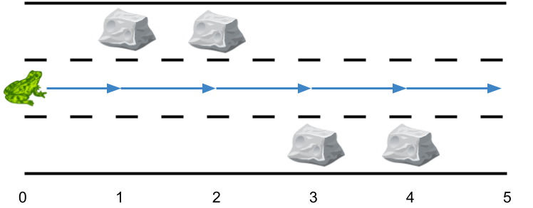

## 题目

给你一个长度为 n 的 3 跑道道路 ，它总共包含 n + 1 个 点 ，编号为 0 到 n 。一只青蛙从 0 号点第二条跑道 出发 ，它想要跳到点 n 处。然而道路上可能有一些障碍。

给你一个长度为 n + 1 的数组 obstacles ，其中 obstacles[i] （取值范围从 0 到 3）表示在点 i 处的 obstacles[i] 跑道上有一个障碍。如果 obstacles[i] == 0 ，那么点 i 处没有障碍。任何一个点的三条跑道中 最多有一个 障碍。

* 比方说，如果 obstacles[2] == 1 ，那么说明在点 2 处跑道 1 有障碍。
这只青蛙从点 i 跳到点 i + 1 且跑道不变的前提是点 i + 1 的同一跑道上没有障碍。为了躲避障碍，这只青蛙也可以在 同一个 点处 侧跳 到 另外一条 跑道（这两条跑道可以不相邻），但前提是跳过去的跑道该点处没有障碍。

* 比方说，这只青蛙可以从点 3 处的跑道 3 跳到点 3 处的跑道 1 。
这只青蛙从点 0 处跑道 2 出发，并想到达点 n 处的 任一跑道 ，请你返回 最少侧跳次数 。

注意：点 0 处和点 n 处的任一跑道都不会有障碍。


示例 1：


    输入：obstacles = [0,1,2,3,0]
    输出：2
    解释：最优方案如上图箭头所示。总共有 2 次侧跳（红色箭头）。
    注意，这只青蛙只有当侧跳时才可以跳过障碍（如上图点 2 处所示）。
示例 2：


    输入：obstacles = [0,1,1,3,3,0]
    输出：0
    解释：跑道 2 没有任何障碍，所以不需要任何侧跳。
示例 3：


    输入：obstacles = [0,2,1,0,3,0]
    输出：2
    解释：最优方案如上图所示。总共有 2 次侧跳。


提示：

* obstacles.length == n + 1
* 1 <= n <= 5 * 10<sup>5</sup>
* 0 <= obstacles[i] <= 3
* obstacles[0] == obstacles[n] == 0

## 思路

方便寻找没有障碍的跑道

## 解法
```java
class Solution {
    public int minSideJumps(int[] os) {
        int n = os.length, INF = 0x3f3f3f3f;
        // 方便寻找没有障碍的跑道
        int[][] ways = {{1, 2}, {0, 2}, {0, 1}};
        // f[i]:代表当前到第i条跑道最少的次数
        int[] f = {1, 0, 1};
        int one = 0, two = 1, w = 2;// 0~2就行
        for (int i = 1; i < n; i++) {
            if (os[i] == 0) {
                // 没有障碍,用上一次的数据更新之前有障碍的跑道
                f[w] = Math.min(f[one], f[two]) + 1;
                continue;
            }
            // w:代表有障碍的跑道
            w = os[i] - 1; f[w] = INF;
            // one,two:代表没有障碍的两条跑道
            one = ways[w][0]; two = ways[w][1];
            f[one] = Math.min(f[one], f[two] + 1);
            f[two] = Math.min(f[one] + 1, f[two]);
        }
        return Math.min(Math.min(f[0], f[1]), f[2]);
    }
}

```

## 总结

- 分析出几种情况，然后分别对各个情况实现 
