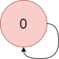

## 题目

给你一个 有向图 ，它含有 n 个节点和 m 条边。节点编号从 0 到 n - 1 。

给你一个字符串 colors ，其中 colors[i] 是小写英文字母，表示图中第 i 个节点的 颜色 （下标从 0 开始）。同时给你一个二维数组 edges ，其中 edges[j] = [aj, bj] 表示从节点 aj 到节点 bj 有一条 有向边 。

图中一条有效 路径 是一个点序列 x1 -> x2 -> x3 -> ... -> xk ，对于所有 1 <= i < k ，从 xi 到 xi+1 在图中有一条有向边。路径的 颜色值 是路径中 出现次数最多 颜色的节点数目。

请你返回给定图中有效路径里面的 最大颜色值 。如果图中含有环，请返回 -1 。


示例 1：


    输入：colors = "abaca", edges = [[0,1],[0,2],[2,3],[3,4]]
    输出：3
    解释：路径 0 -> 2 -> 3 -> 4 含有 3 个颜色为 "a" 的节点（上图中的红色节点）。
示例 2：



    输入：colors = "a", edges = [[0,0]]
    输出：-1
    解释：从 0 到 0 有一个环。


提示：

* n == colors.length
* m == edges.length
* 1 <= n <= 10<sup>5</sup>
* 0 <= m <= 10<sup>5</sup>
* colors 只含有小写英文字母。
* 0 <= aj, bj < n

## 思路

记忆化dfs

## 解法
```java
class Solution {
    public int largestPathValue(String colors, int[][] edges) {
        Map<Integer, List<Integer>> map = new HashMap<>();
        int size = colors.length(), res = -1;
        boolean[] let = new boolean[size];
        for (int[] edge : edges) {
            map.computeIfAbsent(edge[0], k -> new ArrayList<>()).add(edge[1]);
            let[edge[1]] = true;
        }
        Map<Integer, int[]> memoryMap = new HashMap<>();
        boolean[] count = new boolean[size];
        for (int i = 0; i < size; i++) {
            if (!let[i]) {
                int[] dfs = dfs(i, map, colors, new boolean[size], memoryMap, count);
                if (dfs == null) return -1;
                res = Math.max(IntStream.of(dfs).max().getAsInt(), res);
            }
        }
        for (int i = 0; i < size; i++) {
            if (!count[i]) return -1;
        }
        return res;
    }
    private int[] dfs (int node, Map<Integer, List<Integer>> map, String colors, boolean[] f, Map<Integer, int[]> memoryMap, boolean[] count) {
        int[] res = new int[26];
        count[node] = true;
        if (f[node]) return null;
        if (memoryMap.containsKey(node)) return memoryMap.get(node);
        f[node] = true;
        for (int i : map.getOrDefault(node, Collections.emptyList())) {
            int[] dfs = dfs(i, map, colors, f, memoryMap, count);
            if (dfs == null) return null;
            for (int j = 0; j < 26; j++) {
                res[j] = Math.max(res[j], dfs[j]);
            }
        }
        f[node] = false;
        res[colors.charAt(node) - 'a']++;
        memoryMap.put(node, res);
        return res;
    }
}

```

## 总结

- 分析出几种情况，然后分别对各个情况实现 
