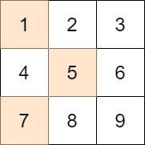

## 题目

给你一个大小为 m x n 的整数矩阵 mat 和一个整数 target 。

从矩阵的 每一行 中选择一个整数，你的目标是 最小化 所有选中元素之 和 与目标值 target 的 绝对差 。

返回 最小的绝对差 。

a 和 b 两数字的 绝对差 是 a - b 的绝对值。


示例 1：



    输入：mat = [[1,2,3],[4,5,6],[7,8,9]], target = 13
    输出：0
    解释：一种可能的最优选择方案是：
    - 第一行选出 1
    - 第二行选出 5
    - 第三行选出 7
    所选元素的和是 13 ，等于目标值，所以绝对差是 0 。
  
示例 2：


    输入：mat = [[1],[2],[3]], target = 100
    输出：94
    解释：唯一一种选择方案是：
    - 第一行选出 1
    - 第二行选出 2
    - 第三行选出 3
    所选元素的和是 6 ，绝对差是 94 。
  
示例 3：


    
    输入：mat = [[1,2,9,8,7]], target = 6
    输出：1
    解释：最优的选择方案是选出第一行的 7 。
    绝对差是 1 。


提示：

* m == mat.length
* n == mat[i].length
* 1 <= m, n <= 70
* 1 <= mat[i][j] <= 70
* 1 <= target <= 800

## 思路

边界

## 解法
```java
class Solution {
    public int minimizeTheDifference(int[][] mat, int target) {
        int minSum=0;
        int maxSum=0;
        
        Set<Integer> set=new HashSet<>();
        int m=mat.length;
        int n=mat[0].length;
        
        for(int i=0;i<m;i++){
            int min=Integer.MAX_VALUE;
            int max=Integer.MIN_VALUE;
            for(int j=0;j<n;j++){
                min=Math.min(min,mat[i][j]);
                max=Math.max(max,mat[i][j]);
            }
            minSum+=min;
            maxSum+=max;
        }
        
        if(minSum<target&&maxSum>target){
            for(int j=0;j<n;j++){
                set.add(mat[0][j]);
            }

            for(int i=1;i<m;i++){
                Set<Integer> tmp=new HashSet<>();
                for(int j=0;j<n;j++){
                    for(Integer num:set){
                        if(!tmp.contains(num+mat[i][j])){
                            tmp.add(num+mat[i][j]);
                        }
                    }
                }
                set=tmp;
            }

            int min=Integer.MAX_VALUE;
            for(Integer num:set){
                min=Math.min(min,Math.abs(num-target));
            }

            return min;
        }
        else if(minSum>=target){
            return minSum-target;
        } 
        else{
            return target-maxSum;
        }
        
        
    }
}

```

## 总结

- 边界
- 按「解法」中的步骤实现主要逻辑，注意边界条件与溢出。
