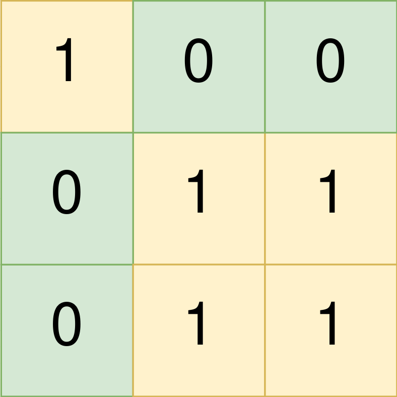
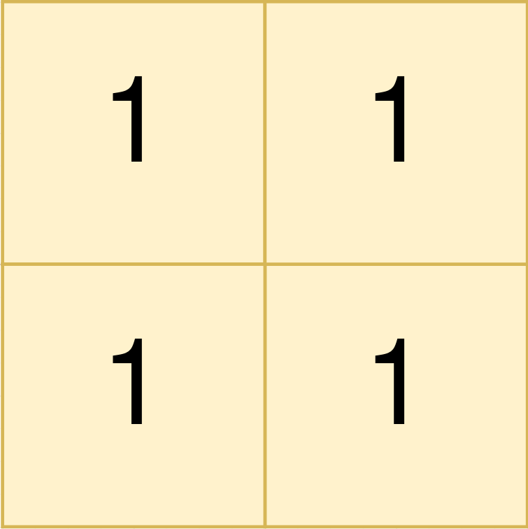
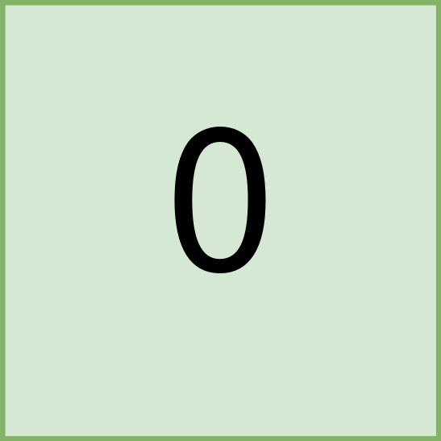

## 题目

给你一个下标从 0 开始，大小为 m x n 的二进制矩阵 land ，其中 0 表示一单位的森林土地，1 表示一单位的农场土地。

为了让农场保持有序，农场土地之间以矩形的 农场组 的形式存在。每一个农场组都 仅 包含农场土地。且题目保证不会有两个农场组相邻，也就是说一个农场组中的任何一块土地都 不会 与另一个农场组的任何一块土地在四个方向上相邻。

land 可以用坐标系统表示，其中 land 左上角坐标为 (0, 0) ，右下角坐标为 (m-1, n-1) 。请你找到所有 农场组 最左上角和最右下角的坐标。一个左上角坐标为 (r1, c1) 且右下角坐标为 (r2, c2) 的 农场组 用长度为 4 的数组 [r1, c1, r2, c2] 表示。

请你返回一个二维数组，它包含若干个长度为 4 的子数组，每个子数组表示 land 中的一个 农场组 。如果没有任何农场组，请你返回一个空数组。可以以 任意顺序 返回所有农场组。

示例 1：



    输入：land = [[1,0,0],[0,1,1],[0,1,1]]
    输出：[[0,0,0,0],[1,1,2,2]]
    解释：
    第一个农场组的左上角为 land[0][0] ，右下角为 land[0][0] 。
    第二个农场组的左上角为 land[1][1] ，右下角为 land[2][2] 。
示例 2：



    输入：land = [[1,1],[1,1]]
    输出：[[0,0,1,1]]
    解释：
    第一个农场组左上角为 land[0][0] ，右下角为 land[1][1] 。
示例 3：



    输入：land = [[0]]
    输出：[]
    解释：
    没有任何农场组。


提示：

* m == land.length
* n == land[i].length
* 1 <= m, n <= 300
* land 只包含 0 和 1 。
* 农场组都是 矩形 的形状。

## 思路

LinkedList

## 解法
```java
class Solution {
     public int[][] findFarmland(int[][] land) {
       List<int[]> res = new LinkedList<>();
        int[][] vis2 = new int[land.length][land[0].length];
        for (int i = 0; i < land.length; i++) {
            for (int j = 0; j < land[i].length; j++) {
                if (vis2[i][j] != 0){
                    j = vis2[i][j];
                    continue;
                }
                if (land[i][j] == 1) {
                    // 往 下移 或者往右
                    int ti = i;
                    int tj = j;
                    while (tj < land[i].length && land[i][tj] == 1) {
                        tj++;
                    }
                    while (ti < land.length && land[ti][j] == 1) {
                        vis2[ti++][j] = tj;
                    }
                    // ti , ji 即为当前矩形的最终目的地
                    res.add(new int[]{i, j, ti - 1, tj - 1});
                    j = tj - 1;
                }
            }
        }
        
        return res.toArray(new int[0][]);
        
    }
}

```

## 总结

- 分析出几种情况，然后分别对各个情况实现 
