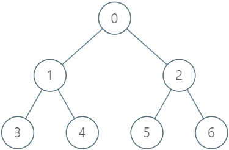

## 题目

给你一棵 n 个节点的树，编号从 0 到 n - 1 ，以父节点数组 parent 的形式给出，其中 parent[i] 是第 i 个节点的父节点。树的根节点为 0 号节点，所以 parent[0] = -1 ，因为它没有父节点。你想要设计一个数据结构实现树里面对节点的加锁，解锁和升级操作。

数据结构需要支持如下函数：

* Lock：指定用户给指定节点 上锁 ，上锁后其他用户将无法给同一节点上锁。只有当节点处于未上锁的状态下，才能进行上锁操作。
* Unlock：指定用户给指定节点 解锁 ，只有当指定节点当前正被指定用户锁住时，才能执行该解锁操作。
* Upgrade：指定用户给指定节点 上锁 ，并且将该节点的所有子孙节点 解锁 。只有如下 3 个条件 全部 满足时才能执行升级操作：
  * 指定节点当前状态为未上锁。
  * 指定节点至少有一个上锁状态的子孙节点（可以是 任意 用户上锁的）。
  * 指定节点没有任何上锁的祖先节点。

请你实现 LockingTree 类：

* LockingTree(int[] parent) 用父节点数组初始化数据结构。
* lock(int num, int user) 如果 id 为 user 的用户可以给节点 num 上锁，那么返回 true ，否则返回 false 。如果可以执行此操作，节点 num 会被 id 为 user 的用户 上锁 。
* unlock(int num, int user) 如果 id 为 user 的用户可以给节点 num 解锁，那么返回 true ，否则返回 false 。如果可以执行此操作，节点 num 变为 未上锁 状态。
* upgrade(int num, int user) 如果 id 为 user 的用户可以给节点 num 升级，那么返回 true ，否则返回 false 。如果可以执行此操作，节点 num 会被 升级 。


示例 1：



    输入：
    ["LockingTree", "lock", "unlock", "unlock", "lock", "upgrade", "lock"]
    [[[-1, 0, 0, 1, 1, 2, 2]], [2, 2], [2, 3], [2, 2], [4, 5], [0, 1], [0, 1]]
    输出：
    [null, true, false, true, true, true, false]
    
    解释：
    LockingTree lockingTree = new LockingTree([-1, 0, 0, 1, 1, 2, 2]);
    lockingTree.lock(2, 2);    // 返回 true ，因为节点 2 未上锁。
    // 节点 2 被用户 2 上锁。
    lockingTree.unlock(2, 3);  // 返回 false ，因为用户 3 无法解锁被用户 2 上锁的节点。
    lockingTree.unlock(2, 2);  // 返回 true ，因为节点 2 之前被用户 2 上锁。
    // 节点 2 现在变为未上锁状态。
    lockingTree.lock(4, 5);    // 返回 true ，因为节点 4 未上锁。
    // 节点 4 被用户 5 上锁。
    lockingTree.upgrade(0, 1); // 返回 true ，因为节点 0 未上锁且至少有一个被上锁的子孙节点（节点 4）。
    // 节点 0 被用户 1 上锁，节点 4 变为未上锁。
    lockingTree.lock(0, 1);    // 返回 false ，因为节点 0 已经被上锁了。


提示：

* n == parent.length
* 2 <= n <= 2000
* 对于 i != 0 ，满足 0 <= parent[i] <= n - 1
* parent[0] == -1
* 0 <= num <= n - 1
* 1 <= user <= 10<sup>4</sup>
* parent 表示一棵合法的树。
* lock ，unlock 和 upgrade 的调用 总共 不超过 2000 次。

## 思路

Arrays.fill

## 解法
```java
class LockingTree {
    int[] locked, p;
    HashMap<Integer, ArrayList<Integer>> tree = new HashMap<>();

    public LockingTree(int[] parent) {
        p = parent;
        locked = new int[parent.length];
        Arrays.fill(locked, -1);
        
        for (int i = 0; i < parent.length; i++) {
            if (!tree.containsKey(parent[i])) {
                tree.put(parent[i], new ArrayList<Integer>());
            }
            tree.get(parent[i]).add(i);
        }
    }
    
    public boolean lock(int num, int user) {
        if (locked[num] == -1) return (locked[num] = user) == user;
        else return false;
    }
    
    public boolean unlock(int num, int user) {
        if (locked[num] == -1 || locked[num] != user) return false;
        else return (locked[num] = -1) == -1;
    }

    public Boolean bfs(int num, int t) {
        if (tree.get(num) == null) return false;
        Queue<ArrayList<Integer>> q = new ArrayDeque<>();
        q.add(tree.get(num));

        while (!q.isEmpty()) {
            ArrayList<Integer> son = q.poll();
            for (int i = 0; i < son.size(); i++) {
                if (locked[son.get(i)] != -1) {
                    if (t == 1) locked[son.get(i)] = -1;
                    else return true;
                }
                if (tree.get(son.get(i)) != null) {
                    q.add(tree.get(son.get(i)));
                }
            }
        }

        return t == 1;
    }
    
    public boolean upgrade(int num, int user) {
        if (locked[num] != -1) return false;
        if (!bfs(num, 0)) return false;
        for (int i = p[num]; i != -1; i = p[i])
            if (locked[i] != -1) return false;

        return bfs(num, 1) && user == (locked[num] = user);
    }
}

```

## 总结

- 分析出几种情况，然后分别对各个情况实现 
